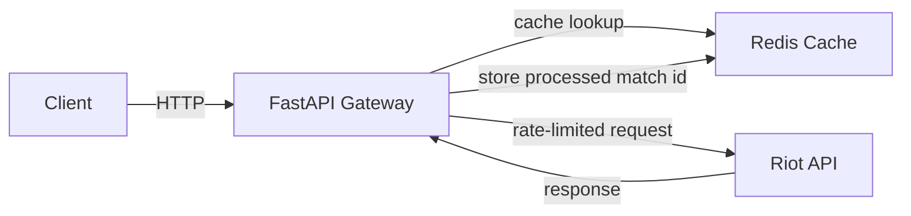
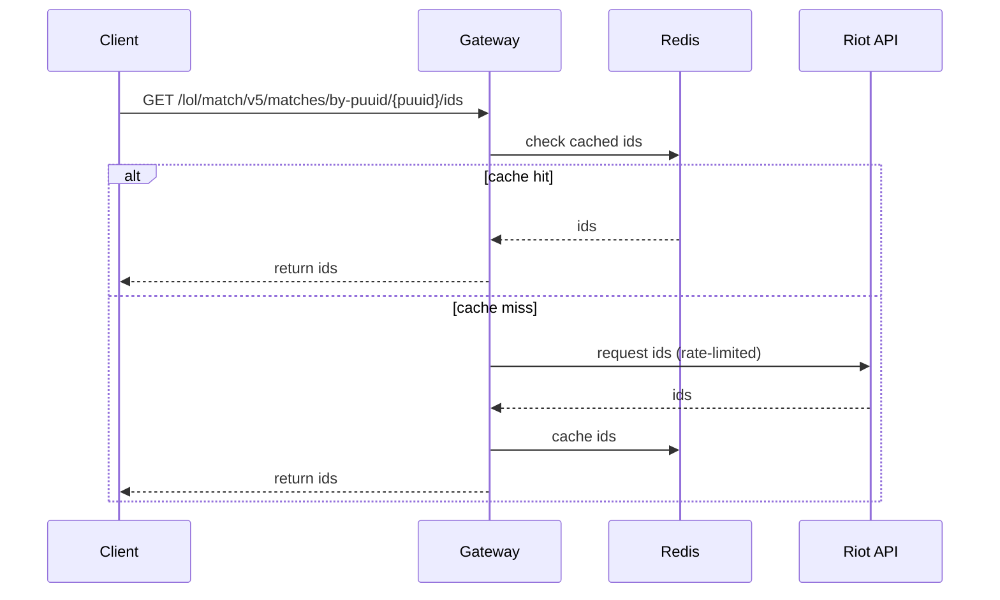

# Architecture

This document summarizes the gateway's major components and responsibilities.

## Components

Design notes

Deployment

## Diagrams

### High-level flow

### Request sequence (match fetch)

- For production: run behind a process manager / reverse proxy, ensure env var provisioning and secrets management are in place.
