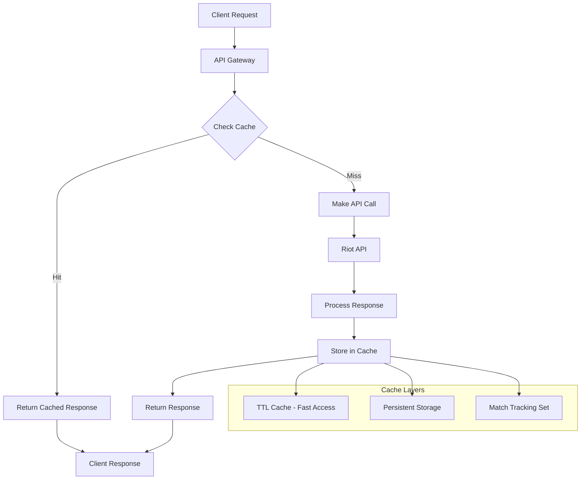

# Caching Architecture

This section details the comprehensive caching strategy implemented in the LOLStonks API Gateway, designed to optimize performance while ensuring data freshness.

## Overview

The caching system uses Redis as the primary caching backend with a multi-layer approach that balances performance, data freshness, and storage efficiency.

## Caching Architecture



## Cache Configuration

### Environment Variables

```env
# Redis connection settings
REDIS_HOST=localhost
REDIS_PORT=6379
REDIS_DB=0
REDIS_PASSWORD=
REDIS_POOL_SIZE=10
REDIS_POOL_TIMEOUT=30

# Cache TTL settings (in seconds)
CACHE_TTL_SUMMONER=3600     # 1 hour
CACHE_TTL_MATCH=86400       # 24 hours
CACHE_TTL_LEAGUE=1800       # 30 minutes
CACHE_TTL_MASTERY=7200      # 2 hours
CACHE_TTL_CHAMPION=604800   # 1 week
CACHE_TTL_CLASH=3600        # 1 hour
CACHE_TTL_CHALLENGES=1800   # 30 minutes

# Match tracking settings
MATCH_TRACKING_TTL=604800   # 1 week
```

### TTL Strategy

Different data types have different TTL (Time To Live) values based on their volatility:

| Data Type | TTL | Rationale |
|-----------|-----|-----------|
| Summoner Info | 1 hour | Profile data changes relatively infrequently |
| Match Data | 24 hours | Historical data never changes |
| League Data | 30 minutes | Competitive data changes frequently |
| Champion Mastery | 2 hours | Mastery scores change regularly |
| Champion Info | 1 week | Static data changes very infrequently |
| Clash Data | 1 hour | Tournament data changes during events |
| Challenges | 30 minutes | Challenge data updates frequently |

## Redis Cache Implementation

### Core Cache Class

```python
# app/cache/redis_cache.py
import json
import asyncio
from typing import Optional, Any, Union
from datetime import datetime, timedelta
import redis.asyncio as redis
from redis.asyncio import ConnectionPool

class RedisCache:
    """
    High-performance Redis cache with TTL support and connection pooling.
    """

    def __init__(
        self,
        host: str = "localhost",
        port: int = 6379,
        db: int = 0,
        password: Optional[str] = None,
        pool_size: int = 10,
        pool_timeout: int = 30
    ):
        self.pool = ConnectionPool.from_url(
            f"redis://:{password}@{host}:{port}/{db}" if password else f"redis://{host}:{port}/{db}",
            max_connections=pool_size,
            socket_timeout=pool_timeout,
            socket_connect_timeout=5,
            retry_on_timeout=True
        )
        self.redis = redis.Redis(connection_pool=self.pool)
        self.ttl_config = self._load_ttl_config()

    def _load_ttl_config(self) -> dict:
        """Load TTL configuration from environment variables."""
        return {
            "summoner": int(os.getenv("CACHE_TTL_SUMMONER", 3600)),
            "match": int(os.getenv("CACHE_TTL_MATCH", 86400)),
            "league": int(os.getenv("CACHE_TTL_LEAGUE", 1800)),
            "mastery": int(os.getenv("CACHE_TTL_MASTERY", 7200)),
            "champion": int(os.getenv("CACHE_TTL_CHAMPION", 604800)),
            "clash": int(os.getenv("CACHE_TTL_CLASH", 3600)),
            "challenges": int(os.getenv("CACHE_TTL_CHALLENGES", 1800))
        }

    def _generate_key(self, endpoint: str, region: str, identifier: str) -> str:
        """Generate consistent cache key."""
        return f"lolstonks:{endpoint}:{region}:{identifier}"

    async def get(self, endpoint: str, region: str, identifier: str) -> Optional[dict]:
        """Get cached data."""
        key = self._generate_key(endpoint, region, identifier)
        try:
            cached_data = await self.redis.get(key)
            if cached_data:
                return json.loads(cached_data)
        except Exception as e:
            logger.error(f"Cache get error for key {key}: {e}")
        return None

    async def set(
        self,
        endpoint: str,
        region: str,
        identifier: str,
        data: dict,
        ttl: Optional[int] = None
    ) -> bool:
        """Set data in cache with TTL."""
        key = self._generate_key(endpoint, region, identifier)
        if ttl is None:
            ttl = self.ttl_config.get(endpoint, 3600)

        try:
            await self.redis.setex(
                key,
                ttl,
                json.dumps(data, default=str)
            )
            return True
        except Exception as e:
            logger.error(f"Cache set error for key {key}: {e}")
            return False

    async def delete(self, endpoint: str, region: str, identifier: str) -> bool:
        """Delete data from cache."""
        key = self._generate_key(endpoint, region, identifier)
        try:
            await self.redis.delete(key)
            return True
        except Exception as e:
            logger.error(f"Cache delete error for key {key}: {e}")
            return False
```

### Cache Decorator

```python
# app/cache/decorators.py
import functools
from typing import Callable, Any

def cached(endpoint: str, ttl: Optional[int] = None):
    """
    Decorator for caching function results.

    Args:
        endpoint: Cache endpoint type
        ttl: Custom TTL override
    """
    def decorator(func: Callable) -> Callable:
        @functools.wraps(func)
        async def wrapper(*args, **kwargs) -> Any:
            # Extract cache parameters
            region = kwargs.get('region', 'euw1')
            cache_key = kwargs.get('cache_key', str(args[1:]) if args else str(kwargs))

            cache: RedisCache = kwargs.get('cache')
            if not cache:
                return await func(*args, **kwargs)

            # Try to get from cache
            cached_result = await cache.get(endpoint, region, cache_key)
            if cached_result:
                logger.debug(f"Cache hit for {endpoint}:{region}:{cache_key}")
                return cached_result

            # Cache miss - execute function
            logger.debug(f"Cache miss for {endpoint}:{region}:{cache_key}")
            result = await func(*args, **kwargs)

            # Store in cache
            await cache.set(endpoint, region, cache_key, result, ttl)
            return result

        return wrapper
    return decorator
```

## Match Tracking System

### Dual Storage Approach

The match tracking system uses both TTL cache and persistent storage:

```python
# app/cache/tracking.py
import json
from typing import Set
from datetime import datetime, timedelta

class MatchTracker:
    """
    Match tracking service to prevent duplicate match processing.

    Uses dual storage:
    1. TTL cache for recent matches (fast access)
    2. Persistent Redis set for all processed matches
    """

    def __init__(self, redis_cache: RedisCache, ttl: int = 604800):
        self.cache = redis_cache
        self.ttl = ttl
        self.processed_key = "lolstonks:matches:processed"
        self.recent_key = "lolstonks:matches:recent"

    async def is_processed(self, match_id: str) -> bool:
        """Check if match has been processed."""
        # Check TTL cache first (fast path)
        in_recent = await self.cache.redis.exists(f"{self.recent_key}:{match_id}")
        if in_recent:
            return True

        # Check persistent set
        is_processed = await self.cache.redis.sismember(self.processed_key, match_id)

        # If found in persistent set, add to recent cache for faster future checks
        if is_processed:
            await self.cache.redis.setex(
                f"{self.recent_key}:{match_id}",
                self.ttl,
                "1"
            )

        return is_processed

    async def mark_processed(self, match_id: str) -> None:
        """Mark match as processed."""
        # Add to persistent set
        await self.cache.redis.sadd(self.processed_key, match_id)

        # Add to TTL cache for fast access
        await self.cache.redis.setex(
            f"{self.recent_key}:{match_id}",
            self.ttl,
            "1"
        )

    async def get_processed_count(self) -> int:
        """Get total number of processed matches."""
        return await self.cache.redis.scard(self.processed_key)

    async def cleanup_expired(self) -> int:
        """Clean up expired entries from recent cache."""
        # This is handled automatically by Redis TTL
        # But we can force cleanup if needed
        pattern = f"{self.recent_key}:*"
        cursor = 0
        deleted = 0

        while True:
            cursor, keys = await self.cache.redis.scan(cursor, match=pattern, count=100)
            if keys:
                deleted += await self.cache.redis.delete(*keys)
            if cursor == 0:
                break

        return deleted
```

## Cache Integration with Routers

### Example Router with Caching

```python
# app/routers/summoner.py
from fastapi import APIRouter, Depends, Query
from app.cache.redis_cache import RedisCache
from app.cache.decorators import cached
from app.riot.client import RiotClient

router = APIRouter(prefix="/summoner", tags=["summoner"])

@router.get("/by-name/{summonerName}")
@cached(endpoint="summoner", ttl=3600)
async def get_summoner_by_name(
    summonerName: str,
    region: str = Query(default="euw1"),
    riot_client: RiotClient = Depends(),
    cache: RedisCache = Depends()
) -> dict:
    """
    Get summoner by summoner name with caching.

    Cached for 1 hour to balance performance and data freshness.
    """
    # Generate unique cache key
    cache_key = f"by-name:{summonerName.lower()}"

    # Make API call (only if cache miss)
    return await riot_client.get(
        f"/lol/summoner/v4/summoners/by-name/{summonerName}",
        region=region
    )

@router.get("/by-puuid/{puuid}")
@cached(endpoint="summoner", ttl=3600)
async def get_summoner_by_puuid(
    puuid: str,
    region: str = Query(default="euw1"),
    riot_client: RiotClient = Depends(),
    cache: RedisCache = Depends()
) -> dict:
    """Get summoner by PUUID with caching."""
    cache_key = f"by-puuid:{puuid}"
    return await riot_client.get(
        f"/lol/summoner/v4/summoners/by-puuid/{puuid}",
        region=region
    )
```

## Cache Performance Optimization

### Connection Pooling

```python
# Optimized connection pool configuration
class OptimizedRedisCache(RedisCache):
    """
    Redis cache with optimized connection pooling.
    """

    def __init__(self, **kwargs):
        # Enhanced connection pool settings
        pool_config = {
            "max_connections": kwargs.get("pool_size", 20),
            "retry_on_timeout": True,
            "socket_keepalive": True,
            "socket_keepalive_options": {},
            "health_check_interval": 30
        }

        super().__init__(**{**kwargs, **pool_config})

    async def batch_get(self, keys: list[str]) -> dict[str, Optional[dict]]:
        """Batch get multiple keys for better performance."""
        try:
            values = await self.redis.mget(keys)
            return {
                key: json.loads(value) if value else None
                for key, value in zip(keys, values)
            }
        except Exception as e:
            logger.error(f"Batch get error: {e}")
            return {key: None for key in keys}

    async def batch_set(self, data: dict[str, dict], ttl: int) -> bool:
        """Batch set multiple keys."""
        try:
            pipe = self.redis.pipeline()
            for key, value in data.items():
                pipe.setex(key, ttl, json.dumps(value, default=str))
            await pipe.execute()
            return True
        except Exception as e:
            logger.error(f"Batch set error: {e}")
            return False
```

### Cache Warming Strategy

```python
# app/cache/warming.py
class CacheWarmer:
    """
    Proactive cache warming for frequently accessed data.
    """

    def __init__(self, riot_client: RiotClient, cache: RedisCache):
        self.riot_client = riot_client
        self.cache = cache
        self.high_activity_summoners = set()

    async def warm_summoner_cache(self, summoner_names: list[str], region: str) -> None:
        """Warm cache for high-activity summoners."""
        for name in summoner_names:
            try:
                # Check if already cached
                cached = await self.cache.get("summoner", region, f"by-name:{name}")
                if not cached:
                    # Fetch and cache
                    data = await self.riot_client.get(
                        f"/lol/summoner/v4/summoners/by-name/{name}",
                        region=region
                    )
                    await self.cache.set("summoner", region, f"by-name:{name}", data)
            except Exception as e:
                logger.error(f"Cache warming error for {name}: {e}")

    async def schedule_warming(self) -> None:
        """Schedule periodic cache warming."""
        while True:
            try:
                # Warm cache for high-activity summoners
                await self.warm_summoner_cache(
                    list(self.high_activity_summoners),
                    "euw1"  # Default region
                )
                await asyncio.sleep(300)  # Every 5 minutes
            except Exception as e:
                logger.error(f"Cache warming error: {e}")
                await asyncio.sleep(60)  # Retry after 1 minute
```

## Cache Monitoring and Metrics

### Cache Performance Metrics

```python
# app/cache/metrics.py
class CacheMetrics:
    """
    Cache performance metrics collection.
    """

    def __init__(self):
        self.hits = 0
        self.misses = 0
        self.sets = 0
        self.errors = 0
        self.start_time = datetime.utcnow()

    def record_hit(self) -> None:
        """Record cache hit."""
        self.hits += 1

    def record_miss(self) -> None:
        """Record cache miss."""
        self.misses += 1

    def record_set(self) -> None:
        """Record cache set operation."""
        self.sets += 1

    def record_error(self) -> None:
        """Record cache error."""
        self.errors += 1

    def get_hit_rate(self) -> float:
        """Calculate cache hit rate."""
        total = self.hits + self.misses
        return (self.hits / total * 100) if total > 0 else 0.0

    def get_metrics(self) -> dict:
        """Get current metrics."""
        uptime = (datetime.utcnow() - self.start_time).total_seconds()
        return {
            "hits": self.hits,
            "misses": self.misses,
            "sets": self.sets,
            "errors": self.errors,
            "hit_rate": self.get_hit_rate(),
            "uptime_seconds": uptime,
            "operations_per_second": (self.hits + self.misses + self.sets) / uptime
        }
```

### Health Check Integration

```python
@app.get("/health")
async def health_check():
    """Health check including cache status."""
    cache_metrics = cache_metrics_collector.get_metrics()

    # Test Redis connection
    try:
        await cache.redis.ping()
        cache_status = "healthy"
    except Exception:
        cache_status = "unhealthy"

    return {
        "status": "ok",
        "cache": {
            "status": cache_status,
            "hit_rate": cache_metrics["hit_rate"],
            "operations_per_second": cache_metrics["operations_per_second"],
            "total_operations": cache_metrics["hits"] + cache_metrics["misses"]
        }
    }
```

## Advanced Features

### Cache Invalidation

```python
class CacheInvalidation:
    """
    Smart cache invalidation based on data changes.
    """

    def __init__(self, cache: RedisCache):
        self.cache = cache

    async def invalidate_summoner_cache(self, puuid: str, region: str) -> None:
        """Invalidate all cache entries for a summoner."""
        patterns = [
            f"lolstonks:summoner:{region}:by-puuid:{puuid}",
            f"lolstonks:summoner:{region}:by-account:*",  # Account-based entries
            f"lolstonks:mastery:{region}:{puuid}",
            f"lolstonks:league:{region}:by-summoner:{puuid}"
        ]

        for pattern in patterns:
            if "*" in pattern:
                # Delete all matching keys
                cursor = 0
                while True:
                    cursor, keys = await self.cache.redis.scan(cursor, match=pattern)
                    if keys:
                        await self.cache.redis.delete(*keys)
                    if cursor == 0:
                        break
            else:
                await self.cache.redis.delete(pattern)

    async def invalidate_match_cache(self, match_id: str, region: str) -> None:
        """Invalidate cache entries for a match."""
        patterns = [
            f"lolstonks:match:{region}:by-id:{match_id}",
            f"lolstonks:match:{region}:timeline:{match_id}"
        ]

        for pattern in patterns:
            await self.cache.redis.delete(pattern)
```

### Distributed Caching

For multi-instance deployments:

```python
class DistributedCache:
    """
    Cache coordination across multiple instances.
    """

    def __init__(self, cache: RedisCache, instance_id: str):
        self.cache = cache
        self.instance_id = instance_id
        self.coordination_channel = "cache:coordination"

    async def invalidate_global(self, key_pattern: str) -> None:
        """Broadcast cache invalidation to all instances."""
        message = {
            "instance_id": self.instance_id,
            "action": "invalidate",
            "pattern": key_pattern,
            "timestamp": datetime.utcnow().isoformat()
        }

        await self.cache.redis.publish(
            self.coordination_channel,
            json.dumps(message)
        )

    async def listen_for_invalidations(self) -> None:
        """Listen for cache invalidation messages."""
        pubsub = self.cache.redis.pubsub()
        await pubsub.subscribe(self.coordination_channel)

        async for message in pubsub.listen():
            if message["type"] == "message":
                try:
                    data = json.loads(message["data"])
                    if data["instance_id"] != self.instance_id:
                        await self._handle_invalidation(data)
                except Exception as e:
                    logger.error(f"Invalidation handling error: {e}")
```

## Best Practices

### Cache Design Principles

1. **Appropriate TTL**: Set TTL based on data volatility
2. **Consistent Keys**: Use consistent cache key patterns
3. **Error Handling**: Graceful degradation when cache fails
4. **Monitoring**: Track cache hit rates and performance
5. **Size Management**: Monitor memory usage and implement eviction policies

### Performance Guidelines

1. **Batch Operations**: Use batch get/set operations when possible
2. **Connection Pooling**: Reuse Redis connections efficiently
3. **Async Operations**: Use async/await throughout the cache layer
4. **Cache Warming**: Proactively cache frequently accessed data
5. **Compression**: Compress large data objects before caching

### Security Considerations

1. **Access Control**: Secure Redis access with authentication
2. **Network Security**: Use secure connections for Redis
3. **Data Sanitization**: Sanitize cache keys and values
4. **Isolation**: Use separate Redis databases for different environments

The comprehensive caching strategy provides optimal performance while maintaining data consistency and supporting the high-throughput requirements of the LOLStonks API Gateway.