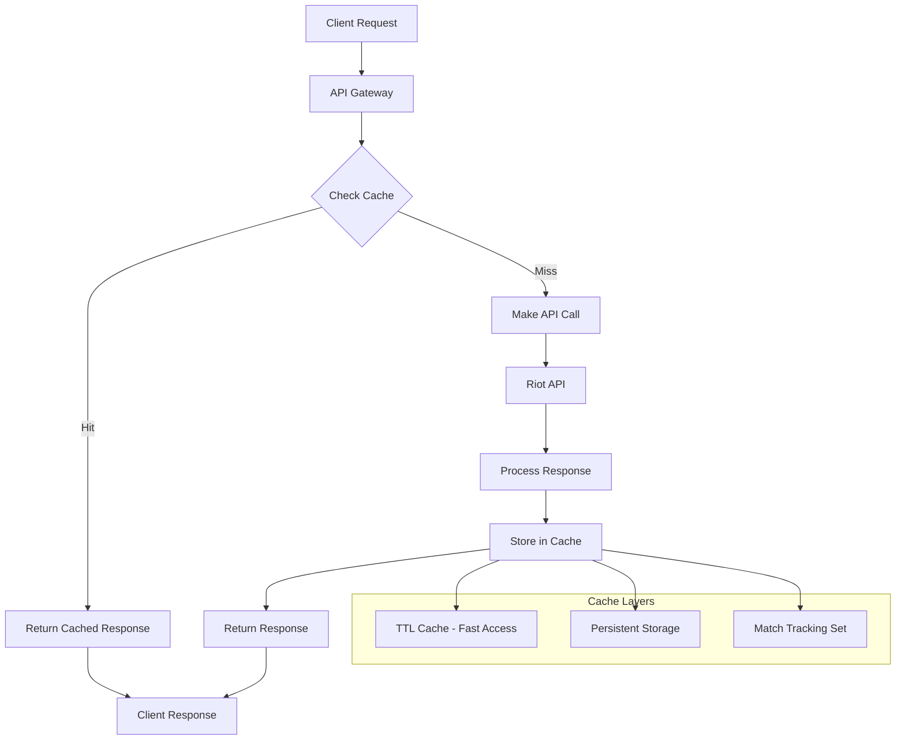

# Caching Architecture

This section details the comprehensive caching strategy implemented in the LOLStonks API Gateway, designed to optimize performance while ensuring data freshness.

> **Documentation Note**: This document describes the conceptual architecture, best practices, and potential implementations for caching. The actual implementation uses the [aiocache](https://github.com/aio-libs/aiocache) library with Redis backend. Many advanced features shown below (batch operations, cache warming, metrics) represent potential enhancements rather than current implementation.

## Overview

The caching system uses Redis as the primary caching backend with a multi-layer approach that balances performance, data freshness, and storage efficiency.

## Caching Architecture



## Cache Configuration

Configuration settings are managed through environment variables. For complete configuration documentation, see [Configuration Guide](../getting-started/configuration.md).

### Environment Variables

```env
# Redis connection settings
REDIS_HOST=localhost
REDIS_PORT=6379
REDIS_DB=0
REDIS_PASSWORD=
REDIS_POOL_SIZE=10
REDIS_POOL_TIMEOUT=30

# Cache TTL settings (in seconds)
CACHE_TTL_SUMMONER=3600     # 1 hour
CACHE_TTL_MATCH=86400       # 24 hours
CACHE_TTL_LEAGUE=1800       # 30 minutes
CACHE_TTL_MASTERY=7200      # 2 hours
CACHE_TTL_CHAMPION=604800   # 1 week
CACHE_TTL_CLASH=3600        # 1 hour
CACHE_TTL_CHALLENGES=1800   # 30 minutes

# Match tracking settings
MATCH_TRACKING_TTL=604800   # 1 week
```

### TTL Strategy

Different data types have different TTL (Time To Live) values based on their volatility:

| Data Type | TTL | Rationale |
|-----------|-----|-----------|
| Summoner Info | 1 hour | Profile data changes relatively infrequently |
| Match Data | 24 hours | Historical data never changes |
| League Data | 30 minutes | Competitive data changes frequently |
| Champion Mastery | 2 hours | Mastery scores change regularly |
| Champion Info | 1 week | Static data changes very infrequently |
| Clash Data | 1 hour | Tournament data changes during events |
| Challenges | 30 minutes | Challenge data updates frequently |

## Redis Cache Implementation

> **Actual Implementation**: The real code in `app/cache/redis_cache.py` uses `aiocache.Cache` with Redis backend, JSON serialization, and namespace prefixing. See [Implementation Details](implementation-details.md#caching-system) for actual code.

### Cache Usage Pattern

The actual implementation uses direct `cache.get()` and `cache.set()` calls in router endpoints rather than decorators. This provides explicit control and clear code flow.

## Match Tracking System

> **Implemented**: The match tracking system in `app/cache/tracking.py` uses Redis SET operations for permanent storage of processed match IDs. See [Implementation Details](implementation-details.md#match-tracking) for actual code.

### Implementation Summary

The match tracking system prevents duplicate match processing using Redis SET:
- Persistent storage of all processed match IDs per region
- No TTL (permanent storage)
- Simple operations: `is_processed()`, `mark_processed()`, `get_processed_count()`

## Cache Integration with Routers

Routers integrate caching through direct `cache.get()` and `cache.set()` operations:

1. Generate cache key from endpoint parameters
2. Check cache for existing data
3. On cache miss, fetch from provider
4. Store result in cache with appropriate TTL
5. Return data to client

See actual router implementations in `app/routers/` directory.

## Cache Performance

The actual implementation uses:
- `aiocache` library with automatic connection pooling
- Redis connection pool managed by the library
- Standard get/set operations without batch optimization
- TTL-based expiration (no active invalidation)

## Best Practices

### Cache Design Principles

1. **Appropriate TTL**: Set TTL based on data volatility
2. **Consistent Keys**: Use consistent cache key patterns
3. **Error Handling**: Graceful degradation when cache fails
4. **Monitoring**: Track cache hit rates and performance
5. **Size Management**: Monitor memory usage and implement eviction policies

### Performance Guidelines

1. **Batch Operations**: Use batch get/set operations when possible
2. **Connection Pooling**: Reuse Redis connections efficiently
3. **Async Operations**: Use async/await throughout the cache layer
4. **Cache Warming**: Proactively cache frequently accessed data
5. **Compression**: Compress large data objects before caching

### Security Considerations

1. **Access Control**: Secure Redis access with authentication
2. **Network Security**: Use secure connections for Redis
3. **Data Sanitization**: Sanitize cache keys and values
4. **Isolation**: Use separate Redis databases for different environments

The comprehensive caching strategy provides optimal performance while maintaining data consistency and supporting the high-throughput requirements of the LOLStonks API Gateway.
