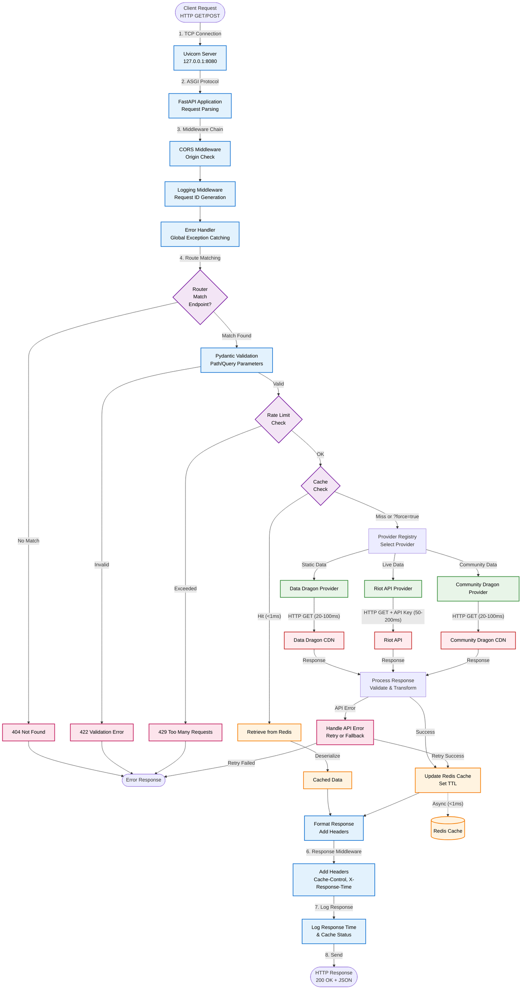
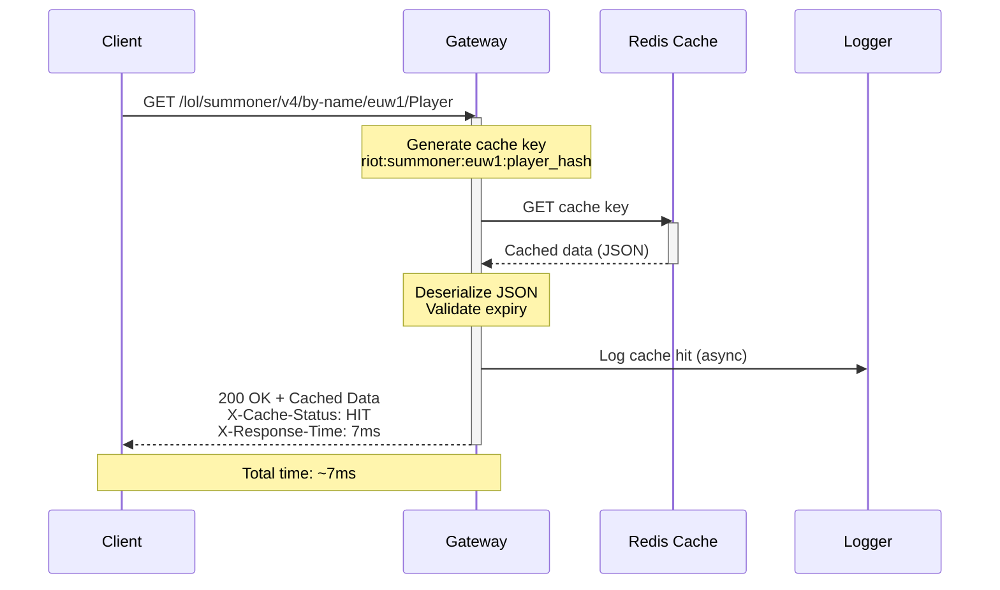
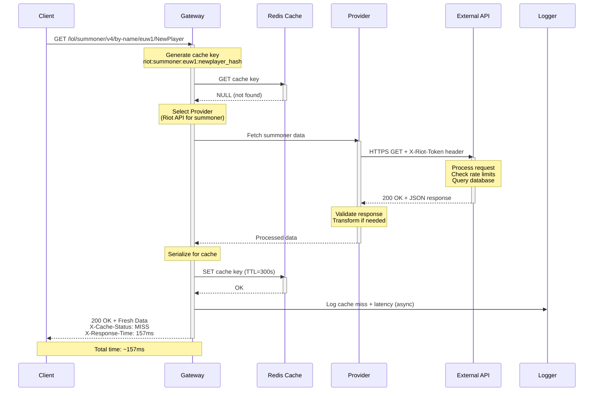
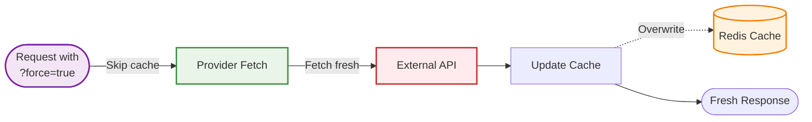
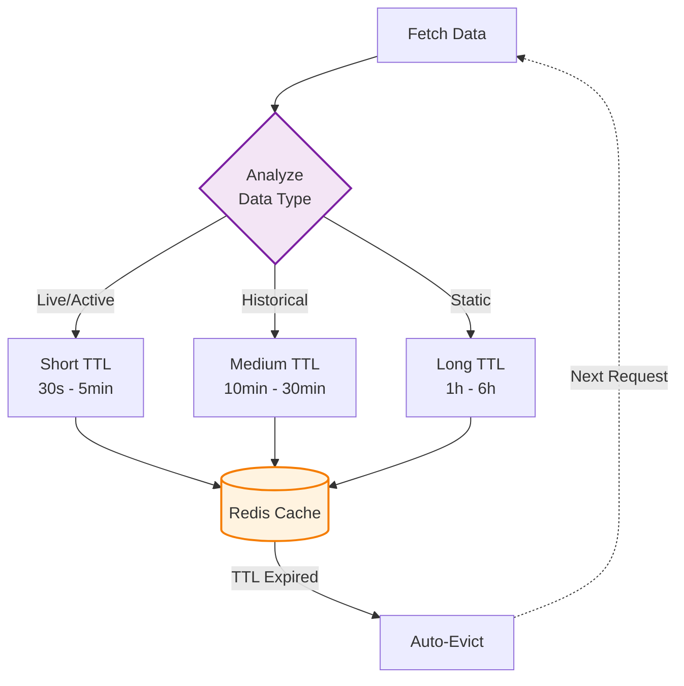
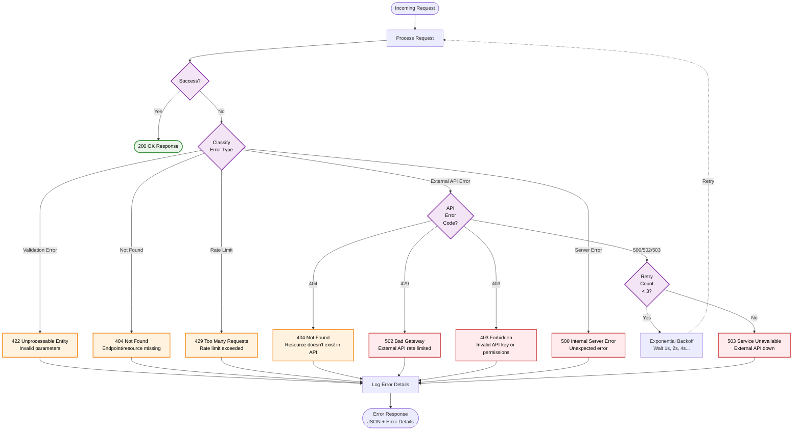
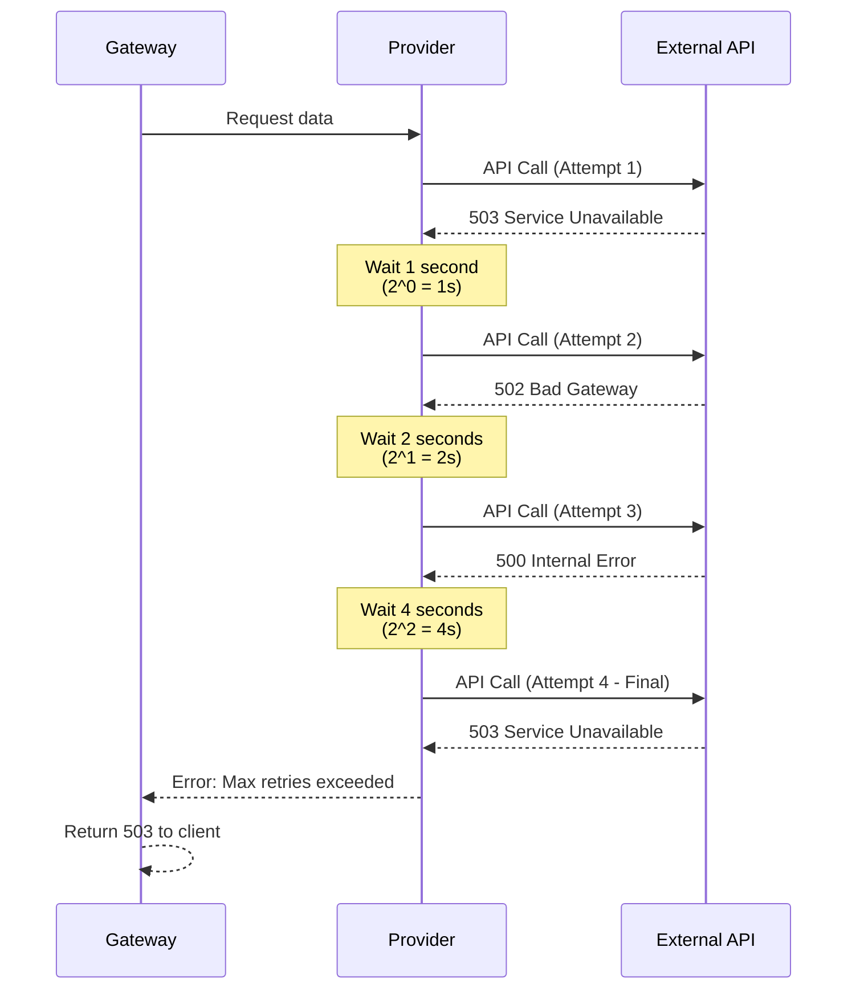
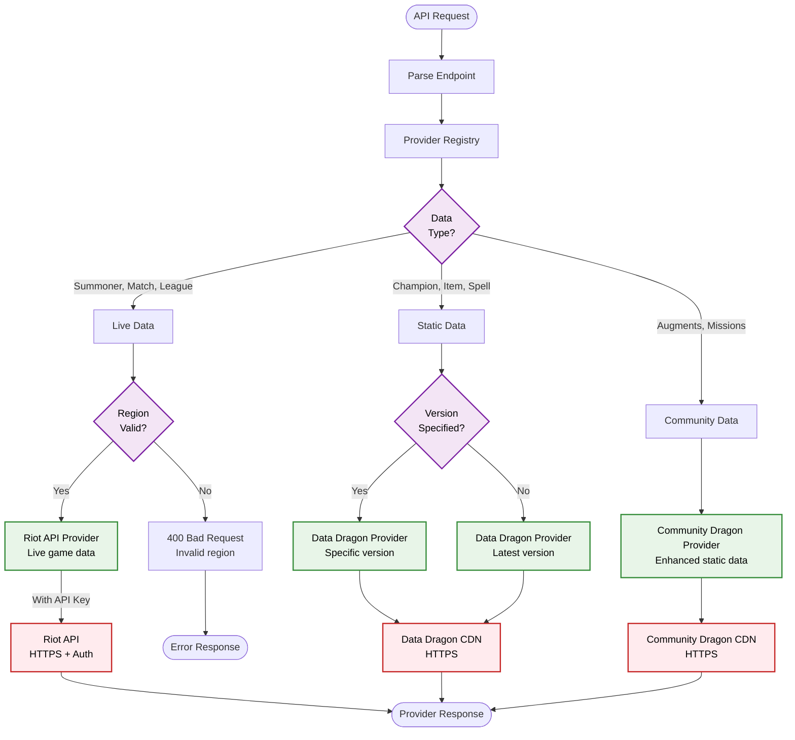
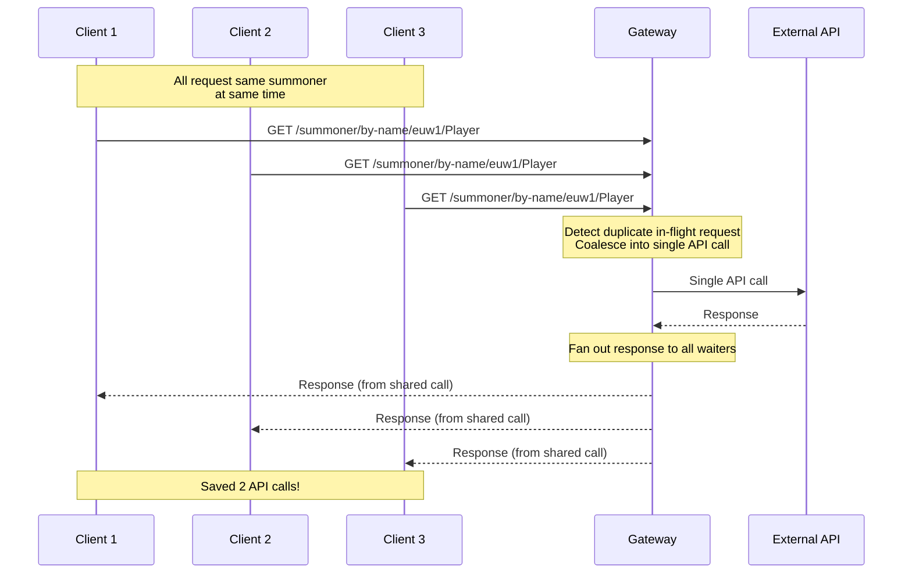
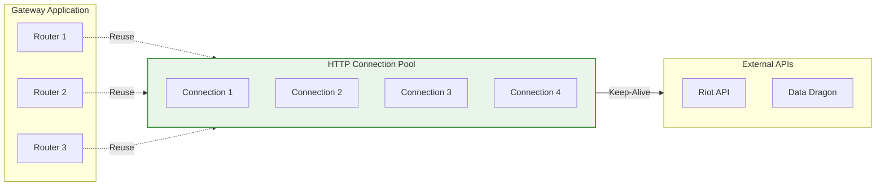

# Data Flow Architecture

> **Detailed request processing** and data flow through the lolstonks-api-gateway system

---

## Overview

This document describes how data flows through the gateway, from incoming client requests to cached responses. Understanding these flows is critical for optimizing performance, debugging issues, and maintaining the system.

---

## Complete Request Flow

### End-to-End Request Processing



### Performance Breakdown

| Step | Component | Time (Typical) | Notes |
|------|-----------|----------------|-------|
| 1 | TCP Connection | `<1ms` | Local network, very fast |
| 2 | Request Parsing | `<1ms` | FastAPI/Pydantic validation |
| 3 | Middleware Chain | `<1ms` | CORS, logging, error handler |
| 4 | Route Matching | `<1ms` | FastAPI router lookup |
| 5 | Parameter Validation | `<1ms` | Pydantic model validation |
| 6 | Rate Limit Check | `<1ms` | Redis counter check |
| **7a** | **Cache Hit** | **<1ms** | **Redis GET operation** |
| **7b** | **Cache Miss** | **50-200ms** | **External API call** |
| 8 | Response Formatting | `<1ms` | JSON serialization |
| 9 | Response Headers | `<1ms` | Header injection |
| 10 | Response Logging | `<1ms` | Async log write |

**Total Time**:
- **Cache Hit**: `<10ms` (typically `5-8ms`)
- **Cache Miss**: `60-220ms` (depends on external API latency)

---

## Cache Flow Detailed

### Cache Hit Path (Fast Path)



**Cache Key Format**:
```
{provider}:{endpoint}:{region}:{params_hash}
```

**Example Keys**:
- `riot:summoner:euw1:d4f2a1b9` (summoner by name)
- `dragon:champion:14.1.1:en_us` (champion data)
- `riot:match:europe:euw1_123456` (match details)

**Cache Headers in Response**:
```http
X-Cache-Status: HIT
X-Cache-TTL: 285
X-Response-Time: 7
Cache-Control: public, max-age=300
```

### Cache Miss Path (Slow Path)



**Cache Update Logic**:
```python
# Pseudo-code for cache update
async def cache_or_fetch(key: str, ttl: int, fetch_fn):
    # Try cache first
    cached = await redis.get(key)
    if cached and not force_refresh:
        return json.loads(cached)

    # Cache miss - fetch from provider
    data = await fetch_fn()

    # Update cache (async, don't block response)
    await redis.set(key, json.dumps(data), ex=ttl)

    return data
```

### Force Refresh Path



**Use Cases**:
- Debugging stale cache data
- Manual cache invalidation
- Testing external API changes
- Ensuring real-time data accuracy

**Example**:
```bash
# Normal request (may return cached data)
curl "http://127.0.0.1:8080/lol/summoner/v4/by-name/euw1/Player"

# Force refresh (always fetches fresh data)
curl "http://127.0.0.1:8080/lol/summoner/v4/by-name/euw1/Player?force=true"
```

---

## Cache TTL Strategy

### TTL Configuration by Data Type

| Data Type | TTL | Rationale | Example Endpoints |
|-----------|-----|-----------|-------------------|
| **Live Game Data** | 30 seconds | Changes frequently during active game | `/spectator/active-game` |
| **Player Profiles** | 5 minutes | Updates occasionally (rank, level) | `/summoner/by-name`, `/summoner/by-puuid` |
| **Match History** | 10 minutes | Recent matches may update, older stable | `/match/by-puuid` (list) |
| **Match Details** | 30 minutes | Match details don't change after completion | `/match/by-match-id` (details) |
| **Ranked Ladders** | 5 minutes | Ladder updates frequently | `/league/challenger`, `/league/entries` |
| **Champion Mastery** | 10 minutes | Updates after games | `/champion-mastery/by-puuid` |
| **Static Data** | 1 hour | Changes only with patches | `/champion/all`, `/item/all` |
| **Version Info** | 6 hours | Updates with new patches (~2 weeks) | `/version/latest` |

### Dynamic TTL Adjustment



**Configuration**:
```python
# app/core/cache_config.py
CACHE_TTL = {
    "summoner": 300,          # 5 minutes
    "match_list": 600,        # 10 minutes
    "match_details": 1800,    # 30 minutes
    "league": 300,            # 5 minutes
    "champion_data": 3600,    # 1 hour
    "spectator": 30,          # 30 seconds
}
```

---

## Error Handling Flow

### Error Propagation and Recovery



### Error Response Format

All errors follow a consistent JSON structure:

```json
{
  "error": {
    "code": "SUMMONER_NOT_FOUND",
    "message": "Summoner 'PlayerName' not found in region 'euw1'",
    "details": {
      "region": "euw1",
      "summoner_name": "PlayerName",
      "provider": "riot_api"
    },
    "request_id": "req_abc123xyz",
    "timestamp": "2025-01-24T12:00:00Z"
  }
}
```

### HTTP Status Code Mapping

| Status Code | Error Type | When It Occurs | Retry? |
|-------------|------------|----------------|--------|
| **400** | Bad Request | Malformed request syntax | No |
| **404** | Not Found | Resource doesn't exist | No |
| **422** | Unprocessable Entity | Validation error (invalid parameters) | No |
| **429** | Too Many Requests | Gateway rate limit exceeded | Yes (with backoff) |
| **403** | Forbidden | Invalid API key or permissions | No |
| **500** | Internal Server Error | Unexpected gateway error | Maybe (check logs) |
| **502** | Bad Gateway | External API error (4xx/5xx) | Yes (auto-retry) |
| **503** | Service Unavailable | External API down after retries | Yes (manual retry later) |
| **504** | Gateway Timeout | External API timeout | Yes (with backoff) |

### Retry Strategy



**Retry Configuration**:
```python
MAX_RETRIES = 3
RETRY_BACKOFF_BASE = 1.0  # seconds
RETRY_BACKOFF_MAX = 10.0  # seconds
RETRYABLE_STATUS_CODES = [500, 502, 503, 504]
```

---

## Provider Selection Flow

### Dynamic Provider Routing



### Provider Selection Logic

**Decision Table**:

| Endpoint Pattern | Data Type | Provider | Authentication | Cache TTL |
|------------------|-----------|----------|----------------|-----------|
| `/summoner/**` | Live | Riot API | API Key Required | 5 min |
| `/match/**` | Live | Riot API | API Key Required | 10-30 min |
| `/league/**` | Live | Riot API | API Key Required | 5 min |
| `/spectator/**` | Live | Riot API | API Key Required | 30 sec |
| `/champion-mastery/**` | Live | Riot API | API Key Required | 10 min |
| `/champion/**` | Static | Data Dragon | Public | 1 hour |
| `/item/**` | Static | Data Dragon | Public | 1 hour |
| `/spell/**` | Static | Data Dragon | Public | 1 hour |
| `/augments/**` | Static | Community Dragon | Public | 1 hour |
| `/missions/**` | Community | Community Dragon | Public | 1 hour |

**Code Example**:
```python
async def select_provider(endpoint: str, region: str) -> BaseProvider:
    if endpoint.startswith("/lol/summoner"):
        return RiotAPIProvider(region=region, api_key=settings.RIOT_API_KEY)
    elif endpoint.startswith("/lol/static/champion"):
        return DataDragonProvider(version="latest", locale="en_US")
    elif endpoint.startswith("/lol/community"):
        return CommunityDragonProvider(version="latest")
    else:
        raise ValueError(f"No provider for endpoint: {endpoint}")
```

---

## Regional Routing

### Region Mapping and Validation

```mermaid
flowchart TD
    request([Request with Region]) --> validate{Region<br/>Valid?}

    validate -->|Invalid| error[400 Bad Request<br/>Invalid region code]
    error --> error_response([Error Response])

    validate -->|Valid| map[Map to API Region]

    map --> platform{Platform<br/>Region?}

    platform -->|Americas| americas[americas.api.riotgames.com<br/>na1, br1, la1, la2]
    platform -->|Europe| europe[europe.api.riotgames.com<br/>euw1, eun1, tr1, ru]
    platform -->|Asia| asia[asia.api.riotgames.com<br/>kr, jp1, oc1, ph2, sg2, th2, tw2, vn2]
    platform -->|SEA| sea[sea.api.riotgames.com<br/>ph2, sg2, th2, tw2, vn2]

    americas --> endpoint[Platform-Specific Endpoint]
    europe --> endpoint
    asia --> endpoint
    sea --> endpoint

    endpoint -->|Add Region Header| headers[X-Region: {region}]
    headers --> call[Make API Call]
    call --> response([API Response])

    classDef decision fill:#f3e5f5,stroke:#7b1fa2,stroke-width:2px,color:#000
    classDef provider fill:#e8f5e8,stroke:#388e3c,stroke-width:2px,color:#000
    classDef error fill:#ffebee,stroke:#c62828,stroke-width:2px,color:#000

    class validate,platform decision
    class americas,europe,asia,sea,endpoint,headers,call provider
    class error error
```

### Region Configuration

**Platform Routing Table**:

| Platform | Regions | API Domain |
|----------|---------|------------|
| **Americas** | `na1`, `br1`, `la1`, `la2` | `americas.api.riotgames.com` |
| **Europe** | `euw1`, `eun1`, `tr1`, `ru` | `europe.api.riotgames.com` |
| **Asia** | `kr`, `jp1`, `oc1` | `asia.api.riotgames.com` |
| **SEA** | `ph2`, `sg2`, `th2`, `tw2`, `vn2` | `sea.api.riotgames.com` |

**Regional Aliases**:
```python
REGION_ALIASES = {
    "euw": "euw1",
    "eune": "eun1",
    "na": "na1",
    "br": "br1",
    "lan": "la1",
    "las": "la2",
    "oce": "oc1",
}
```

---

## Performance Optimization

### Request Coalescing

**Problem**: Multiple simultaneous requests for the same data cause redundant API calls.

**Solution**: Request coalescing (deduplication).



### Compression

**Response Compression**: Reduce bandwidth for large responses.

```http
# Request
GET /lol/champion/all
Accept-Encoding: gzip, deflate

# Response
HTTP/1.1 200 OK
Content-Type: application/json
Content-Encoding: gzip
Content-Length: 15234 (original: 68451)
```

**Compression Savings**:
- Champion data: `~78% reduction` (68KB → 15KB)
- Match details: `~65% reduction` (120KB → 42KB)
- Match lists: `~70% reduction` (50KB → 15KB)

### Connection Pooling



**Configuration**:
```python
# httpx client configuration
httpx.AsyncClient(
    limits=httpx.Limits(
        max_keepalive_connections=20,
        max_connections=100,
        keepalive_expiry=30.0
    )
)
```

**Benefits**:
- Eliminates TCP handshake overhead (`~50ms`)
- Reuses SSL/TLS sessions
- Reduces server load

---

## Cross-References

### Related Documentation

- **[System Overview](./system-overview.md)** - High-level architecture
- **[Routing Architecture](./routing.md)** - API endpoint organization
- **[Caching Strategy](caching.md)** - Detailed cache configuration
- **[Provider Documentation](providers.md)** - Provider implementations
- **[Rate Limiting](../rate-limiting/)** - Rate limit configuration

### Implementation Files

- `app/main.py` - FastAPI application and middleware
- `app/routers/` - Router implementations
- `app/providers/` - Provider implementations
- `app/core/cache.py` - Cache logic
- `app/core/rate_limiter.py` - Rate limiting
- `app/middleware/` - Custom middleware

---

## Monitoring Checklist

Use this checklist to monitor data flow health:

- [ ] **Cache Hit Rate**: Should be `>70%` in steady state
- [ ] **Response Time P95**: Should be `<50ms` for cache hits, `<300ms` for cache misses
- [ ] **Error Rate**: Should be `<1%` overall
- [ ] **Rate Limit Errors**: Should be `<0.1%` (indicates proper cache usage)
- [ ] **External API Latency**: Monitor for degradation
- [ ] **Redis Connection**: Check for connection pool exhaustion
- [ ] **Request Coalescing**: Verify deduplication is working

---

**Last Updated**: 2025-01-24

**Next Steps**:
1. Review [Routing Architecture](./routing.md) for endpoint organization
2. Explore [Caching Strategy](caching.md) for detailed TTL configuration
3. Check [Provider Documentation](providers.md) for implementation details
