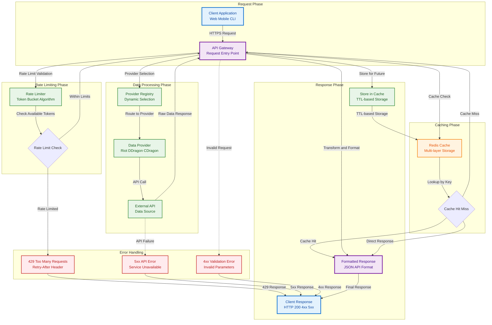
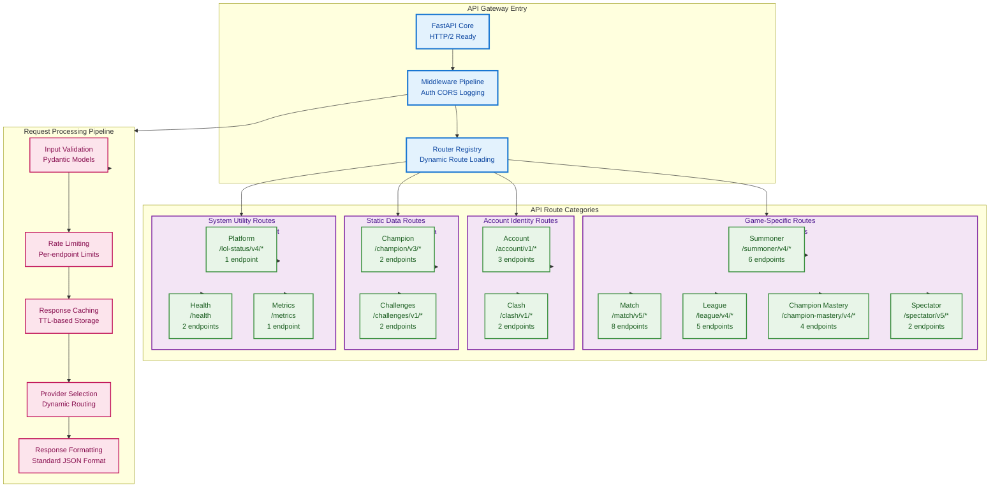

# Architecture Overview

This section provides a comprehensive overview of the LOLStonks API Gateway architecture, its components, and design principles.

##  Architecture Navigation

This overview has been restructured into **focused, interactive diagrams** for better readability and navigation:

###  Core Architecture Diagrams

1. **[System Overview](system-overview.md)** - High-level system architecture with all major components
2. **[Data Flow Architecture](data-flow.md)** - Detailed request processing and caching flow
3. **[Provider Architecture](providers.md)** - Multi-provider abstraction layer
4. **[Security & Error Handling](security.md)** - Security layers and error recovery
5. **[Router Architecture](routing.md)** - API routing and regional management
6. **[Production Deployment](production-deployment.md)** - Production-ready deployment architecture

###  Interactive Features

All diagrams now include:
- **� Zoom and pan controls** - Navigate large diagrams easily
- **�️ Click interactions** - Click nodes for detailed information
- **� Responsive design** - Works on mobile and desktop
- ** Fullscreen mode** - Immersive diagram exploration
- ** Performance annotations** - Real-world timing and scaling data

---

## Multi-Source Architecture

The LOLStonks API Gateway has evolved into a **comprehensive data integration platform** supporting three distinct data sources:

### Supported Providers

| Provider | Type | Endpoints | Auth Required | Description |
|----------|------|-----------|---------------|-------------|
| **Riot API** | Live Data | 40+ | ✅ Yes | Real-time game data from Riot Developer Portal |
| **Data Dragon** | Static Data | 14 | ❌ No | Static game assets from Riot's CDN |
| **Community Dragon** | Enhanced Static | 22 | ❌ No | Community-maintained enhanced data |

**Total: 76+ endpoints with comprehensive API coverage**

### Provider Abstraction Layer

All providers implement a common `BaseProvider` interface, enabling consistent interaction patterns:

```python
class BaseProvider(ABC):
    @abstractmethod
    async def get(self, path: str, params: dict, headers: dict):
        """Make API request to the provider."""

    @abstractmethod
    async def health_check(self) -> bool:
        """Check provider availability."""

    @property
    @abstractmethod
    def provider_type(self) -> ProviderType:
        """Return the provider type."""
```

### Provider Registry

The `ProviderRegistry` singleton manages all provider instances and enables dynamic provider lookup:

```python
from app.providers.registry import get_provider
from app.providers.base import ProviderType

# Get specific provider
riot_provider = get_provider(ProviderType.RIOT_API)
ddragon_provider = get_provider(ProviderType.DATA_DRAGON)
```

## High-Level Architecture

### Comprehensive Multi-Provider Architecture

The LOLStonks API Gateway v2.0 has evolved into a comprehensive data integration platform supporting three distinct data sources with unified access patterns.

### System Architecture Diagram

```mermaid
flowchart TD
    %% Client Layer
    subgraph ClientLayer["Client Applications"]
        WebApp["Web Application<br/>React Vue Frontend"]
        MobileApp["Mobile App<br/>iOS Android"]
        CLI["CLI Tool<br/>Python Node.js"]
        External["External Service<br/>Third-party Integration"]
    end

    %% Gateway Core
    subgraph GatewayCore["LOLStonks API Gateway v2.0"]
        Gateway["FastAPI Core<br/>Async HTTP Server"]

        %% Middleware Layer
        subgraph MiddlewareLayer["Middleware Layer"]
            RateLimiter["Rate Limiter<br/>20 req/s, 100 burst"]
            Cache["Cache Manager<br/>Redis Integration"]
            HealthCheck["Health Monitor<br/>Real-time Status"]
            Security["Security Layer<br/>Auth and Validation"]
            CORS["CORS Handler<br/>Cross-origin Support"]
        end

        %% Provider Abstraction
        subgraph ProviderAbstraction["Provider Abstraction Layer"]
            Registry["Provider Registry<br/>Dynamic Provider Management"]

            subgraph ProviderImplementations["Data Providers"]
                RiotProvider["Riot API Provider<br/>40+ endpoints<br/>Live Game Data"]
                DataDragonProvider["Data Dragon Provider<br/>14 endpoints<br/>Static Assets"]
                CommunityDragonProvider["Community Dragon Provider<br/>22 endpoints<br/>Enhanced Data"]
            end
        end

        %% API Routing
        subgraph RoutingLayer["API Routing Layer"]
            RiotRoutes["Riot API Routes<br/>/riot/v1/*"]
            DDRoutes["Data Dragon Routes<br/>/ddragon/v1/*"]
            CDRoutes["Community Dragon Routes<br/>/cdragon/v1/*"]
            HealthRoutes["Health Routes<br/>/health"]
            SecurityRoutes["Security Routes<br/>/security/*"]
        end
    end

    %% External Data Sources
    subgraph DataSources["External Data Sources"]
        RiotAPI["Riot Developer API<br/>Rate Limited: 20/s<br/>Live Game Data"]
        DataDragonCDN["Data Dragon CDN<br/>Static Content Delivery<br/>Champion Item Assets"]
        CommunityDragonAPI["Community Dragon API<br/>Community-maintained<br/>Enhanced Media"]
    end

    %% Infrastructure Services
    subgraph Infrastructure["Infrastructure and Monitoring"]
        RedisCluster["Redis Cluster<br/>Primary Cache and Session Store"]
        Monitoring["Monitoring Stack<br/>Prometheus + Grafana"]
        LoadBalancer["Load Balancer<br/>Nginx HAProxy"]
        Logging["Centralized Logging<br/>ELK Stack"]
    end

    %% Client Connections
    WebApp --> |HTTPS REST| Gateway
    MobileApp --> |HTTPS REST| Gateway
    CLI --> |HTTPS CLI| Gateway
    External --> |HTTPS API Key| Gateway

    %% Gateway Internal Flow
    Gateway --> |Middleware Pipeline| MiddlewareLayer
    Gateway --> |Request Routing| RoutingLayer
    Gateway --> |Provider Selection| ProviderAbstraction

    %% Middleware Connections
    MiddlewareLayer --> |Rate Validation| RateLimiter
    MiddlewareLayer --> |Cache Strategy| Cache
    MiddlewareLayer --> |Health Checks| HealthCheck
    MiddlewareLayer --> |Security Policies| Security
    MiddlewareLayer --> |CORS Rules| CORS

    %% Provider Registry Flow
    Registry --> |Runtime Selection| RiotProvider
    Registry --> |Runtime Selection| DataDragonProvider
    Registry --> |Runtime Selection| CommunityDragonProvider

    %% Provider to External Services
    RiotProvider --> |Authenticated API Calls| RiotAPI
    DataDragonProvider --> |CDN Asset Requests| DataDragonCDN
    CommunityDragonProvider --> |Enhanced API Calls| CommunityDragonAPI

    %% Infrastructure Dependencies
    Cache --> |Data Storage and Retrieval| RedisCluster
    HealthCheck --> |Health Status Store| RedisCluster
    Security --> |Session Storage| RedisCluster
    HealthCheck --> |Metrics Export| Monitoring
    Security --> |Security Events| Logging

    %% Simplified Styling
    classDef clientStyle fill:#e3f2fd,stroke:#1976d2,stroke-width:3px,color:#0d47a1
    classDef gatewayStyle fill:#f3e5f5,stroke:#7b1fa2,stroke-width:3px,color:#4a148c
    classDef providerStyle fill:#e8f5e8,stroke:#388e3c,stroke-width:3px,color:#1b5e20
    classDef externalStyle fill:#fff3e0,stroke:#f57c00,stroke-width:3px,color:#e65100
    classDef infraStyle fill:#fce4ec,stroke:#c2185b,stroke-width:3px,color:#880e4f

    class WebApp,MobileApp,CLI,External clientStyle
    class Gateway,RateLimiter,Cache,HealthCheck,Security,CORS,Registry,RiotProvider,DataDragonProvider,CommunityDragonProvider,RiotRoutes,DDRoutes,CDRRoutes,HealthRoutes,SecurityRoutes gatewayStyle
    class RiotAPI,DataDragonCDN,CommunityDragonAPI externalStyle
    class RedisCluster,Monitoring,LoadBalancer,Logging infraStyle
```



### Request Flow Patterns

#### Simplified Request Flow



## Core Components

### 1. FastAPI Application (`app.main`)

The main entry point that provides:
- **Async HTTP server** with automatic documentation
- **Request routing** to appropriate API endpoints
- **Middleware** for request processing and error handling
- **OpenAPI specification** generation

**Key Features:**
- Automatic request/response validation
- Interactive API documentation (Swagger UI, ReDoc)
- High performance async request handling
- Built-in support for CORS, middleware, and dependency injection

### 2. Provider Registry (`app.providers.registry`)

Central management system for all data source providers:

```python
class ProviderRegistry:
    """
    Singleton registry for managing all data providers.

    Features:
    - Dynamic provider registration
    - Provider lifecycle management
    - Health monitoring for all providers
    - Unified interface for multi-provider support
    """
```

**Provider Types:**
- **Riot API Provider**: Live game data, match history, summoner information
- **Data Dragon Provider**: Static game data (champions, items, runes)
- **Community Dragon Provider**: Enhanced static data with additional assets

### 3. Provider Abstraction Layer (`app.providers.base`)

Common interface for all data providers:

```python
class BaseProvider(ABC):
    @abstractmethod
    async def get(self, path: str, params: dict, headers: dict):
        """Make API request to the provider."""

    @abstractmethod
    async def health_check(self) -> ProviderHealth:
        """Check provider availability and performance."""

    @property
    @abstractmethod
    def provider_type(self) -> ProviderType:
        """Return the provider type identifier."""
```

### 4. Specialized Providers (`app.providers.*`)

#### Riot API Provider
- **Authentication**: API key management and rotation
- **Rate Limiting**: Token bucket algorithm compliant with Riot's limits
- **Retry Logic**: Exponential backoff for 429 responses
- **Region Management**: Dynamic routing to regional endpoints

#### Data Dragon Provider
- **CDN Integration**: Direct access to Riot's static asset CDN
- **Version Management**: Support for multiple game versions
- **Language Support**: Multi-language static data
- **Cache Optimization**: Long-term caching for immutable data

#### Community Dragon Provider
- **Enhanced Assets**: Access to community-maintained enhanced data
- **TFT Support**: Teamfight Tactics data and assets
- **High-Quality Media**: Superior image and audio assets
- **Extended Information**: Additional game metadata

### 3. Rate Limiter (`app.riot.rate_limiter`)

Implements sophisticated rate limiting using the token bucket algorithm:

```python
class RateLimiter:
    """
    Token bucket rate limiter for Riot API compliance.

    - Configurable requests per second (RPS)
    - Burst capacity handling
    - Automatic token refill
    """
```

**Algorithm:**
- **Tokens**: Available request capacity
- **Refill Rate**: Tokens added per second
- **Burst Capacity**: Maximum token accumulation
- **Wait Strategy**: Queue requests when tokens exhausted

### 4. Redis Cache (`app.cache.redis_cache`)

High-performance caching layer:

```python
class RedisCache:
    """
    Redis-based caching with TTL support.

    - Automatic TTL management
    - Connection pooling
    - Error handling and fallbacks
    """
```

**Cache Strategy:**
- **TTL-based Expiration**: Different TTLs per data type
- **Intelligent Key Generation**: Consistent cache key patterns
- **Connection Pooling**: Efficient Redis connection management
- **Graceful Degradation**: Continue operation when cache unavailable

### 5. Match Tracking (`app.cache.tracking`)

Prevents duplicate match processing:

```python
class MatchTracker:
    """
    Match tracking service to prevent duplicate processing.

    - TTL cache for recent matches
    - Persistent set for all processed matches
    - Automatic cleanup of expired entries
    """
```

**Dual Storage Approach:**
- **TTL Cache**: Fast lookup for recent matches (1 week)
- **Persistent Set**: Complete record of all processed matches
- **Automatic Cleanup**: Removal of expired TTL entries

## API Router Architecture

### Router Organization



### Router Responsibilities

Each router handles:
- **Path Parameter Validation**: Pydantic models for route parameters
- **Query Parameter Handling**: Optional parameters and defaults
- **Response Transformation**: Standardized response format
- **Error Handling**: Consistent error responses
- **Caching Integration**: Automatic cache integration per endpoint

### Example Router Structure

```python
# app/routers/summoner.py
router = APIRouter(prefix="/summoner", tags=["summoner"])

@router.get("/by-name/{summonerName}")
async def get_summoner_by_name(
    summonerName: str,
    region: str = Query(default="euw1"),
    riot_client: RiotClient = Depends(),
    cache: RedisCache = Depends()
) -> SummonerDto:
    """Get summoner by summoner name."""
    # Implementation with caching and error handling
```

## Data Flow Architecture

### Request Processing Flow

```mermaid
sequenceDiagram
    participant Client as Client Application<br/>Web Mobile CLI
    participant Gateway as API Gateway<br/>FastAPI Core
    participant RateLimiter as Rate Limiter<br/>Token Bucket (20/s)
    participant Cache as Redis Cache<br/>TTL Storage
    participant Validation as Input Validator<br/>Pydantic Models
    participant Provider as Provider Registry<br/>Dynamic Selection
    participant RiotClient as Riot HTTP Client<br/>Authenticated API Calls
    participant RiotAPI as Riot Developer API<br/>Rate Limited: 20/s

    %% Initial Request Phase
    Client->>+Gateway: HTTPS Request<br/>GET /summoner/v4/summoners/by-name/{name}
    Gateway->>+Validation: Validate Input<br/>Parameters, Headers, Auth

    alt Validation Failed
        Validation-->>-Gateway: ValidationError<br/>400 Bad Request
        Gateway-->>-Client: HTTP 400<br/>Invalid Parameters
    else Validation Passed
        Validation-->>-Gateway: ValidationOK<br/>Sanitized Request
        Gateway->>+RateLimiter: Check Rate Limits<br/>Token Bucket Check

        alt Rate Limit Exceeded
            RateLimiter-->>-Gateway: RateLimited<br/>429 Too Many Requests
            Gateway-->>-Client: HTTP 429<br/>Retry-After: X seconds
        else Rate Limit OK
            RateLimiter-->>-Gateway: RateLimitOK<br/>Token Consumed
            Gateway->>+Cache: Check Cache<br/>lol:summoner:euw1:{name}

            alt Cache Hit
                Cache-->>-Gateway: CacheHit<br/>Cached Data (<5ms)
                Gateway-->>-Client: HTTP 200<br/>Cached Response
                Note over Client,Cache: Fast Path: <10ms total latency
            else Cache Miss
                Cache-->>Gateway: CacheMiss<br/>No Cached Data
                Gateway->>+Provider: Select Provider<br/>Route to Riot Provider
                Provider-->>-Gateway: ProviderSelected<br/>Riot API Provider
                Gateway->>+RiotClient: Make API Request<br/>With Authentication Headers
                RiotClient->>+RiotAPI: HTTP GET Request<br/>Authenticated API Call

                alt API Success
                    RiotAPI-->>-RiotClient: HTTP 200 Response<br/>Summoner Data
                    RiotClient-->>-Gateway: ProcessResponse<br/>Transform and Validate
                    Gateway->>Cache: Store in Cache<br/>TTL: 1 hour
                    Cache-->>-Gateway: StoredSuccessfully<br/>Future Cache Hits
                    Gateway-->>-Client: HTTP 200<br/>Fresh Data Response
                    Note over Client,RiotAPI: Slow Path: 50-200ms total latency
                else API Error
                    RiotAPI-->>-RiotClient: HTTP Error<br/>4xx/5xx Response

                    alt Rate Limited by Riot
                        RiotClient-->>-Gateway: RateLimitedError<br/>429 from Riot API
                        Gateway-->>-Client: HTTP 503<br/>Service Temporarily Unavailable
                        Note over Client,RiotAPI: Retry Logic: Exponential Backoff
                    else Server Error
                        RiotClient-->>-Gateway: ServerError<br/>5xx from Riot API
                        Gateway-->>-Client: HTTP 502<br/>Bad Gateway
                    else Client Error
                        RiotClient-->>-Gateway: ClientError<br/>4xx from Riot API
                        Gateway-->>-Client: HTTP 404<br/>Resource Not Found
                end
                end
            end
        end
    end

    %% Cleanup and Finalization
    Gateway->>RateLimiter: End Request<br/>Release Resources
    RateLimiter-->>Gateway: Reset State<br/>Ready for Next Request

    %% Performance Notes
    Note over Client,RiotAPI: Performance Characteristics:
    Note over Client,RiotAPI: Cache Hit: <10ms (95% of requests)
    Note over Client,RiotAPI: Cache Miss: 50-200ms (5% of requests)
    Note over Client,RiotAPI: Rate Limit Check: <1ms (every request)
    Note over Client,RiotAPI: Validation: <1ms (every request)
    Note over Client,RiotAPI: Error Rate: <1% (monitoring alert at >5%)
```

### Caching Strategy

**Cache Key Pattern:**
```
lolstonks:{endpoint}:{region}:{identifier}
```

**TTL Configuration:**
- **Summoner Data**: 1 hour (relatively stable)
- **Match Data**: 24 hours (historical data)
- **League Data**: 30 minutes (competitive data)
- **Champion Data**: 1 week (static data)

### Error Handling Flow

```mermaid
flowchart TD
    %% Request Entry and Validation
    subgraph ValidationPhase["Validation Phase"]
        Request["Incoming Request<br/>HTTP GET/POST"]
        InputValidation["Input Validation<br/>Pydantic Models"]
        ValidationDecision{"Input Valid?"}
        ValidationError["Validation Error<br/>400 Bad Request<br/>Invalid Parameters"]
    end

    %% Rate Limiting Phase
    subgraph RateLimitingPhase["Rate Limiting Phase"]
        RateLimitCheck["Rate Limit Check<br/>Token Bucket (20/s)"]
        RateLimitDecision{"Within Limits?"}
        RateLimitExceeded["Rate Limit Exceeded<br/>429 Too Many Requests<br/>Retry-After Header"]
    end

    %% Caching Phase
    subgraph CachingPhase["Caching Phase"]
        CacheHealthCheck["Cache Health Check<br/>Redis Connection"]
        CacheAvailable{"Cache Available?"}
        CacheLookup["Cache Lookup<br/>`lol:{endpoint}:{region}:{id}`"]
        CacheHitDecision{"Cache Hit?"}
        CachedResponse["Cached Response<br/>HTTP 200 (<5ms)"]
        CacheFailure["Cache Failure<br/>Continue to API"]
    end

    %% API Request Phase
    subgraph APIPhase["API Request Phase"]
        ProviderSelection["Provider Selection<br/>Dynamic Routing"]
        APIRequest["External API Request<br/>Authenticated HTTP Call"]
        APIResponse["API Response<br/>HTTP Status Code"]
        APISuccessDecision{"API Success?"}
    end

    %% Error Classification and Handling
    subgraph ErrorHandlingPhase["Error Classification"]
        ErrorClassification{"Error Type?"}
        RateLimitFromAPI["429 from API<br/>Retry-After: Xs"]
        ClientError["4xx Client Error<br/>Bad Request/Unauthorized"]
        NotFoundError["404 Not Found<br/>Resource Missing"]
        ServerError["5xx Server Error<br/>Service Unavailable"]
        TimeoutError["Request Timeout<br/>408/504 Gateway"]
        NetworkError["Network Failure<br/>Connection Lost"]
    end

    %% Recovery and Retry Logic
    subgraph RecoveryPhase["Recovery & Retry"]
        RetryWithBackoff["Retry with Backoff<br/>Exponential: 1s, 2s, 4s, 8s"]
        MaxRetriesReached["Max Retries Reached<br/>After 4 attempts"]
        CircuitBreaker["Circuit Breaker<br/>Open for 30s"]
    end

    %% Success Processing
    subgraph SuccessPhase["Success Processing"]
        ProcessResponse["Process Response<br/>Transform and Validate"]
        StoreInCache["Store in Cache<br/>TTL: Per Endpoint"]
        SuccessResponse["Success Response<br/>HTTP 200 + Data"]
        ClientFinalResponse["Client Response<br/>Formatted JSON"]
    end

    %% Final Error Response
    subgraph ErrorFinalPhase["Error Response Phase"]
        FormatErrorResponse["Format Error Response<br/>Standard Error Format"]
        LogError["Log Error Details<br/>Structured Logging"]
        SendErrorAlert["Send Error Alert<br/>High Severity Only"]
        ErrorFinalResponse["Error Response<br/>Appropriate HTTP Code"]
    end

    %% Primary Flow
    Request --> InputValidation
    InputValidation --> ValidationDecision

    %% Validation Paths
    ValidationDecision --> | Invalid| ValidationError
    ValidationDecision --> | Valid| RateLimitCheck

    %% Rate Limiting Flow
    RateLimitCheck --> RateLimitDecision
    RateLimitDecision --> | Exceeded| RateLimitExceeded
    RateLimitDecision --> | Within Limits| CacheHealthCheck

    %% Cache Flow
    CacheHealthCheck --> CacheAvailable
    CacheAvailable --> | Unavailable| CacheFailure
    CacheAvailable --> | Available| CacheLookup
    CacheLookup --> CacheHitDecision

    %% Cache Decision Paths
    CacheHitDecision --> | Hit| CachedResponse
    CacheHitDecision --> | Miss| ProviderSelection
    CacheFailure --> | Bypass| ProviderSelection

    %% API Request Flow
    ProviderSelection --> APIRequest
    APIRequest --> APIResponse
    APIResponse --> APISuccessDecision

    %% API Success/Error Decision
    APISuccessDecision --> | Success| ProcessResponse
    APISuccessDecision --> | Error| ErrorClassification

    %% Error Classification
    ErrorClassification --> |429| RateLimitFromAPI
    ErrorClassification --> |401-403| ClientError
    ErrorClassification --> |404| NotFoundError
    ErrorClassification --> |5xx| ServerError
    ErrorClassification --> |408/504| TimeoutError
    ErrorClassification --> |Network| NetworkError

    %% Retry Logic
    RateLimitFromAPI --> RetryWithBackoff
    ServerError --> RetryWithBackoff
    TimeoutError --> RetryWithBackoff
    NetworkError --> RetryWithBackoff
    RetryWithBackoff --> || APIRequest

    %% Retry Limits
    RetryWithBackoff --> | Wait| APIRequest
    RetryWithBackoff --> | Limit Reached| MaxRetriesReached
    MaxRetriesReached --> CircuitBreaker
    CircuitBreaker --> | Open| FormatErrorResponse

    %% Success Processing
    ProcessResponse --> StoreInCache
    StoreInCache --> SuccessResponse
    SuccessResponse --> ClientFinalResponse
    CachedResponse --> ClientFinalResponse

    %% Error Final Processing
    ValidationError --> FormatErrorResponse
    RateLimitExceeded --> FormatErrorResponse
    ClientError --> FormatErrorResponse
    NotFoundError --> FormatErrorResponse
    MaxRetriesReached --> FormatErrorResponse

    FormatErrorResponse --> LogError
    FormatErrorResponse --> SendErrorAlert
    LogError --> ErrorFinalResponse
    SendErrorAlert --> ErrorFinalResponse

    %% Professional Styling
    classDef validationStyle fill:#e3f2fd,stroke:#1976d2,stroke-width:3px,color:#0d47a1
    classDef processingStyle fill:#e8f5e8,stroke:#388e3c,stroke-width:2px,color:#1b5e20
    classDef cacheStyle fill:#fff3e0,stroke:#f57c00,stroke-width:2px,color:#e65100
    classDef errorStyle fill:#ffebee,stroke:#c62828,stroke-width:3px,color:#b71c1c
    classDef successStyle fill:#e8f5e8,stroke:#2e7d32,stroke-width:3px,color:#1b5e20
    classDef decisionStyle fill:#f3e5f5,stroke:#7b1fa2,stroke-width:2px,color:#4a148c
    classDef retryStyle fill:#fff8e1,stroke:#ffa000,stroke-width:2px,color:#f57c00

    class Request,InputValidation validationStyle
    class RateLimitCheck,CacheHealthCheck,ProviderSelection,APIRequest,ProcessResponse,StoreInCache processingStyle
    class CacheLookup,CachedResponse cacheStyle
    class ValidationError,RateLimitExceeded,ClientError,NotFoundError,ServerError,TimeoutError,NetworkError,MaxRetriesReached,CircuitBreaker errorStyle
    class SuccessResponse,ClientFinalResponse successStyle
    class ValidationDecision,RateLimitDecision,CacheAvailable,CacheHitDecision,APISuccessDecision,ErrorClassification decisionStyle
    class RetryWithBackoff retryStyle

    %% Performance Annotations
    CacheHitDecision -.-> | <5ms response | CachedResponse
    InputValidation -.-> | <1ms validation | ValidationDecision
    RateLimitCheck -.-> | <1ms check | RateLimitDecision
    ErrorClassification -.-> | <10ms classification | FormatErrorResponse
```

## Configuration Architecture

### Configuration Hierarchy

1. **Environment Variables**: Primary configuration source
2. `.env` File: Local development configuration
3. **Defaults**: Built-in fallback values
4. **Runtime**: Dynamic configuration updates

### Configuration Management

```python
# app/config.py
class Settings(BaseSettings):
    """Configuration settings with environment variable support."""

    # Riot API Configuration
    riot_api_key: str
    riot_default_region: str = "euw1"

    # Server Configuration
    host: str = "0.0.0.0"
    port: int = 8080
    log_level: str = "INFO"

    # Redis Configuration
    redis_host: str = "localhost"
    redis_port: int = 6379

    class Config:
        env_file = ".env"
        case_sensitive = False
```

## Performance Architecture

### Performance Optimizations

1. **Async Processing**: Non-blocking I/O throughout the stack
2. **Connection Pooling**: Efficient database and HTTP connections
3. **Intelligent Caching**: Multi-layer caching strategy
4. **Rate Limiting**: Protects against API abuse and ensures compliance
5. **Batch Operations**: Support for concurrent requests

### Scalability Considerations

- **Horizontal Scaling**: Stateless design allows multiple instances
- **Redis Cluster**: Support for distributed caching
- **Load Balancing**: Compatible with standard load balancers
- **Monitoring**: Built-in health checks and metrics

## Security Architecture

### Security Layers

1. **API Key Management**: Secure storage and rotation of Riot API keys
2. **Input Validation**: Comprehensive request validation using Pydantic
3. **Rate Limiting**: Protection against abuse and DoS attacks
4. **Error Sanitization**: Prevents information leakage in error messages
5. **CORS Configuration**: Configurable cross-origin resource sharing

### Best Practices

- **Principle of Least Privilege**: Minimal required permissions
- **Defense in Depth**: Multiple security layers
- **Secure Defaults**: Secure configuration out of the box
- **Audit Logging**: Comprehensive request and error logging

## Monitoring and Observability

### Health Checks

```python
@app.get("/health")
async def health_check():
    """Comprehensive health check endpoint."""
    return {
        "status": "ok",
        "timestamp": datetime.utcnow(),
        "version": "1.0.0",
        "dependencies": {
            "redis": await check_redis_health(),
            "riot_api": await check_riot_api_health()
        }
    }
```

### Logging Strategy

- **Structured Logging**: JSON-formatted logs for easy parsing
- **Request Tracking**: Unique request IDs for tracing
- **Performance Metrics**: Request timing and cache hit rates
- **Error Tracking**: Comprehensive error logging and alerting

## Future Architecture Considerations

### Planned Enhancements

1. **Metrics Collection**: Prometheus metrics integration
2. **Distributed Tracing**: OpenTelemetry support
3. **API Versioning**: Versioned API endpoints
4. **Webhook Support**: Real-time event notifications
5. **Admin Interface**: Management dashboard for operations

### Scalability Roadmap

- **Multi-Region Deployment**: Geographic distribution
- **Circuit Breakers**: Fault tolerance for external dependencies
- **Event Streaming**: Kafka/Redis Streams for real-time data
- **GraphQL Support**: Alternative API interface

## Design Principles

The LOLStonks API Gateway follows these design principles:

1. **Performance First**: Optimized for high throughput and low latency
2. **Developer Experience**: Clear APIs and comprehensive documentation
3. **Reliability**: Graceful degradation and error handling
4. **Observability**: Built-in monitoring and debugging capabilities
5. **Security**: Secure by design with defense in depth
6. **Scalability**: Designed to scale horizontally and vertically

## Production Deployment

### Deployment Architecture

For production deployments, the API Gateway should be run behind a reverse proxy with proper process management:

```mermaid
flowchart TB
    %% Internet and Edge Services
    subgraph InternetLayer["Internet and Edge Services"]
        Internet["Internet<br/>Global Users"]
        CDN["CDN Provider<br/>CloudFlare AWS"]
        DDoSProtection["DDoS Protection<br/>CloudFlare WAF"]
    end

    %% Load Balancer Layer
    subgraph LoadBalancerLayer["Load Balancer and Security"]
        PrimaryLB["Primary Load Balancer<br/>Nginx HAProxy<br/>Active"]
        BackupLB["Backup Load Balancer<br/>Failover Support<br/>Standby"]
        SSLTermination["SSL Termination<br/>TLS 1.3 Support"]
        WebApplicationFirewall["Web Application Firewall<br/>OWASP Rules"]
    end

    %% Application Cluster
    subgraph ApplicationCluster["API Gateway Cluster<br/>Auto-scaling Group"]
        subgraph InstanceGroup1["Instance Group 1<br/>Primary AZ"]
            Gateway1["Gateway Instance 1<br/>4 CPU, 8GB RAM"]
            Gateway2["Gateway Instance 2<br/>4 CPU, 8GB RAM"]
            Gateway3["Gateway Instance 3<br/>4 CPU, 8GB RAM"]
        end

        subgraph InstanceGroup2["Instance Group 2<br/>Secondary AZ"]
            Gateway4["Gateway Instance 4<br/>4 CPU, 8GB RAM"]
            Gateway5["Gateway Instance 5<br/>4 CPU, 8GB RAM"]
        end

        AutoScaler["Auto Scaler<br/>CPU Memory based<br/>Min: 5, Max: 20"]
        HealthChecker["Health Checker<br/>Grace Period: 30s"]
    end

    %% Data Layer
    subgraph DataLayer["Data and Storage Layer"]
        subgraph RedisCluster["Redis Cluster<br/>High Availability"]
            RedisMaster["Redis Master<br/>Write Operations"]
            RedisReplica1["Redis Replica 1<br/>Read Operations"]
            RedisReplica2["Redis Replica 2<br/>Read Operations"]
        end

        RedisSentinel["Redis Sentinel<br/>Failover Management"]
        CacheWarmer["Cache Warmer<br/>Background Process"]
    end

    %% External Services
    subgraph ExternalServices["External Data Sources"]
        RiotAPI["Riot API<br/>Rate Limited: 20/s<br/>api.riotgames.com"]
        DataDragonCDN["Data Dragon CDN<br/>Static Assets<br/>ddragon.leagueoflegends.com"]
        CommunityDragon["Community Dragon<br/>Enhanced Data<br/>communitydragon.org"]
    end

    %% Monitoring Stack
    subgraph MonitoringStack["Monitoring and Observability"]
        subgraph MetricsCollection["Metrics Collection"]
            Prometheus["Prometheus<br/>Time Series DB<br/>Retention: 30 days"]
            CustomExporter["Custom Exporter<br/>Gateway Metrics"]
        end

        subgraph Visualization["Visualization and Alerting"]
            Grafana["Grafana<br/>Real-time Dashboards"]
            AlertManager["Alert Manager<br/>Slack Email Alerts"]
        end

        subgraph Logging["Centralized Logging"]
            LogAggregator["ELK Stack<br/>Elasticsearch Kibana"]
            LogShipper["Log Shipper<br/>Filebeat Fluentd"]
        end
    end

    %% Connection Flow
    Internet --> CDN
    CDN --> DDoSProtection
    DDoSProtection --> PrimaryLB
    PrimaryLB --> |SSL Termination| SSLTermination
    PrimaryLB --> |WAF Rules| WebApplicationFirewall

    %% Load Balancer to Application
    PrimaryLB --> |Round Robin| InstanceGroup1
    PrimaryLB --> |Round Robin| InstanceGroup2
    BackupLB -.-> |Failover Only| InstanceGroup1
    BackupLB -.-> |Failover Only| InstanceGroup2

    %% Application to Data Layer
    Gateway1 --> |Redis Client| RedisMaster
    Gateway2 --> |Redis Client| RedisMaster
    Gateway3 --> |Redis Client| RedisMaster
    Gateway4 --> |Redis Client| RedisMaster
    Gateway5 --> |Redis Client| RedisMaster

    Gateway1 --> |Read Operations| RedisReplica1
    Gateway2 --> |Read Operations| RedisReplica1
    Gateway3 --> |Read Operations| RedisReplica2
    Gateway4 --> |Read Operations| RedisReplica2
    Gateway5 --> |Read Operations| RedisReplica2

    %% Redis High Availability
    RedisMaster --> |Replication| RedisReplica1
    RedisMaster --> |Replication| RedisReplica2
    RedisSentinel --> |Health Checks| RedisMaster
    RedisSentinel --> |Health Checks| RedisReplica1
    RedisSentinel --> |Health Checks| RedisReplica2

    %% External API Connections
    Gateway1 --> |HTTP/2 Calls| RiotAPI
    Gateway2 --> |HTTP/2 Calls| RiotAPI
    Gateway3 --> |CDN Access| DataDragonCDN
    Gateway4 --> |API Calls| CommunityDragon
    Gateway5 --> |API Calls| CommunityDragon

    %% Monitoring Connections
    Gateway1 --> |Metrics| CustomExporter
    Gateway2 --> |Metrics| CustomExporter
    Gateway3 --> |Metrics| CustomExporter
    Gateway4 --> |Metrics| CustomExporter
    Gateway5 --> |Metrics| CustomExporter
    CustomExporter --> |Scrape| Prometheus

    Gateway1 --> |Logs| LogShipper
    Gateway2 --> |Logs| LogShipper
    Gateway3 --> |Logs| LogShipper
    Gateway4 --> |Logs| LogShipper
    Gateway5 --> |Logs| LogShipper
    LogShipper --> |Index| LogAggregator

    %% Monitoring Stack
    Prometheus --> |Data Source| Grafana
    Prometheus --> |Alert Rules| AlertManager
    LogAggregator --> |Data Source| Grafana

    %% Auto Scaling
    AutoScaler --> |Scale Events| InstanceGroup1
    AutoScaler --> |Scale Events| InstanceGroup2
    HealthChecker --> |Health Status| PrimaryLB
    HealthChecker --> |Health Status| AutoScaler

    %% Professional Styling
    classDef internetStyle fill:#e3f2fd,stroke:#1976d2,stroke-width:3px,color:#0d47a1
    classDef lbStyle fill:#f3e5f5,stroke:#7b1fa2,stroke-width:3px,color:#4a148c
    classDef appStyle fill:#e8f5e8,stroke:#388e3c,stroke-width:2px,color:#1b5e20
    classDef dataStyle fill:#fff3e0,stroke:#f57c00,stroke-width:2px,color:#e65100
    classDef externalStyle fill:#ffebee,stroke:#c62828,stroke-width:2px,color:#b71c1c
    classDef monitorStyle fill:#f3e5f5,stroke:#7b1fa2,stroke-width:2px,color:#4a148c

    class Internet,CDN,DDoSProtection internetStyle
    class PrimaryLB,BackupLB,SSLTermination,WebApplicationFirewall lbStyle
    class Gateway1,Gateway2,Gateway3,Gateway4,Gateway5,AutoScaler,HealthChecker appStyle
    class RedisMaster,RedisReplica1,RedisReplica2,RedisSentinel,CacheWarmer dataStyle
    class RiotAPI,DataDragonCDN,CommunityDragon externalStyle
    class Prometheus,CustomExporter,Grafana,AlertManager,LogAggregator,LogShipper monitorStyle

    %% Performance Annotations
    PrimaryLB -.-> |<1ms routing| InstanceGroup1
    PrimaryLB -.-> |<1ms routing| InstanceGroup2
    RedisMaster -.-> |<2ms operations| Gateway1
    Prometheus -.-> |30s scrape interval| CustomExporter
```



### Production Requirements

1. **Process Management**: Use systemd, supervisor, or similar process manager
2. **Reverse Proxy**: Nginx or similar for SSL termination and load balancing
3. **Environment Variables**: Secure configuration management for API keys
4. **Monitoring**: Health checks, metrics collection, and alerting
5. **Logging**: Centralized log aggregation and analysis
6. **Security**: Firewall, rate limiting, and access controls

### Scaling Considerations

- **Horizontal Scaling**: Stateless design enables multiple instances
- **Redis Cluster**: Distributed caching for high availability
- **Database Connection Pooling**: Efficient resource utilization
- **Circuit Breakers**: Fault tolerance for external dependencies

This architecture provides a solid foundation for a production-ready API Gateway that can handle high traffic while maintaining reliability and performance.
