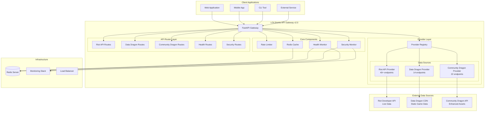
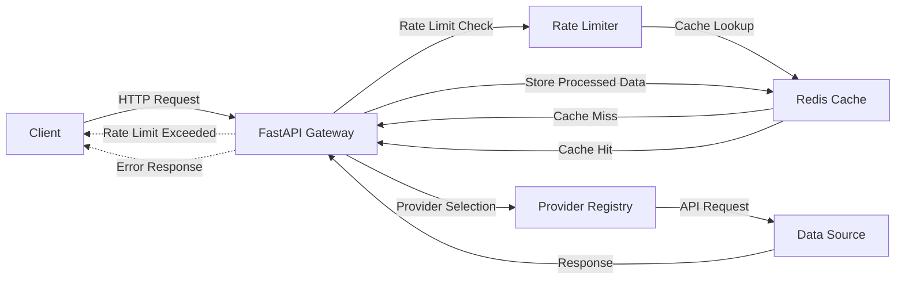
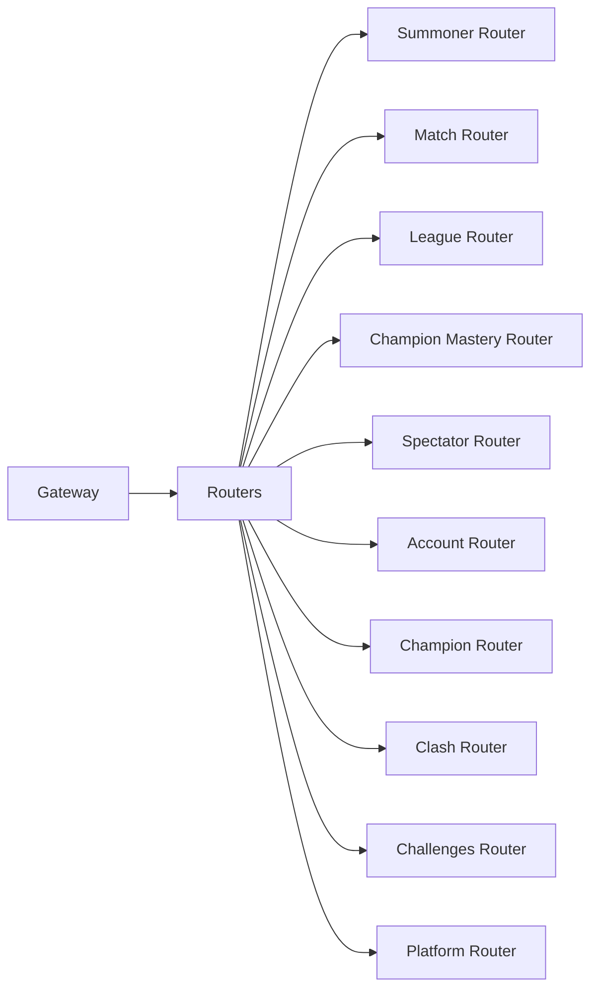
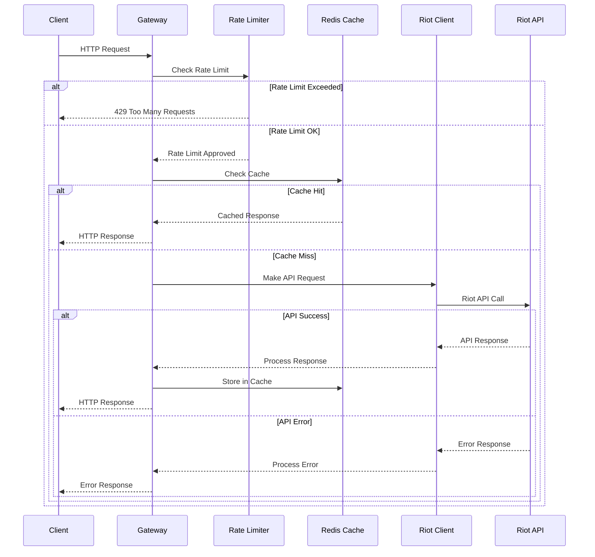
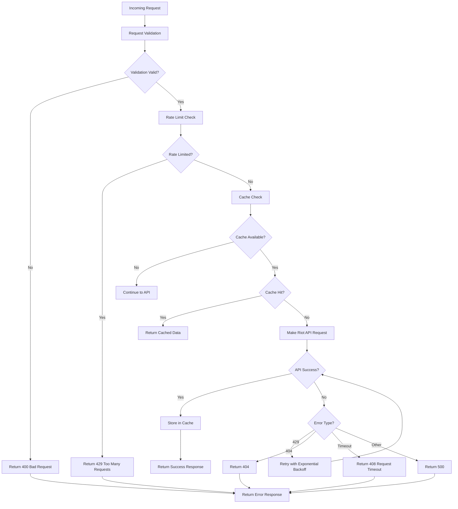
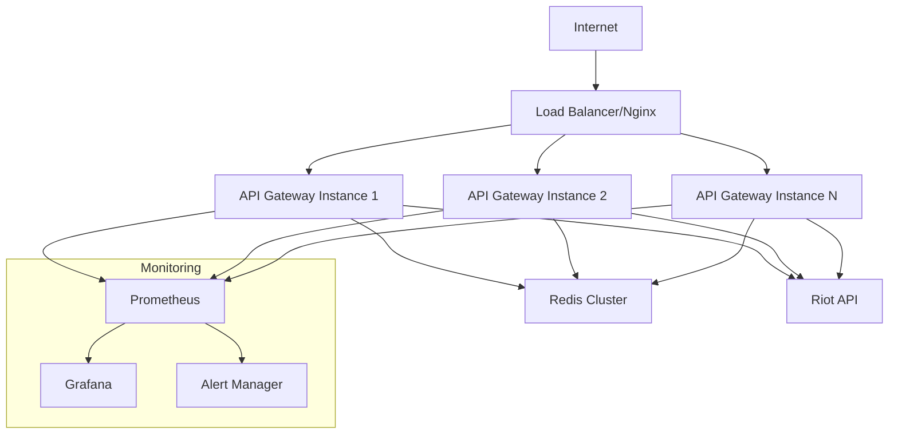

# Architecture Overview

This section provides a comprehensive overview of the LOLStonks API Gateway architecture, its components, and design principles.

## Multi-Source Architecture

The LOLStonks API Gateway has evolved into a **comprehensive data integration platform** supporting three distinct data sources:

### Supported Providers

| Provider | Type | Endpoints | Auth Required | Description |
|----------|------|-----------|---------------|-------------|
| **Riot API** | Live Data | 40+ | ✅ Yes | Real-time game data from Riot Developer Portal |
| **Data Dragon** | Static Data | 14 | ❌ No | Static game assets from Riot's CDN |
| **Community Dragon** | Enhanced Static | 22 | ❌ No | Community-maintained enhanced data |

**Total: 76+ endpoints with comprehensive API coverage**

### Provider Abstraction Layer

All providers implement a common `BaseProvider` interface, enabling consistent interaction patterns:

```python
class BaseProvider(ABC):
    @abstractmethod
    async def get(self, path: str, params: dict, headers: dict):
        """Make API request to the provider."""

    @abstractmethod
    async def health_check(self) -> bool:
        """Check provider availability."""

    @property
    @abstractmethod
    def provider_type(self) -> ProviderType:
        """Return the provider type."""
```

### Provider Registry

The `ProviderRegistry` singleton manages all provider instances and enables dynamic provider lookup:

```python
from app.providers.registry import get_provider
from app.providers.base import ProviderType

# Get specific provider
riot_provider = get_provider(ProviderType.RIOT_API)
ddragon_provider = get_provider(ProviderType.DATA_DRAGON)
```

## High-Level Architecture

### Comprehensive Multi-Provider Architecture

The LOLStonks API Gateway v2.0 has evolved into a comprehensive data integration platform supporting three distinct data sources with unified access patterns.

### System Architecture Diagram



### Request Flow Patterns

#### Simplified Request Flow


## Core Components

### 1. FastAPI Application (`app.main`)

The main entry point that provides:
- **Async HTTP server** with automatic documentation
- **Request routing** to appropriate API endpoints
- **Middleware** for request processing and error handling
- **OpenAPI specification** generation

**Key Features:**
- Automatic request/response validation
- Interactive API documentation (Swagger UI, ReDoc)
- High performance async request handling
- Built-in support for CORS, middleware, and dependency injection

### 2. Provider Registry (`app.providers.registry`)

Central management system for all data source providers:

```python
class ProviderRegistry:
    """
    Singleton registry for managing all data providers.

    Features:
    - Dynamic provider registration
    - Provider lifecycle management
    - Health monitoring for all providers
    - Unified interface for multi-provider support
    """
```

**Provider Types:**
- **Riot API Provider**: Live game data, match history, summoner information
- **Data Dragon Provider**: Static game data (champions, items, runes)
- **Community Dragon Provider**: Enhanced static data with additional assets

### 3. Provider Abstraction Layer (`app.providers.base`)

Common interface for all data providers:

```python
class BaseProvider(ABC):
    @abstractmethod
    async def get(self, path: str, params: dict, headers: dict):
        """Make API request to the provider."""

    @abstractmethod
    async def health_check(self) -> ProviderHealth:
        """Check provider availability and performance."""

    @property
    @abstractmethod
    def provider_type(self) -> ProviderType:
        """Return the provider type identifier."""
```

### 4. Specialized Providers (`app.providers.*`)

#### Riot API Provider
- **Authentication**: API key management and rotation
- **Rate Limiting**: Token bucket algorithm compliant with Riot's limits
- **Retry Logic**: Exponential backoff for 429 responses
- **Region Management**: Dynamic routing to regional endpoints

#### Data Dragon Provider
- **CDN Integration**: Direct access to Riot's static asset CDN
- **Version Management**: Support for multiple game versions
- **Language Support**: Multi-language static data
- **Cache Optimization**: Long-term caching for immutable data

#### Community Dragon Provider
- **Enhanced Assets**: Access to community-maintained enhanced data
- **TFT Support**: Teamfight Tactics data and assets
- **High-Quality Media**: Superior image and audio assets
- **Extended Information**: Additional game metadata

### 3. Rate Limiter (`app.riot.rate_limiter`)

Implements sophisticated rate limiting using the token bucket algorithm:

```python
class RateLimiter:
    """
    Token bucket rate limiter for Riot API compliance.

    - Configurable requests per second (RPS)
    - Burst capacity handling
    - Automatic token refill
    """
```

**Algorithm:**
- **Tokens**: Available request capacity
- **Refill Rate**: Tokens added per second
- **Burst Capacity**: Maximum token accumulation
- **Wait Strategy**: Queue requests when tokens exhausted

### 4. Redis Cache (`app.cache.redis_cache`)

High-performance caching layer:

```python
class RedisCache:
    """
    Redis-based caching with TTL support.

    - Automatic TTL management
    - Connection pooling
    - Error handling and fallbacks
    """
```

**Cache Strategy:**
- **TTL-based Expiration**: Different TTLs per data type
- **Intelligent Key Generation**: Consistent cache key patterns
- **Connection Pooling**: Efficient Redis connection management
- **Graceful Degradation**: Continue operation when cache unavailable

### 5. Match Tracking (`app.cache.tracking`)

Prevents duplicate match processing:

```python
class MatchTracker:
    """
    Match tracking service to prevent duplicate processing.

    - TTL cache for recent matches
    - Persistent set for all processed matches
    - Automatic cleanup of expired entries
    """
```

**Dual Storage Approach:**
- **TTL Cache**: Fast lookup for recent matches (1 week)
- **Persistent Set**: Complete record of all processed matches
- **Automatic Cleanup**: Removal of expired TTL entries

## API Router Architecture

### Router Organization



### Router Responsibilities

Each router handles:
- **Path Parameter Validation**: Pydantic models for route parameters
- **Query Parameter Handling**: Optional parameters and defaults
- **Response Transformation**: Standardized response format
- **Error Handling**: Consistent error responses
- **Caching Integration**: Automatic cache integration per endpoint

### Example Router Structure

```python
# app/routers/summoner.py
router = APIRouter(prefix="/summoner", tags=["summoner"])

@router.get("/by-name/{summonerName}")
async def get_summoner_by_name(
    summonerName: str,
    region: str = Query(default="euw1"),
    riot_client: RiotClient = Depends(),
    cache: RedisCache = Depends()
) -> SummonerDto:
    """Get summoner by summoner name."""
    # Implementation with caching and error handling
```

## Data Flow Architecture

### Request Processing Flow



### Caching Strategy

**Cache Key Pattern:**
```
lolstonks:{endpoint}:{region}:{identifier}
```

**TTL Configuration:**
- **Summoner Data**: 1 hour (relatively stable)
- **Match Data**: 24 hours (historical data)
- **League Data**: 30 minutes (competitive data)
- **Champion Data**: 1 week (static data)

### Error Handling Flow



## Configuration Architecture

### Configuration Hierarchy

1. **Environment Variables**: Primary configuration source
2. `.env` File: Local development configuration
3. **Defaults**: Built-in fallback values
4. **Runtime**: Dynamic configuration updates

### Configuration Management

```python
# app/config.py
class Settings(BaseSettings):
    """Configuration settings with environment variable support."""

    # Riot API Configuration
    riot_api_key: str
    riot_default_region: str = "euw1"

    # Server Configuration
    host: str = "0.0.0.0"
    port: int = 8080
    log_level: str = "INFO"

    # Redis Configuration
    redis_host: str = "localhost"
    redis_port: int = 6379

    class Config:
        env_file = ".env"
        case_sensitive = False
```

## Performance Architecture

### Performance Optimizations

1. **Async Processing**: Non-blocking I/O throughout the stack
2. **Connection Pooling**: Efficient database and HTTP connections
3. **Intelligent Caching**: Multi-layer caching strategy
4. **Rate Limiting**: Protects against API abuse and ensures compliance
5. **Batch Operations**: Support for concurrent requests

### Scalability Considerations

- **Horizontal Scaling**: Stateless design allows multiple instances
- **Redis Cluster**: Support for distributed caching
- **Load Balancing**: Compatible with standard load balancers
- **Monitoring**: Built-in health checks and metrics

## Security Architecture

### Security Layers

1. **API Key Management**: Secure storage and rotation of Riot API keys
2. **Input Validation**: Comprehensive request validation using Pydantic
3. **Rate Limiting**: Protection against abuse and DoS attacks
4. **Error Sanitization**: Prevents information leakage in error messages
5. **CORS Configuration**: Configurable cross-origin resource sharing

### Best Practices

- **Principle of Least Privilege**: Minimal required permissions
- **Defense in Depth**: Multiple security layers
- **Secure Defaults**: Secure configuration out of the box
- **Audit Logging**: Comprehensive request and error logging

## Monitoring and Observability

### Health Checks

```python
@app.get("/health")
async def health_check():
    """Comprehensive health check endpoint."""
    return {
        "status": "ok",
        "timestamp": datetime.utcnow(),
        "version": "1.0.0",
        "dependencies": {
            "redis": await check_redis_health(),
            "riot_api": await check_riot_api_health()
        }
    }
```

### Logging Strategy

- **Structured Logging**: JSON-formatted logs for easy parsing
- **Request Tracking**: Unique request IDs for tracing
- **Performance Metrics**: Request timing and cache hit rates
- **Error Tracking**: Comprehensive error logging and alerting

## Future Architecture Considerations

### Planned Enhancements

1. **Metrics Collection**: Prometheus metrics integration
2. **Distributed Tracing**: OpenTelemetry support
3. **API Versioning**: Versioned API endpoints
4. **Webhook Support**: Real-time event notifications
5. **Admin Interface**: Management dashboard for operations

### Scalability Roadmap

- **Multi-Region Deployment**: Geographic distribution
- **Circuit Breakers**: Fault tolerance for external dependencies
- **Event Streaming**: Kafka/Redis Streams for real-time data
- **GraphQL Support**: Alternative API interface

## Design Principles

The LOLStonks API Gateway follows these design principles:

1. **Performance First**: Optimized for high throughput and low latency
2. **Developer Experience**: Clear APIs and comprehensive documentation
3. **Reliability**: Graceful degradation and error handling
4. **Observability**: Built-in monitoring and debugging capabilities
5. **Security**: Secure by design with defense in depth
6. **Scalability**: Designed to scale horizontally and vertically

## Production Deployment

### Deployment Architecture

For production deployments, the API Gateway should be run behind a reverse proxy with proper process management:



### Production Requirements

1. **Process Management**: Use systemd, supervisor, or similar process manager
2. **Reverse Proxy**: Nginx or similar for SSL termination and load balancing
3. **Environment Variables**: Secure configuration management for API keys
4. **Monitoring**: Health checks, metrics collection, and alerting
5. **Logging**: Centralized log aggregation and analysis
6. **Security**: Firewall, rate limiting, and access controls

### Scaling Considerations

- **Horizontal Scaling**: Stateless design enables multiple instances
- **Redis Cluster**: Distributed caching for high availability
- **Database Connection Pooling**: Efficient resource utilization
- **Circuit Breakers**: Fault tolerance for external dependencies

This architecture provides a solid foundation for a production-ready API Gateway that can handle high traffic while maintaining reliability and performance.
