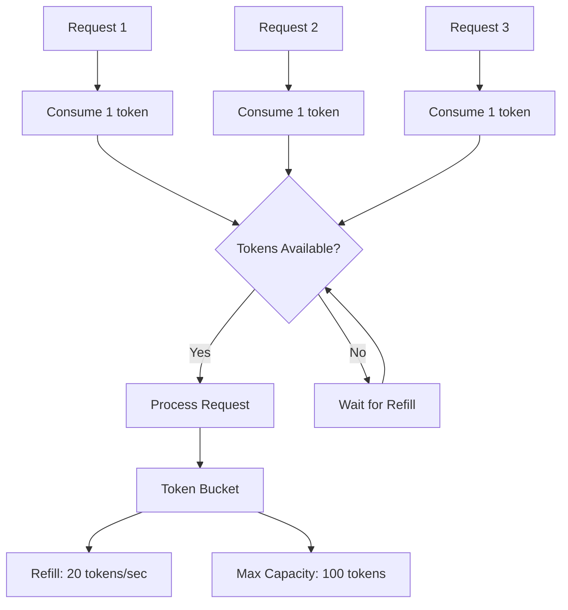

# Rate Limiting Architecture

This section details the rate limiting implementation in the LOLStonks API Gateway, designed to ensure compliance with Riot Games API rate limits while providing optimal performance.

> **Actual Implementation**: The system uses the [aiolimiter](https://github.com/mjpieters/aiolimiter) library with dual-layer rate limiting. See [Implementation Details](implementation-details.md#rate-limiting) for actual code.

## Overview

The rate limiting system uses a **token bucket algorithm** to control the flow of requests to the Riot Games API, preventing rate limit violations and ensuring fair usage.

## Token Bucket Algorithm

### Algorithm Description

The token bucket algorithm works as follows:

1. **Bucket Capacity**: Maximum number of tokens that can be stored
2. **Refill Rate**: Number of tokens added per second
3. **Token Consumption**: Each request consumes one token
4. **Wait Strategy**: Requests wait when tokens are unavailable



### Implementation Summary

The actual implementation uses `aiolimiter.AsyncLimiter` with dual-layer protection:
- Layer 1: 20 requests per second limit
- Layer 2: 100 requests per 2-minute limit
- Requests must pass both limiters before proceeding

## Configuration

Environment variables control rate limiting behavior:

```env
RIOT_RATE_LIMIT_PER_SECOND=20    # Short-term limit
RIOT_RATE_LIMIT_PER_2MIN=100     # Long-term limit
```

## Integration with HTTP Client

The HTTP client in `app/riot/client.py` integrates rate limiting through:
1. Call `rate_limiter.acquire()` before each request
2. Wait if tokens unavailable
3. Make HTTP request after acquiring token
4. Handle 429 responses with exponential backoff retry

## Rate Limit Response Handling

When Riot API returns a 429 (Too Many Requests) response:
1. Extract `Retry-After` header value
2. Wait for specified duration
3. Retry the request automatically
4. Log rate limit information for monitoring

## Best Practices

1. **Conservative Configuration**: Start with conservative limits and adjust based on actual usage patterns
2. **Monitor Headers**: Track Riot API rate limit headers for proactive management
3. **Graceful Degradation**: Handle rate limit errors without complete failure
4. **Caching**: Combine with intelligent caching to minimize API calls

The rate limiting system ensures Riot Games API compliance while maintaining optimal performance.
