# Rate Limiting Architecture

This section details the rate limiting architecture of LOLStonks API Gateway, ensuring fair usage and service protection.

## Rate Limiting Overview

```mermaid
flowchart TB
    %% Request Entry Point
    subgraph RequestEntry["🚪 Request Entry"]
        ClientRequest["👤 Client Request<br/><em>HTTP Request</em>"]
        KeyExtractor["🔑 API Key Extractor<br/><em>Header/Query</em>"]
        RequestClassifier["🏷️ Request Classifier<br/><em>Endpoint & Method</em>"]
    end

    %% Rate Limiting Engine
    subgraph RateLimitingEngine["⚡ Rate Limiting Engine"]
        subgraph TokenBucket["🪣 Token Bucket Algorithm"]
            BucketState["🗑️ Bucket State<br/><em>Tokens & Refill Rate</em>"]
            TokenRefill["💧 Token Refill<br/><em>Configurable Rate</em>"]
            TokenConsumer["🔽 Token Consumer<br/><em>Request Consumption</em>"]
        end

        subgraph RateCalculator["📊 Rate Calculator"]
            WindowSize["⏱️ Time Window<br/><em>Sliding/Fixed Window</em>"]
            RequestCounter["🔢 Request Counter<br/><em>Running Total</em>"]
            RateDetermination["📈 Rate Determination<br/><em>Current RPS</em>"]
        end

        subgraph LimitStorage["💾 Limit Storage"]
            RedisStore["🔴 Redis Store<br/><em>High Performance</em>"]
            LocalCache["⚡ Local Cache<br/><em>Frequently Used</em>"]
            PersistentStore["💾 Persistent Store<br/><em>Backup & Recovery</em>"]
        end
    end

    %% Decision Logic
    subgraph DecisionLogic["🤔 Decision Logic"]
        RateCheck["✅ Rate Check<br/><em>Within Limits?</em>"]
        ActionSelector["🎯 Action Selector<br/><em>Allow/Limit/Block</em>"]
        ResponseHeaders["📝 Response Headers<br/><em>Rate Limit Info</em>"]
    end

    %% Response Actions
    subgraph ResponseActions["📬 Response Actions"]
        AllowRequest["✅ Allow Request<br/><em>Process Normally</em>"]
        RateLimitResponse["⏸️ Rate Limit<br/><em>429 Response</em>"]
        BlockResponse["🚫 Block Request<br/><em>403 Response</em>"]
        RetryAfter["⏰ Retry After<br/><em>Backoff Timing</em>"]
    end

    %% Monitoring & Metrics
    subgraph MonitoringLayer["📈 Monitoring & Metrics"]
        MetricsCollector["📊 Metrics Collector<br/><em>Usage Statistics</em>"]
        AlertSystem["🚨 Alert System<br/><em>Threshold Breach</em>"]
        Analytics["📈 Analytics<br/><em>Trend Analysis</em>"]
        Dashboard["🖥️ Dashboard<br/><em>Real-time Monitoring</em>"]
    end

    %% Connections
    ClientRequest --> KeyExtractor
    KeyExtractor --> RequestClassifier
    RequestClassifier --> TokenBucket
    RequestClassifier --> RateCalculator

    TokenBucket --> LimitStorage
    RateCalculator --> LimitStorage

    LimitStorage --> RateCheck
    RateCheck --> ActionSelector
    ActionSelector --> ResponseHeaders

    ResponseHeaders --> AllowRequest
    ResponseHeaders --> RateLimitResponse
    ResponseHeaders --> BlockResponse
    RateLimitResponse --> RetryAfter

    AllowRequest --> MetricsCollector
    RateLimitResponse --> MetricsCollector
    BlockResponse --> AlertSystem
    RetryAfter --> Analytics

    MetricsCollector --> Dashboard
    AlertSystem --> Dashboard
    Analytics --> Dashboard

    %% Styling
    classDef entry fill:#e3f2fd,stroke:#1976d2,stroke-width:2px
    classDef engine fill:#f3e5f5,stroke:#4a148c,stroke-width:2px
    classDef logic fill:#fff3e0,stroke:#f57c00,stroke-width:2px
    classDef response fill:#e8f5e8,stroke:#388e3c,stroke-width:2px
    classDef monitor fill:#fce4ec,stroke:#c2185b,stroke-width:2px

    class RequestEntry entry
    class RateLimitingEngine engine
    class DecisionLogic logic
    class ResponseActions response
    class MonitoringLayer monitor
```



## Rate Limiting Strategy

### Token Bucket Algorithm
The gateway implements a refined **Token Bucket** algorithm that provides:

- **Token Refill Rate**: Configurable tokens per second
- **Bucket Capacity**: Maximum tokens that can be stored
- **Burst Handling**: Allows short bursts within capacity
- **Gradual Refill**: Continuous token addition

#### Implementation Details
```python
class TokenBucket:
    def __init__(self, capacity, refill_rate):
        self.capacity = capacity
        self.refill_rate = refill_rate
        self.tokens = capacity
        self.last_refill = time.time()

    def consume(self, tokens=1):
        self.refill()

        if self.tokens >= tokens:
            self.tokens -= tokens
            return True
        return False

    def refill(self):
        now = time.time()
        elapsed = now - self.last_refill
        self.tokens = min(self.capacity,
                       self.tokens + elapsed * self.refill_rate)
        self.last_refill = now
```

### Rate Limiting Tiers

| Tier | Requests per Minute | Burst Capacity | Use Case |
|------|-------------------|----------------|-----------|
| Bronze | 100 | 150 | Basic users |
| Silver | 500 | 750 | Premium users |
| Gold | 2000 | 3000 | Enterprise |
| Platinum | 5000 | 7500 | Partners |
| Diamond | 10000 | 15000 | Internal services |

## Configuration Management

### Dynamic Configuration
Rate limits are dynamically configurable through:

- **Environment Variables**: `RATE_LIMIT_TIER_X`
- **Database Settings**: Real-time configuration updates
- **API Configuration**: Administrative interface
- **File-based**: YAML configuration files

### Configuration Example
```yaml
rate_limiting:
  default_tier: bronze
  tiers:
    bronze:
      requests_per_minute: 100
      burst_capacity: 150
      refill_rate: 1.67
    silver:
      requests_per_minute: 500
      burst_capacity: 750
      refill_rate: 8.33
    gold:
      requests_per_minute: 2000
      burst_capacity: 3000
      refill_rate: 33.33
```

## Storage and Persistence

### Redis-based Storage
- **Primary Storage**: Redis for high-performance access
- **Key Strategy**: `rate_limit:{api_key}:{endpoint}:{window}`
- **TTL Configuration**: Automatic expiration of old data
- **Memory Efficiency**: Compact data structures

### Local Caching
- **Frequently Used**: Hot caching of popular limits
- **Cache Invalidation**: Time-based and event-driven
- **Fallback Mechanism**: Local cache when Redis unavailable
- **Memory Management**: LRU eviction policy

## Response Headers

### Standard Headers
All rate-limited responses include:

```http
X-RateLimit-Limit: 100
X-RateLimit-Remaining: 75
X-RateLimit-Reset: 1640995200
X-RateLimit-Retry-After: 30
```

### Header Information
- **X-RateLimit-Limit**: Total requests allowed in window
- **X-RateLimit-Remaining**: Requests left in current window
- **X-RateLimit-Reset**: Unix timestamp for window reset
- **X-RateLimit-Retry-After**: Seconds until next request allowed

## Error Handling

### 429 Too Many Requests
```json
{
  "error": {
    "code": "RATE_LIMIT_EXCEEDED",
    "message": "Rate limit exceeded. Please retry later.",
    "details": {
      "limit": 100,
      "window": 60,
      "retry_after": 30,
      "reset_time": "2023-12-01T12:00:00Z"
    }
  }
}
```

### Graceful Degradation
- **Priority Requests**: Essential operations have higher limits
- **Emergency Mode**: Reduced limits during high load
- **Fair Queuing**: Request queuing for non-critical operations
- **Backpressure**: Automatic load shedding when overloaded

## Monitoring and Analytics

### Real-time Metrics
- **Request Rate**: Current requests per second
- **Utilization**: Percentage of rate limit usage
- **Blocking Events**: Rate limit triggers per endpoint
- **Response Times**: Processing latency distribution

### Analytics Dashboard
- **Historical Trends**: Long-term usage patterns
- **User Behavior**: Request pattern analysis
- **Performance Impact**: Rate limiting effect on response times
- **Capacity Planning**: Resource allocation recommendations

## Advanced Features

### Intelligent Rate Limiting
- **Endpoint-specific Limits**: Different limits per API route
- **Time-based Variations**: Different limits for peak/off-peak
- **Geographic Considerations**: Regional rate limit adjustments
- **User Classification**: Dynamic limit assignment

### Predictive Rate Limiting
- **Machine Learning**: Pattern recognition and prediction
- **Proactive Scaling**: Anticipatory limit adjustments
- **Anomaly Detection**: Unusual usage pattern alerts
- **Automated Optimization**: Self-adjusting parameters

## Integration Points

### Gateway Integration
Rate limiting integrates seamlessly with:

- **Authentication**: User identity and tier determination
- **Authorization**: Permission-based limit adjustments
- **Caching**: Smart cache invalidation on limits
- **Logging**: Comprehensive audit trails

### External Dependencies
- **Redis Cluster**: Primary rate limit storage
- **Configuration Service**: Dynamic limit updates
- **Monitoring Stack**: Metrics and alerting
- **Analytics Platform**: Usage pattern analysis

## Performance Considerations

### Optimization Techniques
- **Bloom Filters**: Fast existence checks
- **Sliding Windows**: Efficient time window management
- **Batch Processing**: Grouped limit updates
- **Memory Pooling**: Reduced allocation overhead

### Scalability Design
- **Horizontal Scaling**: Distributed rate limiting
- **Consistent Hashing**: Even load distribution
- **Fault Tolerance**: Graceful degradation on failures
- **Resource Efficiency**: Minimal CPU and memory usage

## Security and Compliance

### Abuse Prevention
- **Bot Detection**: Automated behavior analysis
- **IP-based Limits**: Additional client restrictions
- **Pattern Recognition**: Suspicious activity detection
- **Automatic Blocking**: Malicious actor prevention

### Compliance Features
- **GDPR Compliance**: Data retention policies
- **API Security Standards**: OWASP best practices
- **Audit Requirements**: Complete usage logging
- **Rate Limit Disclosure**: Transparent user communication