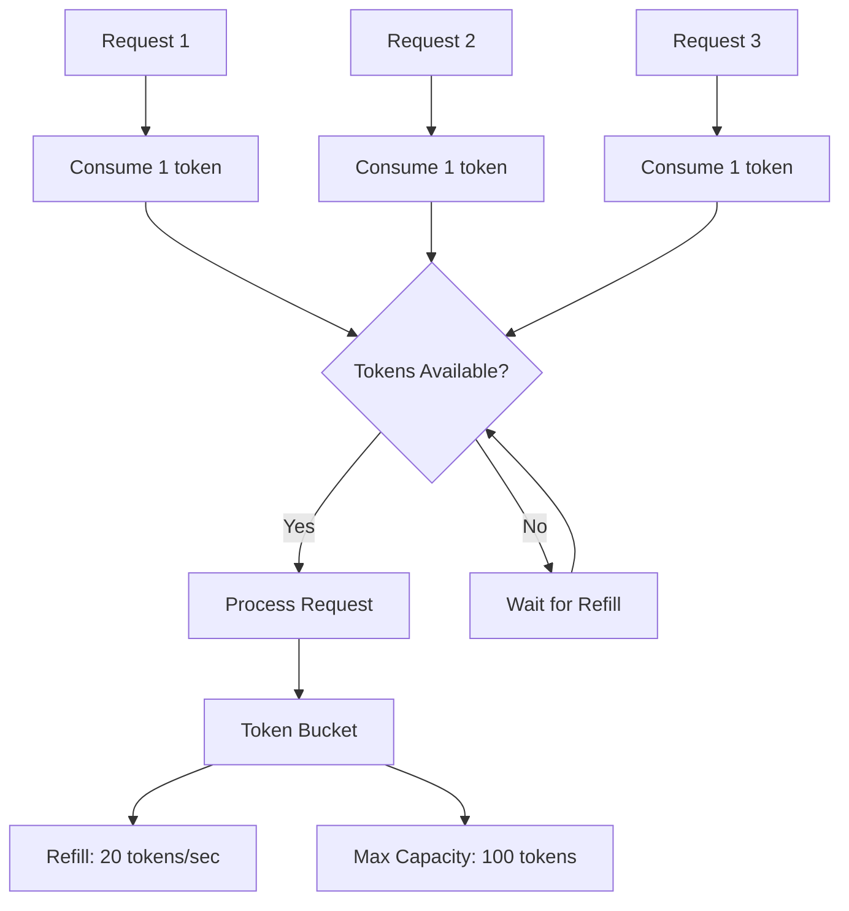

# Rate Limiting Architecture

This section details the rate limiting implementation in the LOLStonks API Gateway, designed to ensure compliance with Riot Games API rate limits while providing optimal performance.

## Overview

The rate limiting system uses a **token bucket algorithm** to control the flow of requests to the Riot Games API, preventing rate limit violations and ensuring fair usage.

## Token Bucket Algorithm

### Algorithm Description

The token bucket algorithm works as follows:

1. **Bucket Capacity**: Maximum number of tokens that can be stored
2. **Refill Rate**: Number of tokens added per second
3. **Token Consumption**: Each request consumes one token
4. **Wait Strategy**: Requests wait when tokens are unavailable



### Implementation Details

```python
# app/riot/rate_limiter.py
import asyncio
from datetime import datetime, timedelta
from typing import Optional

class RateLimiter:
    """
    Token bucket rate limiter for Riot API compliance.

    Default configuration:
    - 20 requests per second
    - 100 token burst capacity
    - 120-second refill period for burst capacity
    """

    def __init__(self, rate: float = 20.0, capacity: int = 100):
        self.rate = rate  # tokens per second
        self.capacity = capacity  # maximum tokens
        self.tokens = capacity  # current tokens
        self.last_refill = datetime.utcnow()
        self._lock = asyncio.Lock()

    async def acquire(self) -> None:
        """Acquire a token, waiting if necessary."""
        async with self._lock:
            await self._refill()
            if self.tokens >= 1:
                self.tokens -= 1
                return

            # Calculate wait time for next token
            wait_time = 1.0 / self.rate
            await asyncio.sleep(wait_time)
            await self._refill()
            self.tokens -= 1

    async def _refill(self) -> None:
        """Refill tokens based on elapsed time."""
        now = datetime.utcnow()
        elapsed = (now - self.last_refill).total_seconds()
        tokens_to_add = elapsed * self.rate

        self.tokens = min(self.capacity, self.tokens + tokens_to_add)
        self.last_refill = now
```

## Configuration

### Environment Variables

```env
# Rate limiting configuration
RATE_LIMIT_RPS=20           # Requests per second
RATE_LIMIT_BURST=100        # Burst capacity
RATE_LIMIT_PERIOD=120       # Period for burst refill (seconds)
```

### Custom Rate Limits

You can configure different rate limits for different endpoint types:

```python
# Custom rate limits per endpoint type
RATE_LIMITS = {
    "summoner": {"rps": 30, "burst": 150},    # Higher limit for summoner data
    "match": {"rps": 10, "burst": 50},        # Lower limit for match data
    "league": {"rps": 20, "burst": 100},      # Standard limit for league data
    "spectator": {"rps": 5, "burst": 25}      # Very low limit for spectator
}
```

## Integration with HTTP Client

### Rate-Limited HTTP Client

```python
# app/riot/client.py
import httpx
from app.riot.rate_limiter import RateLimiter

class RiotClient:
    """
    HTTP client for Riot API with integrated rate limiting.
    """

    def __init__(self, api_key: str):
        self.api_key = api_key
        self.client = httpx.AsyncClient()
        self.rate_limiter = RateLimiter(
            rate=float(os.getenv("RATE_LIMIT_RPS", 20)),
            capacity=int(os.getenv("RATE_LIMIT_BURST", 100))
        )

    async def get(self, path: str, region: str, **kwargs) -> dict:
        """
        Make GET request with automatic rate limiting and retry.
        """
        await self.rate_limiter.acquire()

        # Make request
        response = await self.client.get(
            self._build_url(path, region),
            headers=self._get_headers(),
            **kwargs
        )

        # Handle rate limiting from Riot API
        if response.status_code == 429:
            retry_after = int(response.headers.get("Retry-After", 1))
            await asyncio.sleep(retry_after)
            return await self.get(path, region, **kwargs)  # Retry

        response.raise_for_status()
        return response.json()
```

## Rate Limit Response Handling

### 429 Response Handling

When Riot API returns a 429 (Too Many Requests) response:

```python
async def _handle_rate_limit_response(self, response: httpx.Response) -> dict:
    """
    Handle 429 responses from Riot API.

    Riot API provides:
    - Retry-After header: Seconds to wait before retrying
    - X-Rate-Limit-* headers: Current rate limit status
    """
    if response.status_code != 429:
        response.raise_for_status()
        return response.json()

    # Extract retry information
    retry_after = int(response.headers.get("Retry-After", 1))
    app_rate_limit = response.headers.get("X-App-Rate-Limit", "")
    app_rate_count = response.headers.get("X-App-Rate-Limit-Count", "")

    # Log rate limit information
    logger.warning(
        f"Rate limited. Retry after {retry_after}s. "
        f"App limit: {app_rate_count}/{app_rate_limit}"
    )

    # Wait for the specified time
    await asyncio.sleep(retry_after)

    # The request will be retried by the calling method
    raise RateLimitExceeded(retry_after=retry_after)
```

### Rate Limit Headers Monitoring

```python
def _monitor_rate_limits(self, response: httpx.Response) -> None:
    """
    Monitor rate limit headers for proactive management.

    Riot API headers:
    - X-App-Rate-Limit: application limits (e.g., "20:1,100:120")
    - X-App-Rate-Limit-Count: current usage (e.g., "5:1,17:120")
    - X-Method-Rate-Limit: method-specific limits
    - X-Method-Rate-Limit-Count: current method usage
    """
    app_limit = response.headers.get("X-App-Rate-Limit", "")
    app_count = response.headers.get("X-App-Rate-Limit-Count", "")

    if app_limit and app_count:
        # Parse rate limit information
        limits = self._parse_rate_limit_header(app_limit)
        counts = self._parse_rate_limit_header(app_count)

        # Check if we're approaching limits
        for (limit_period, limit_count), (_, current_count) in zip(limits, counts):
            usage_percentage = (current_count / limit_count) * 100

            if usage_percentage > 80:
                logger.warning(
                    f"Approaching rate limit: {current_count}/{limit_count} "
                    f"({usage_percentage:.1f}%) for {limit_period}s period"
                )
```

## Performance Considerations

### Rate Limiter Performance

```python
# Optimized rate limiter with minimal blocking
class HighPerformanceRateLimiter:
    """
    High-performance rate limiter using async primitives.
    """

    def __init__(self, rate: float, capacity: int):
        self.rate = rate
        self.capacity = capacity
        self.tokens = capacity
        self.last_refill = time.time()
        self._lock = asyncio.Lock()
        self._not_empty = asyncio.Condition(self._lock)

    async def acquire(self) -> None:
        """Acquire token with efficient waiting."""
        async with self._not_empty:
            while self.tokens < 1:
                # Calculate wait time more precisely
                now = time.time()
                time_since_refill = now - self.last_refill
                tokens_needed = 1 - self.tokens
                wait_time = max(0, tokens_needed / self.rate - time_since_refill)

                if wait_time > 0:
                    await asyncio.sleep(wait_time)
                else:
                    await self._refill()

            self.tokens -= 1
            self._not_empty.notify()
```

### Connection Pooling with Rate Limiting

```python
# HTTP client configuration optimized for rate limiting
class OptimizedRiotClient:
    def __init__(self, api_key: str):
        self.client = httpx.AsyncClient(
            limits=httpx.Limits(
                max_keepalive_connections=20,
                max_connections=100,
                keepalive_expiry=30.0
            ),
            timeout=httpx.Timeout(30.0, connect=5.0)
        )
        self.rate_limiter = RateLimiter(rate=20, capacity=100)
```

## Monitoring and Metrics

### Rate Limit Metrics

```python
# Metrics collection for rate limiting
class RateLimitMetrics:
    """
    Collect and report rate limiting metrics.
    """

    def __init__(self):
        self.requests_total = 0
        self.requests_limited = 0
        self.wait_time_total = 0.0
        self.tokens_consumed = 0

    def record_request(self, wait_time: float, was_limited: bool = False) -> None:
        """Record a request with its wait time."""
        self.requests_total += 1
        self.wait_time_total += wait_time
        if was_limited:
            self.requests_limited += 1
        self.tokens_consumed += 1

    def get_metrics(self) -> dict:
        """Get current metrics."""
        return {
            "requests_total": self.requests_total,
            "requests_limited": self.requests_limited,
            "limit_rate": self.requests_limited / self.requests_total * 100,
            "average_wait_time": self.wait_time_total / self.requests_total,
            "tokens_consumed": self.tokens_consumed
        }
```

### Health Check Integration

```python
@app.get("/health")
async def health_check():
    """Health check including rate limiting status."""
    rate_limiter_metrics = riot_client.rate_limiter.get_metrics()

    return {
        "status": "ok",
        "rate_limiting": {
            "status": "healthy",
            "current_tokens": rate_limiter_metrics["current_tokens"],
            "requests_per_second": rate_limiter_metrics["current_rate"],
            "limit_rate": rate_limiter_metrics["limit_rate_percentage"]
        }
    }
```

## Advanced Features

### Adaptive Rate Limiting

```python
class AdaptiveRateLimiter(RateLimiter):
    """
    Rate limiter that adapts based on Riot API responses.
    """

    def __init__(self, initial_rate: float, initial_capacity: int):
        super().__init__(initial_rate, initial_capacity)
        self.adaptive_mode = True
        self.consecutive_429s = 0
        self.last_adjustment = time.time()

    async def adapt_after_429(self, retry_after: int) -> None:
        """Adjust rate limits after receiving 429 response."""
        self.consecutive_429s += 1

        if self.consecutive_429s >= 3:
            # Reduce rate limit if we get multiple 429s
            new_rate = max(1, self.rate * 0.8)
            self.rate = new_rate
            logger.warning(f"Reduced rate limit to {new_rate} RPS due to 429s")

    async def adapt_success(self) -> None:
        """Gradually increase rate limit on success."""
        if self.consecutive_429s == 0 and time.time() - self.last_adjustment > 300:
            # Gradually increase if no recent 429s
            self.rate = min(30, self.rate * 1.1)
            self.last_adjustment = time.time()
```

### Distributed Rate Limiting

For multi-instance deployments:

```python
class DistributedRateLimiter:
    """
    Rate limiter using Redis for distributed coordination.
    """

    def __init__(self, redis_client, rate: float, capacity: int):
        self.redis = redis_client
        self.rate = rate
        self.capacity = capacity
        self.key = "rate_limiter:tokens"

    async def acquire(self) -> None:
        """Acquire token using Redis-based rate limiting."""
        script = """
        local key = KEYS[1]
        local capacity = tonumber(ARGV[1])
        local tokens = tonumber(ARGV[2])
        local interval = tonumber(ARGV[3])

        local current = redis.call('GET', key)
        if not current then
            current = capacity
        else
            current = tonumber(current)
        end

        if current >= 1 then
            redis.call('SET', key, current - 1)
            redis.call('EXPIRE', key, interval)
            return 1
        else
            return 0
        end
        """

        result = await self.redis.eval(
            script,
            keys=[self.key],
            args=[self.capacity, 1, self.capacity / self.rate]
        )

        if result == 0:
            # No tokens available, wait
            await asyncio.sleep(1.0 / self.rate)
            await self.acquire()
```

## Best Practices

### Configuration Guidelines

1. **Conservative Rate Limits**: Start with conservative limits and adjust based on usage
2. **Monitor Usage**: Regularly monitor rate limit headers and adjust accordingly
3. **Graceful Degradation**: Handle rate limit errors gracefully without failing completely
4. **Burst Capacity**: Maintain adequate burst capacity for traffic spikes

### Error Handling

1. **Exponential Backoff**: Use exponential backoff for retries
2. **Circuit Breaker**: Implement circuit breaker for repeated failures
3. **Logging**: Comprehensive logging of rate limit events
4. **Alerting**: Set up alerts for high rate limit usage

### Performance Optimization

1. **Async Operations**: Use async/await throughout the stack
2. **Connection Pooling**: Reuse HTTP connections efficiently
3. **Batch Operations**: Batch requests when possible
4. **Caching**: Cache responses to reduce API calls

The rate limiting system ensures reliable operation while respecting Riot Games API limits, providing a robust foundation for high-volume API access.