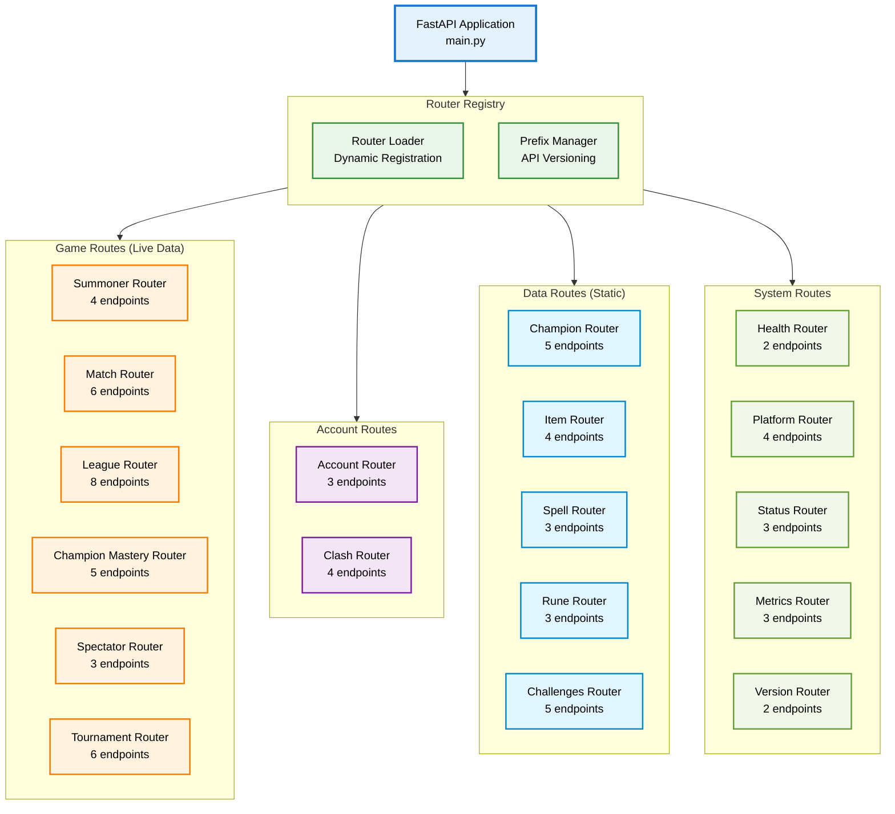
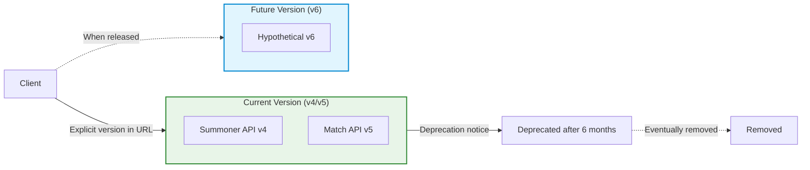
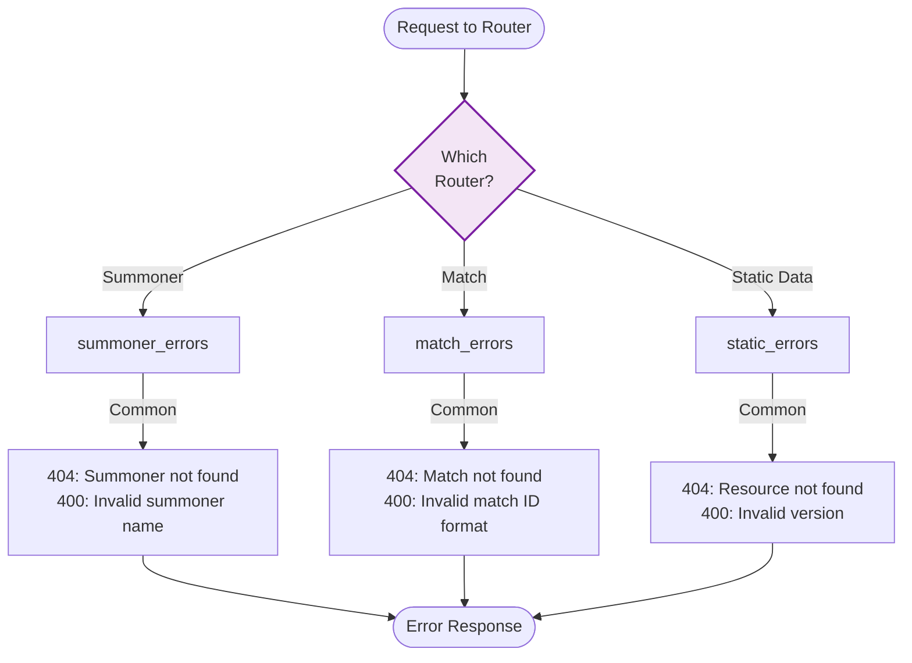
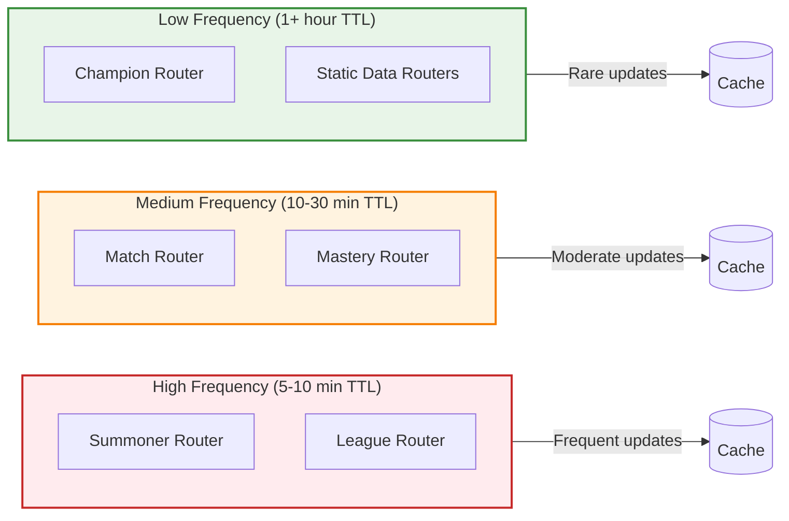

# Routing Architecture

> **API endpoint organization** and request routing through the lolstonks-api-gateway

---

## Overview

The lolstonks-api-gateway uses a modular router architecture to organize 100+ API endpoints into logical groups. This document describes the router hierarchy, request pipeline, and endpoint organization.

---

## Router Hierarchy

### Complete Router Structure



---

## Router Categories

### Game Routes (Live Data)

Live game data fetched from Riot API with short cache TTLs.

#### Summoner Router
**Prefix**: `/lol/summoner/v4`

| Endpoint | Method | Description | Cache TTL | Provider |
|----------|--------|-------------|-----------|----------|
| `/by-account/{accountId}` | GET | Get summoner by account ID | 5 min | Riot API |
| `/by-name/{region}/{summonerName}` | GET | Get summoner by name | 5 min | Riot API |
| `/by-puuid/{puuid}` | GET | Get summoner by PUUID | 5 min | Riot API |
| `/me` | GET | Get current summoner (requires auth) | 5 min | Riot API |

**Path Parameters**:
- `region`: Platform region (e.g., `euw1`, `na1`)
- `summonerName`: Summoner name (case-insensitive)
- `accountId`: Encrypted account ID
- `puuid`: Player Universally Unique ID

**Response Example**:
```json
{
  "id": "encrypted_summoner_id",
  "accountId": "encrypted_account_id",
  "puuid": "puuid_string",
  "name": "SummonerName",
  "profileIconId": 4568,
  "revisionDate": 1706112000000,
  "summonerLevel": 234
}
```

#### Match Router
**Prefix**: `/lol/match/v5`

| Endpoint | Method | Description | Cache TTL | Provider |
|----------|--------|-------------|-----------|----------|
| `/by-puuid/{region}/{puuid}` | GET | Get match list by PUUID | 10 min | Riot API |
| `/by-match-id/{region}/{matchId}` | GET | Get match details | 30 min | Riot API |
| `/by-match-id/{region}/{matchId}/timeline` | GET | Get match timeline | 30 min | Riot API |

**Query Parameters**:
- `start`: Start index (pagination)
- `count`: Number of matches to return (max 100)
- `startTime`: Filter by start time (epoch seconds)
- `endTime`: Filter by end time (epoch seconds)
- `queue`: Filter by queue ID
- `type`: Filter by match type (ranked, normal, etc.)

**Response Example (Match List)**:
```json
[
  "EUW1_6234567890",
  "EUW1_6234567891",
  "EUW1_6234567892"
]
```

#### League Router
**Prefix**: `/lol/league/v4`

| Endpoint | Method | Description | Cache TTL | Provider |
|----------|--------|-------------|-----------|----------|
| `/challenger/{region}/{queue}` | GET | Get Challenger ladder | 5 min | Riot API |
| `/grandmaster/{region}/{queue}` | GET | Get Grandmaster ladder | 5 min | Riot API |
| `/master/{region}/{queue}` | GET | Get Master ladder | 5 min | Riot API |
| `/entries/{region}/{queue}/{tier}/{division}` | GET | Get league entries by tier/division | 5 min | Riot API |
| `/by-summoner/{region}/{summonerId}` | GET | Get league entries for summoner | 5 min | Riot API |

**Queue Types**:
- `RANKED_SOLO_5x5`: Solo/Duo ranked
- `RANKED_FLEX_SR`: Flex 5v5 ranked
- `RANKED_FLEX_TT`: Flex 3v3 ranked (deprecated)

**Tiers**: `IRON`, `BRONZE`, `SILVER`, `GOLD`, `PLATINUM`, `EMERALD`, `DIAMOND`

**Divisions**: `I`, `II`, `III`, `IV`

#### Champion Mastery Router
**Prefix**: `/lol/champion-mastery/v4`

| Endpoint | Method | Description | Cache TTL | Provider |
|----------|--------|-------------|-----------|----------|
| `/by-puuid/{region}/{puuid}` | GET | Get all champion masteries for player | 10 min | Riot API |
| `/by-puuid/{region}/{puuid}/champion/{championId}` | GET | Get mastery for specific champion | 10 min | Riot API |
| `/by-puuid/{region}/{puuid}/top` | GET | Get top N champion masteries | 10 min | Riot API |
| `/scores/{region}/{puuid}` | GET | Get total mastery score | 10 min | Riot API |

**Query Parameters**:
- `count`: Number of top champions to return (default 3)

#### Spectator Router
**Prefix**: `/lol/spectator/v5`

| Endpoint | Method | Description | Cache TTL | Provider |
|----------|--------|-------------|-----------|----------|
| `/active-game/{region}/{puuid}` | GET | Get current game info | 30 sec | Riot API |
| `/featured-games/{region}` | GET | Get featured games | 60 sec | Riot API |

**Note**: Very short TTL due to live game data changing rapidly.

#### Tournament Router
**Prefix**: `/lol/tournament/v5`

| Endpoint | Method | Description | Cache TTL | Provider |
|----------|--------|-------------|-----------|----------|
| `/codes` | POST | Create tournament codes | N/A | Riot API |
| `/codes/{tournamentCode}` | GET | Get tournament code details | 30 min | Riot API |
| `/codes/{tournamentCode}` | PUT | Update tournament code | N/A | Riot API |
| `/lobby-events/{tournamentCode}` | GET | Get lobby events | 5 min | Riot API |
| `/providers` | POST | Register as tournament provider | N/A | Riot API |
| `/tournaments` | POST | Create tournament | N/A | Riot API |

**Note**: Requires tournament API key (separate from standard API key).

---

### Account Routes

Cross-platform account management.

#### Account Router
**Prefix**: `/riot/account/v1`

| Endpoint | Method | Description | Cache TTL | Provider |
|----------|--------|-------------|-----------|----------|
| `/by-puuid/{puuid}` | GET | Get account by PUUID | 10 min | Riot API |
| `/by-riot-id/{gameName}/{tagLine}` | GET | Get account by Riot ID | 10 min | Riot API |
| `/active-shard/{game}/{puuid}` | GET | Get active shard for game | 10 min | Riot API |

**Riot ID Format**: `GameName#TagLine` (e.g., `Player#EUW`)

#### Clash Router
**Prefix**: `/lol/clash/v1`

| Endpoint | Method | Description | Cache TTL | Provider |
|----------|--------|-------------|-----------|----------|
| `/players/by-summoner/{region}/{summonerId}` | GET | Get clash player info | 5 min | Riot API |
| `/teams/{region}/{teamId}` | GET | Get clash team info | 5 min | Riot API |
| `/tournaments` | GET | Get all clash tournaments | 10 min | Riot API |
| `/tournaments/{tournamentId}` | GET | Get specific tournament | 10 min | Riot API |

---

### Data Routes (Static)

Static game data from Data Dragon and Community Dragon CDNs.

#### Champion Router
**Prefix**: `/lol/static/champion`

| Endpoint | Method | Description | Cache TTL | Provider |
|----------|--------|-------------|-----------|----------|
| `/all` | GET | Get all champions | 1 hour | Data Dragon |
| `/{championId}` | GET | Get specific champion | 1 hour | Data Dragon |
| `/by-name/{name}` | GET | Get champion by name | 1 hour | Data Dragon |

**Query Parameters**:
- `version`: Data version (e.g., `14.1.1`)
- `locale`: Language (e.g., `en_US`, `de_DE`)

**Response Example**:
```json
{
  "type": "champion",
  "version": "14.1.1",
  "data": {
    "Aatrox": {
      "id": "Aatrox",
      "key": "266",
      "name": "Aatrox",
      "title": "the Darkin Blade",
      "stats": { ... },
      "spells": [ ... ],
      "passive": { ... }
    }
  }
}
```

#### Item Router
**Prefix**: `/lol/static/item`

| Endpoint | Method | Description | Cache TTL | Provider |
|----------|--------|-------------|-----------|----------|
| `/all` | GET | Get all items | 1 hour | Data Dragon |
| `/{itemId}` | GET | Get specific item | 1 hour | Data Dragon |

#### Spell Router
**Prefix**: `/lol/static/spell`

| Endpoint | Method | Description | Cache TTL | Provider |
|----------|--------|-------------|-----------|----------|
| `/all` | GET | Get all summoner spells | 1 hour | Data Dragon |
| `/{spellId}` | GET | Get specific spell | 1 hour | Data Dragon |

#### Rune Router
**Prefix**: `/lol/static/rune`

| Endpoint | Method | Description | Cache TTL | Provider |
|----------|--------|-------------|-----------|----------|
| `/all` | GET | Get all runes | 1 hour | Data Dragon |
| `/perks` | GET | Get rune perks | 1 hour | Data Dragon |

#### Challenges Router
**Prefix**: `/lol/challenges/v1`

| Endpoint | Method | Description | Cache TTL | Provider |
|----------|--------|-------------|-----------|----------|
| `/config` | GET | Get all challenge configs | 1 hour | Riot API |
| `/config/{challengeId}` | GET | Get specific challenge config | 1 hour | Riot API |
| `/percentiles` | GET | Get challenge percentiles | 1 hour | Riot API |
| `/by-puuid/{region}/{puuid}` | GET | Get player challenges | 10 min | Riot API |

---

### System Routes

Health, monitoring, and system information endpoints.

#### Health Router
**Prefix**: `/health`

| Endpoint | Method | Description | Cache | Provider |
|----------|--------|-------------|-------|----------|
| `/` | GET | Simple health check | No | Local |
| `/detailed` | GET | Component-level health | No | Local |

**Response Example**:
```json
{
  "status": "healthy",
  "timestamp": "2025-01-24T12:00:00Z",
  "components": {
    "redis": {
      "status": "healthy",
      "latency_ms": 0.8
    },
    "riot_api": {
      "status": "healthy",
      "latency_ms": 145.2
    },
    "data_dragon": {
      "status": "healthy",
      "latency_ms": 42.1
    }
  },
  "version": "1.0.0"
}
```

#### Platform Router
**Prefix**: `/lol/platform/v3`

| Endpoint | Method | Description | Cache TTL | Provider |
|----------|--------|-------------|-----------|----------|
| `/champion-rotations/{region}` | GET | Get free champion rotation | 1 hour | Riot API |

#### Status Router
**Prefix**: `/lol/status/v4`

| Endpoint | Method | Description | Cache TTL | Provider |
|----------|--------|-------------|-----------|----------|
| `/platform-data/{region}` | GET | Get platform status | 5 min | Riot API |

#### Metrics Router
**Prefix**: `/metrics`

| Endpoint | Method | Description | Cache | Provider |
|----------|--------|-------------|-------|----------|
| `/` | GET | Basic metrics summary | No | Local |
| `/detailed` | GET | Detailed performance metrics | No | Local |
| `/prometheus` | GET | Prometheus-format metrics (future) | No | Local |

#### Version Router
**Prefix**: `/lol/static/version`

| Endpoint | Method | Description | Cache TTL | Provider |
|----------|--------|-------------|-----------|----------|
| `/latest` | GET | Get latest version | 6 hours | Data Dragon |
| `/all` | GET | Get all versions | 6 hours | Data Dragon |

---

## Request Pipeline

### Complete Request Processing Pipeline

```mermaid
flowchart TD
    request([HTTP Request]) -->|1. Parse URL| urlparse[URL Parser<br/>Extract path/query]
    urlparse -->|2. Match Route| router{Router<br/>Lookup}

    router -->|No Match| notfound[404 Not Found<br/>Unknown endpoint]
    notfound --> error_response([Error Response])

    router -->|Match| extract[Extract Parameters<br/>Path/Query/Headers]

    extract -->|3. Validate| validate{Pydantic<br/>Validation}
    validate -->|Invalid| validation_error[422 Unprocessable Entity<br/>Parameter errors]
    validation_error --> error_response

    validate -->|Valid| auth[4. Authentication<br/>Check API Key (future)]
    auth -->|Unauthorized| auth_error[401 Unauthorized]
    auth_error --> error_response

    auth -->|OK| ratelimit[5. Rate Limiting<br/>Check request quota]
    ratelimit -->|Exceeded| rate_error[429 Too Many Requests]
    rate_error --> error_response

    ratelimit -->|OK| cache[6. Cache Layer<br/>Check Redis]
    cache -->|Hit| cached[Return Cached Data<br/><10ms]
    cached --> response_format

    cache -->|Miss| provider[7. Provider Selection<br/>Route to data source]

    provider -->|Live Data| riot[Riot API Provider]
    provider -->|Static Data| dragon[Data Dragon Provider]
    provider -->|Community Data| community[Community Dragon Provider]

    riot -->|8. External API| riot_api[Riot API Call<br/>50-200ms]
    dragon --> dragon_api[Data Dragon Call<br/>20-100ms]
    community --> community_api[Community Dragon Call<br/>20-100ms]

    riot_api -->|9. Process| process[Process Response<br/>Validate/Transform]
    dragon_api --> process
    community_api --> process

    process -->|Error| api_error[502 Bad Gateway<br/>External API error]
    api_error --> error_response

    process -->|Success| cache_update[10. Update Cache<br/>Store with TTL]
    cache_update -.->|Async| redis[(Redis Cache)]

    cache_update --> response_format[11. Format Response<br/>Add headers]

    response_format --> log[12. Log Request<br/>Metrics + Logging]
    log --> success([HTTP Response<br/>200 OK + JSON])

    classDef gateway fill:#e3f2fd,stroke:#1976d2,stroke-width:2px,color:#000
    classDef provider fill:#e8f5e8,stroke:#388e3c,stroke-width:2px,color:#000
    classDef cache fill:#fff3e0,stroke:#f57c00,stroke-width:2px,color:#000
    classDef external fill:#ffebee,stroke:#c62828,stroke-width:2px,color:#000
    classDef decision fill:#f3e5f5,stroke:#7b1fa2,stroke-width:2px,color:#000
    classDef error fill:#fce4ec,stroke:#c2185b,stroke-width:2px,color:#000

    class urlparse,extract,auth,ratelimit,response_format,log gateway
    class riot,dragon,community provider
    class cache,cached,cache_update,redis cache
    class riot_api,dragon_api,community_api external
    class router,validate decision
    class notfound,validation_error,auth_error,rate_error,api_error error
```

### Pipeline Stages Explained

#### 1. URL Parsing
- Extract HTTP method, path, query parameters
- Parse route parameters (region, IDs, etc.)
- Normalize path (lowercase, trim slashes)

**Time**: `<1ms`

#### 2. Router Lookup
- Match path against registered routes
- Use FastAPI's Starlette router for efficient matching
- Support path templates (e.g., `/summoner/{summonerId}`)

**Time**: `<1ms`

#### 3. Parameter Validation
- Validate path parameters (format, type)
- Validate query parameters (ranges, enums)
- Validate request body (for POST/PUT)
- Use Pydantic models for automatic validation

**Example Validation**:
```python
class SummonerByNameParams(BaseModel):
    region: Region  # Enum validation
    summoner_name: str = Field(min_length=3, max_length=16)
```

**Time**: `<1ms`

#### 4. Authentication (Future)
- Check API key header
- Validate key against database/cache
- Apply key-specific rate limits

**Currently**: Not implemented (open API)

#### 5. Rate Limiting
- Check request count against limit
- Use Redis for distributed rate limiting
- Implement token bucket algorithm
- Return `429` if exceeded

**Time**: `<1ms`

#### 6. Cache Layer
- Generate cache key from request parameters
- Check Redis for cached data
- Return cached data if found and valid
- Proceed to provider if cache miss

**Time**: `<1ms`

#### 7. Provider Selection
- Determine data type (live vs static)
- Route to appropriate provider
- Pass region and parameters

**Time**: `<1ms`

#### 8. External API Call
- Make HTTP request to external API
- Add authentication headers if needed
- Handle timeouts (default 10s)
- Retry on transient errors

**Time**: `50-200ms` (varies by provider and region)

#### 9. Response Processing
- Validate response status code
- Parse JSON response
- Transform data if needed (minimal)
- Handle API errors

**Time**: `<1ms`

#### 10. Cache Update
- Serialize data for cache
- Store in Redis with TTL
- Execute asynchronously (non-blocking)

**Time**: `<1ms` (async)

#### 11. Response Formatting
- Add custom headers (cache status, timing)
- Set Content-Type, CORS headers
- Serialize to JSON

**Time**: `<1ms`

#### 12. Logging
- Log request details (endpoint, region, parameters)
- Log response (status, cache hit/miss, timing)
- Update metrics counters

**Time**: `<1ms` (async)

---

## Router Registration

### Dynamic Router Loading

```mermaid
flowchart TD
    startup([Application Startup]) --> scan[Scan routers/ directory]
    scan --> discover[Discover router modules]

    discover --> load{For each<br/>router}

    load --> import[Import router module]
    import --> validate[Validate router<br/>Has .router attribute]

    validate -->|Invalid| skip[Skip router<br/>Log warning]
    validate -->|Valid| register[Register with FastAPI app]

    register --> prefix[Apply prefix<br/>e.g., /lol/summoner/v4]
    prefix --> tags[Apply tags<br/>e.g., ["Summoner"]]
    tags --> done{More<br/>routers?}

    done -->|Yes| load
    done -->|No| complete[Registration complete<br/>Routes ready]

    skip --> done

    complete --> generate[Generate OpenAPI schema]
    generate --> ready([Application Ready])

    style startup fill:#e3f2fd,stroke:#1976d2,stroke-width:2px
    style complete fill:#e8f5e8,stroke:#388e3c,stroke-width:2px
```

### Router Module Structure

**File**: `app/routers/summoner.py`

```python
from fastapi import APIRouter, Depends
from app.models import SummonerResponse
from app.dependencies import get_cache, get_provider

router = APIRouter(
    prefix="/lol/summoner/v4",
    tags=["Summoner"],
)

@router.get("/by-name/{region}/{summoner_name}", response_model=SummonerResponse)
async def get_summoner_by_name(
    region: str,
    summoner_name: str,
    cache = Depends(get_cache),
    provider = Depends(get_provider),
):
    """Get summoner by summoner name."""
    # Implementation
    ...
```

### Registration in Main App

**File**: `app/main.py`

```python
from fastapi import FastAPI
from app.routers import (
    summoner,
    match,
    league,
    champion,
    health,
)

app = FastAPI(title="LoL Stonks API Gateway")

# Register routers
app.include_router(summoner.router)
app.include_router(match.router)
app.include_router(league.router)
app.include_router(champion.router)
app.include_router(health.router)
```

---

## API Versioning

### Version Strategy



**Versioning Rules**:
1. **URL-based versioning**: Version in path (e.g., `/v4/`, `/v5/`)
2. **Explicit versions**: Match Riot API versions exactly
3. **No default version**: Clients must specify version
4. **Deprecation period**: 6 months notice before removal
5. **Migration guide**: Provided for version changes

---

## Endpoint Naming Conventions

### Consistent Patterns

| Pattern | Example | Usage |
|---------|---------|-------|
| `by-{identifier}` | `/by-name/euw1/Player` | Get by specific identifier |
| `all` | `/champion/all` | Get all items of a type |
| `{id}` | `/champion/266` | Get by numeric/string ID |
| `{resource}/v{n}` | `/summoner/v4` | API version |
| `{region}/{resource}` | `/euw1/summoner` | Regional resource |

### Path Parameter Conventions

| Parameter | Format | Example | Notes |
|-----------|--------|---------|-------|
| `region` | Lowercase, 2-4 chars | `euw1`, `na1` | Platform region |
| `puuid` | UUID string | `abc-123-def` | Player UUID |
| `summonerId` | Encrypted ID | `encrypted_id` | Opaque summoner ID |
| `matchId` | Region + number | `EUW1_1234567890` | Match identifier |
| `championId` | Numeric | `266` | Champion key |

---

## Error Handling by Router

### Router-Specific Error Codes



### Error Code Reference

| Router | Error Code | Description | Example |
|--------|------------|-------------|---------|
| **Summoner** | 404 | Summoner not found | Unknown summoner name |
| **Summoner** | 400 | Invalid summoner name | Name too short/long |
| **Match** | 404 | Match not found | Invalid match ID |
| **Match** | 400 | Invalid pagination | `start` > total matches |
| **League** | 400 | Invalid queue type | Unknown queue ID |
| **League** | 400 | Invalid tier/division | Invalid tier name |
| **Champion** | 404 | Champion not found | Unknown champion ID |
| **Static** | 400 | Invalid version | Version doesn't exist |
| **All** | 429 | Rate limit exceeded | Too many requests |
| **All** | 500 | Internal server error | Unexpected error |

---

## Performance Optimization

### Router-Level Caching

Different cache strategies per router type:



### Request Batching (Future)

**Concept**: Allow batching multiple requests into one HTTP call.

```json
POST /batch
{
  "requests": [
    {"method": "GET", "path": "/lol/summoner/v4/by-name/euw1/Player1"},
    {"method": "GET", "path": "/lol/summoner/v4/by-name/euw1/Player2"},
    {"method": "GET", "path": "/lol/summoner/v4/by-name/euw1/Player3"}
  ]
}
```

**Benefits**:
- Reduce HTTP overhead
- Enable parallel processing
- Better for mobile clients

---

## Cross-References

### Related Documentation

- **[System Overview](./system-overview.md)** - High-level architecture
- **[Data Flow Architecture](./data-flow.md)** - Request processing details
- **[API Reference](../api/overview.md)** - Detailed endpoint specifications
- **[Provider Documentation](providers.md)** - Provider implementations

### Implementation Files

- `app/main.py` - Application and router registration
- `app/routers/` - All router implementations
- `app/models/` - Pydantic models for validation
- `app/dependencies.py` - Dependency injection
- `app/middleware/` - Request/response middleware

---

## Quick Reference

### Most Common Endpoints

```bash
# Get summoner by name
GET /lol/summoner/v4/by-name/{region}/{name}

# Get match list
GET /lol/match/v5/by-puuid/{region}/{puuid}

# Get match details
GET /lol/match/v5/by-match-id/{region}/{matchId}

# Get ranked ladder
GET /lol/league/v4/challenger/{region}/{queue}

# Get champion data
GET /lol/static/champion/all?version=14.1.1

# Health check
GET /health
```

### Region Codes

**Americas**: `na1`, `br1`, `la1`, `la2`
**Europe**: `euw1`, `eun1`, `tr1`, `ru`
**Asia**: `kr`, `jp1`, `oc1`, `ph2`, `sg2`, `th2`, `tw2`, `vn2`

### Queue Types

- `RANKED_SOLO_5x5`: Solo/Duo ranked
- `RANKED_FLEX_SR`: Flex 5v5 ranked
- `NORMAL_DRAFT_5x5`: Normal draft pick

---

## Development Checklist

When adding a new router:

- [ ] Create router file in `app/routers/`
- [ ] Define APIRouter with prefix and tags
- [ ] Implement endpoint handlers with type hints
- [ ] Add Pydantic models for request/response
- [ ] Configure cache TTL appropriately
- [ ] Add error handling for common cases
- [ ] Register router in `app/main.py`
- [ ] Write unit tests in `tests/routers/`
- [ ] Update OpenAPI documentation
- [ ] Update this routing documentation
- [ ] Test with real API calls

---

**Last Updated**: 2025-01-24

**Next Steps**:
1. Review [Data Flow Architecture](./data-flow.md) for request processing details
2. Check [API Reference](../api/overview.md) for complete endpoint specifications
3. Explore [Provider Documentation](providers.md) for data source details
