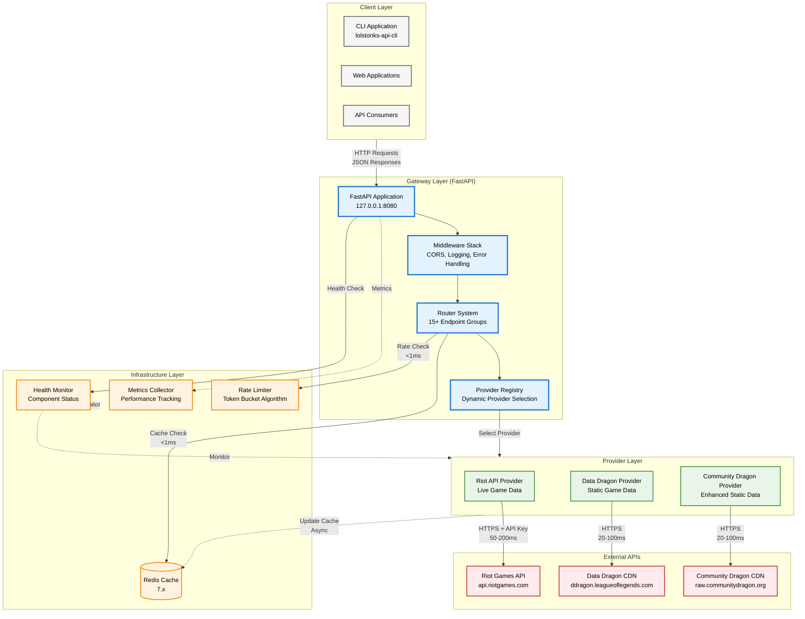
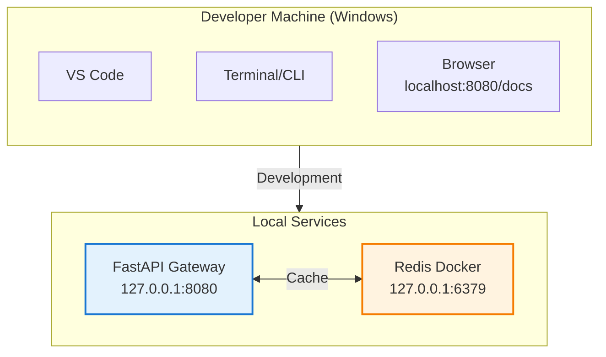

# System Overview

> **High-level architecture** of the lolstonks-api-gateway system

---

## Introduction

The lolstonks-api-gateway is a FastAPI-based reverse proxy that provides a unified, cached interface to Riot Games League of Legends APIs. This document provides a comprehensive overview of the system architecture, major components, and their interactions.

---

## System Architecture Diagram



---

## Component Overview

### Client Layer

The gateway serves multiple client types:

#### CLI Application (lolstonks-api-cli)
- **Purpose**: Command-line interface for League of Legends data queries
- **Connection**: HTTP client using httpx
- **Features**: Rich terminal output, JSON export, offline mode
- **Location**: `D:\LoLProjects\lolstonks-api-cli`

#### Web Applications
- **Purpose**: Browser-based dashboards and analytics tools
- **Connection**: Standard HTTP/REST
- **Authentication**: API key-based (future feature)

#### API Consumers
- **Purpose**: Third-party integrations and custom tools
- **Connection**: REST API with OpenAPI/Swagger documentation
- **Documentation**: Available at `http://127.0.0.1:8080/docs`

---

### Gateway Layer

The core application layer built on FastAPI 0.115+.

#### FastAPI Application
- **Binding**: `127.0.0.1:8080` (localhost only for security)
- **Runtime**: Uvicorn ASGI server
- **Configuration**: Environment-based via `.env`
- **Startup**: Initializes providers, cache, health checks
- **Documentation**: Auto-generated OpenAPI schema at `/openapi.json`

**Key Features**:
- Automatic API documentation (Swagger UI, ReDoc)
- Request validation via Pydantic 2.5+
- Dependency injection for shared resources
- Lifespan events for startup/shutdown

#### Provider Registry
- **Purpose**: Dynamic provider selection based on data type and region
- **Implementation**: Factory pattern with provider routing
- **Providers**: Riot API (live data), Data Dragon (static), Community Dragon (enhanced)
- **Selection Logic**:
  - Static data (champions, items) → Data Dragon or Community Dragon
  - Live data (matches, rankings) → Riot API
  - Fallback handling for provider unavailability

**Code Location**: `app/core/providers.py`

#### Router System
- **Organization**: 15+ router modules grouped by functionality
- **Categories**:
  - **Game Routes**: Summoner, Match, League, Mastery, Spectator, Tournament
  - **Account Routes**: Account, Clash
  - **Data Routes**: Champion, Challenges, Item, Rune, Spell
  - **System Routes**: Health, Metrics, Platform, Status
- **Pattern**: Each router is a separate module with versioned endpoints
- **Registration**: Routers registered to FastAPI app on startup

**Code Location**: `app/routers/`

#### Middleware Stack
- **CORS**: Cross-Origin Resource Sharing for browser clients
- **Logging**: Request/response logging via loguru
- **Error Handling**: Global exception handlers for consistent error responses
- **Request ID**: Unique tracking ID for each request
- **Timing**: Response time measurement and headers

**Configuration**: See `app/middleware/` and `app/main.py`

---

### Infrastructure Layer

Supporting components for caching, rate limiting, and monitoring.

#### Redis Cache
- **Version**: Redis 7.x
- **Purpose**: High-performance caching layer
- **Connection**: Docker container or standalone instance
- **TTL Strategy**:
  - Live data: 5 minutes (configurable)
  - Static data: 1 hour (configurable)
  - Player data: 10 minutes
  - Match data: 30 minutes (matches don't change)
- **Invalidation**: TTL-based expiration, manual force refresh via `?force=true`
- **Keys Pattern**: `{provider}:{endpoint}:{region}:{params_hash}`

**Performance**:
- Cache hit: `<10ms` response time
- Cache miss: `50-200ms` (depends on external API)
- Hit rate: Typically `>70%` in production

**Configuration**: `REDIS_URL` in `.env`

#### Rate Limiter
- **Algorithm**: Token bucket with sliding window
- **Purpose**: Protect external APIs from rate limit violations
- **Limits**:
  - Riot API: 20 requests/second, 100 requests/2 minutes (configurable per key tier)
  - Data Dragon: No strict limit (CDN)
  - Community Dragon: No strict limit (CDN)
- **Implementation**: Redis-backed counter with TTL
- **Behavior**: Returns `429 Too Many Requests` when limit exceeded

**Code Location**: `app/core/rate_limiter.py`

#### Health Monitor
- **Purpose**: Component health checking and status reporting
- **Checks**:
  - Redis connectivity
  - Provider availability
  - External API reachability
  - Disk space and memory
- **Endpoints**:
  - `/health` - Simple up/down status
  - `/health/detailed` - Component-level health
- **Frequency**: Checked on-demand and via periodic background task

**Response Format**:
```json
{
  "status": "healthy",
  "components": {
    "redis": "healthy",
    "riot_api": "healthy",
    "data_dragon": "healthy"
  },
  "timestamp": "2025-01-24T12:00:00Z"
}
```

#### Metrics Collector
- **Purpose**: Performance monitoring and analytics
- **Metrics**:
  - Request count by endpoint
  - Response times (p50, p95, p99)
  - Cache hit/miss ratio
  - Error rates by type
  - External API latency
- **Storage**: In-memory counters, exportable to Prometheus (future)
- **Endpoint**: `/metrics` (basic stats), `/metrics/prometheus` (future)

**Code Location**: `app/monitoring/`

---

### Provider Layer

Data source abstraction layer implementing the provider pattern.

#### Riot API Provider
- **Purpose**: Access to live League of Legends game data
- **Authentication**: API key required (`RIOT_API_KEY`)
- **Base URL**: `https://{region}.api.riotgames.com`
- **Data Types**:
  - Summoner profiles and stats
  - Match history and details
  - Live game spectator data
  - Ranked ladder (League)
  - Champion mastery
  - Tournament data
- **Rate Limits**: Strict (20/sec, 100/2min default)
- **Caching**: Aggressive caching with 5-10 minute TTL
- **Error Handling**: Retries with exponential backoff

**Regional Routing**:
- Americas: `na1`, `br1`, `la1`, `la2`
- Europe: `euw1`, `eun1`, `tr1`, `ru`
- Asia: `kr`, `jp1`, `oc1`, `ph2`, `sg2`, `th2`, `tw2`, `vn2`

**Code Location**: `app/providers/riot_provider.py`

#### Data Dragon Provider
- **Purpose**: Static game data (champions, items, runes, spells)
- **Authentication**: None (public CDN)
- **Base URL**: `https://ddragon.leagueoflegends.com`
- **Data Types**:
  - Champion data (stats, abilities, skins)
  - Item data (stats, recipes, costs)
  - Summoner spell data
  - Rune data
  - Profile icons
  - Localization files
- **Versioning**: Version-specific URLs (e.g., `14.1.1`)
- **Caching**: Long TTL (1 hour+) due to static nature
- **Updates**: Version changes with patches (every ~2 weeks)

**URL Pattern**: `https://ddragon.leagueoflegends.com/cdn/{version}/data/{lang}/{resource}.json`

**Code Location**: `app/providers/data_dragon_provider.py`

#### Community Dragon Provider
- **Purpose**: Enhanced static data with additional details
- **Authentication**: None (public CDN)
- **Base URL**: `https://raw.communitydragon.org`
- **Data Types**:
  - Detailed champion data (passive descriptions, recommended builds)
  - High-resolution assets
  - Augment data
  - Mission/quest data
  - Loot and crafting data
- **Advantages**: More detailed than official Data Dragon
- **Caching**: Long TTL (1 hour+)
- **Reliability**: Community-maintained, may lag official patches

**URL Pattern**: `https://raw.communitydragon.org/{version}/plugins/rcp-be-lol-game-data/global/default/{resource}`

**Code Location**: `app/providers/community_dragon_provider.py`

---

### External APIs

Third-party services accessed by providers.

#### Riot Games API
- **Domain**: `api.riotgames.com`
- **Protocol**: HTTPS with API key header (`X-Riot-Token`)
- **Rate Limits**: Enforced per API key
- **Regions**: Regional endpoints (e.g., `na1.api.riotgames.com`)
- **Documentation**: https://developer.riotgames.com/
- **Availability**: `99.9%+` uptime SLA
- **Latency**: Typically `50-200ms` depending on region

**Authentication Header**:
```
X-Riot-Token: RGAPI-xxxxxxxx-xxxx-xxxx-xxxx-xxxxxxxxxxxx
```

#### Data Dragon CDN
- **Domain**: `ddragon.leagueoflegends.com`
- **Protocol**: HTTPS (no authentication)
- **Content**: JSON data files and image assets
- **Caching**: CDN-cached, very fast
- **Versions**: Multiple versions available simultaneously
- **Update Frequency**: Patch releases (~every 2 weeks)
- **Latency**: Typically `20-100ms` (CDN performance)

#### Community Dragon CDN
- **Domain**: `raw.communitydragon.org`
- **Protocol**: HTTPS (no authentication)
- **Content**: Enhanced JSON data and high-res assets
- **Maintenance**: Community-driven, GitHub-based
- **Latency**: Typically `20-100ms`
- **Reliability**: Generally stable, may lag official patches by hours/days

---

## Request Flow Overview

### Typical Request Path

```mermaid
flowchart LR
    start([Client Request]) -->|1. HTTP POST/GET| app[FastAPI App]
    app -->|2. Middleware| validate[Validation]
    validate -->|3. Router| endpoint[Endpoint Handler]
    endpoint -->|4. Cache Check| cache{Cache<br/>Hit?}
    cache -->|Yes - <10ms| response([Cached Response])
    cache -->|No| provider[Provider Selection]
    provider -->|5. External API<br/>50-200ms| external[External API]
    external -->|6. Process| format[Format Response]
    format -.->|7. Update Cache| cacheupdate[(Redis)]
    format -->|8. Return| response

    style app fill:#e3f2fd,stroke:#1976d2,stroke-width:2px
    style cache fill:#f3e5f5,stroke:#7b1fa2,stroke-width:2px
    style provider fill:#e8f5e8,stroke:#388e3c,stroke-width:2px
    style external fill:#ffebee,stroke:#c62828,stroke-width:2px
    style cacheupdate fill:#fff3e0,stroke:#f57c00,stroke-width:2px
```



**Performance Breakdown**:
1. Request parsing: `<1ms`
2. Middleware processing: `<1ms`
3. Cache check: `<1ms`
4. **Cache hit path**: `<10ms` total
5. **Cache miss path**: `50-200ms` (external API latency)
6. Response formatting: `<1ms`
7. Cache update: `<1ms` (async)

**Optimization**: Cache hit rate `>70%` means most requests complete in `<10ms`.

---

## Deployment Architecture

### Development Environment



**Setup**:
```bash
cd lolstonks-api-gateway
make docker-run  # Starts Redis + Gateway
```

**Access**:
- API: `http://127.0.0.1:8080`
- Docs: `http://127.0.0.1:8080/docs`
- Health: `http://127.0.0.1:8080/health`

### Production Deployment (Future)

**Planned Architecture**:
- **Container**: Docker image with multi-stage build
- **Orchestration**: Kubernetes or Docker Swarm
- **Cache**: Redis Cluster for high availability
- **Load Balancing**: NGINX or cloud load balancer
- **Monitoring**: Prometheus + Grafana
- **Logging**: ELK stack or cloud logging

---

## Security Considerations

### API Key Management

- **Storage**: Never in repository (use `.env` or environment variables)
- **Location**: `D:\LoLProjects\docs` for development secrets
- **Rotation**: Periodic key rotation recommended
- **Scoping**: Use development keys for local, production keys for deployed

### Network Security

- **Binding**: `127.0.0.1` only (not `0.0.0.0`)
- **HTTPS**: Required for production (TLS termination at load balancer)
- **CORS**: Configured for specific origins only
- **Rate Limiting**: Protects against abuse

### Data Privacy

- **PII**: Minimal personal data stored (summoner names, Riot IDs)
- **Caching**: Cached data expires via TTL
- **Logging**: No sensitive data in logs
- **Compliance**: GDPR considerations for EU players

---

## Scalability Considerations

### Current Limits

- **Throughput**: `~100 requests/second` (limited by Riot API rate limits)
- **Cache Size**: Redis memory limit (default 512MB)
- **Concurrent Connections**: FastAPI async handles `1000+` concurrent connections

### Scaling Strategies

#### Horizontal Scaling
- Multiple gateway instances behind load balancer
- Shared Redis cluster for cache coherency
- Distributed rate limiting

#### Vertical Scaling
- Increase Redis memory for larger cache
- More CPU cores for FastAPI workers
- SSD storage for faster cache persistence

#### Cache Optimization
- Increase TTLs for static data
- Implement cache warming for popular queries
- Use cache compression for large responses

---

## Monitoring and Observability

### Health Checks

- **Liveness**: `/health` - Is the service running?
- **Readiness**: `/health/detailed` - Can the service handle requests?
- **Component Status**: Individual checks for Redis, providers, external APIs

### Metrics

- **Request Metrics**: Count, latency, error rate by endpoint
- **Cache Metrics**: Hit rate, eviction rate, memory usage
- **Provider Metrics**: API call count, latency, error rate by provider
- **System Metrics**: CPU, memory, disk I/O

### Logging

- **Structured Logging**: JSON format via loguru
- **Log Levels**: DEBUG, INFO, WARNING, ERROR, CRITICAL
- **Request Tracking**: Unique request ID in all logs
- **Retention**: Configurable (default 7 days)

**Log Example**:
```json
{
  "timestamp": "2025-01-24T12:00:00.000Z",
  "level": "INFO",
  "request_id": "abc-123",
  "endpoint": "/lol/summoner/v4/by-name",
  "region": "euw1",
  "cache_hit": true,
  "duration_ms": 8.5
}
```

---

## Technology Stack Summary

| Layer | Technology | Version | Purpose |
|-------|-----------|---------|---------|
| **Application** | FastAPI | 0.115+ | Web framework |
| **Runtime** | Python | 3.11+ | Programming language |
| **Server** | Uvicorn | Latest | ASGI server |
| **Cache** | Redis | 7.x | High-performance cache |
| **HTTP Client** | httpx | Latest | Async HTTP requests |
| **Validation** | Pydantic | 2.5+ | Data modeling and validation |
| **Logging** | loguru | Latest | Structured logging |
| **Package Manager** | uv | Latest | Dependency management |
| **Code Quality** | ruff | Latest | Linting and formatting |
| **Testing** | pytest | 8.3+ | Test framework |
| **Container** | Docker | Latest | Containerization |

---

## Cross-References

### Related Documentation

- **[Data Flow Architecture](./data-flow.md)** - Request processing details
- **[Routing Architecture](./routing.md)** - Router organization and endpoints
- **[Provider Documentation](providers.md)** - Provider implementation details
- **[Caching Strategy](caching.md)** - Cache configuration and best practices
- **[API Reference](../api/overview.md)** - Endpoint specifications

### Implementation Guides

- **[Development Setup](../../README.md)** - Getting started guide
- **[Development Workflows](../../DEVELOPMENT.md)** - Standard development patterns
- **[Configuration Guide](../configuration/)** - Environment and settings

---

## Quick Start

### Running the Gateway

```bash
# Navigate to project
cd D:\LoLProjects\lolstonks-api-gateway

# Start Redis and Gateway
make docker-run

# Verify health
curl http://127.0.0.1:8080/health

# Access API docs
# Open browser to http://127.0.0.1:8080/docs
```

### Making Requests

```bash
# Get summoner by name
curl "http://127.0.0.1:8080/lol/summoner/v4/by-name/euw1/PlayerName"

# Get match details
curl "http://127.0.0.1:8080/lol/match/v5/by-match-id/europe/EUW1_123456789"

# Force cache refresh
curl "http://127.0.0.1:8080/lol/summoner/v4/by-name/euw1/PlayerName?force=true"
```

---

**Last Updated**: 2025-01-24

**Next Steps**:
1. Read [Data Flow Architecture](./data-flow.md) to understand request processing
2. Review [Routing Architecture](./routing.md) for endpoint organization
3. Explore [Provider Documentation](providers.md) for implementation details
