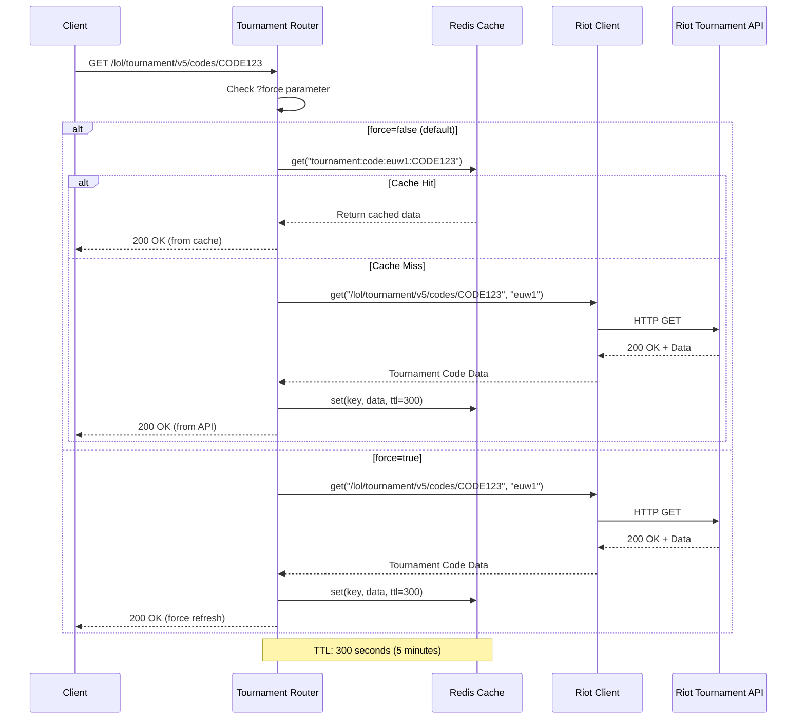
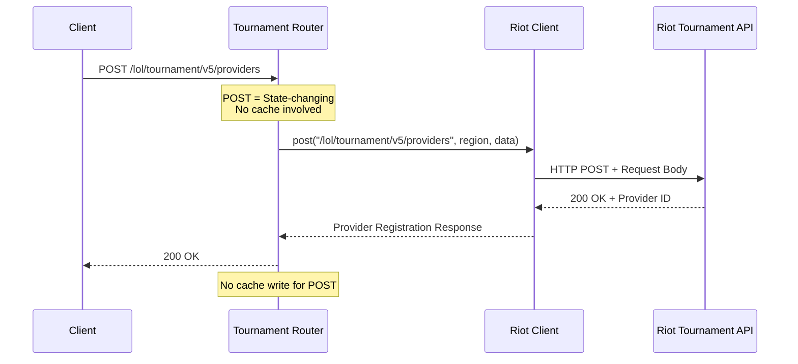
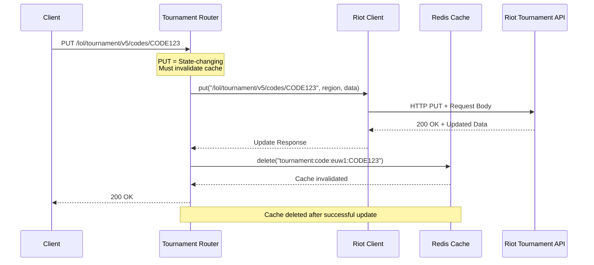
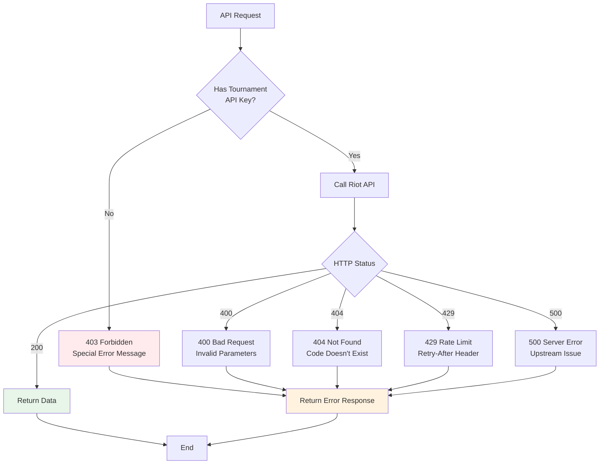

# Tournament Router Architecture Diagrams

**Version**: 1.0
**Date**: 2025-01-29
**Related Document**: [tournament-router-design.md](./tournament-router-design.md)

---

## Overview Diagram

```mermaid
graph TB
    subgraph "Client Layer"
        CLI[lolstonks-api-cli]
        HTTP[HTTP Client]
    END

    subgraph "API Gateway Layer"
        Gateway[lolstonks-api-gateway]

        subgraph "Tournament Routers"
            TV5[tournament.py<br/>Tournament V5]
            TSV5[tournament_stub.py<br/>Tournament Stub V5]
        END

        subgraph "Core Components"
            Cache[Redis Cache]
            Client[Riot HTTP Client]
            Config[Settings Config]
        END
    END

    subgraph "Riot API Layer"
        API_PROD[Riot Tournament V5 API<br/>/lol/tournament/v5/*]
        API_STUB[Riot Tournament Stub V5 API<br/>/lol/tournament-stub/v5/*]
    END

    CLI -->|HTTP Request| Gateway
    HTTP -->|HTTP Request| Gateway

    Gateway --> TV5
    Gateway --> TSV5

    TV5 -->|GET: Cache Check| Cache
    TV5 -->|POST/PUT: Direct| Client
    TV5 -->|GET: Cache Miss| Client
    TV5 -->|PUT: Invalidate| Cache

    TSV5 -->|GET: Cache Check| Cache
    TSV5 -->|POST/PUT: Direct| Client
    TSV5 -->|GET: Cache Miss| Client

    Client -->|Production API| API_PROD
    Client -->|Stub API| API_STUB

    Config -->|TTL Settings| TV5
    Config -->|TTL Settings| TSV5

    style TV5 fill:#e1f5ff
    style TSV5 fill:#fff4e1
    style Cache fill:#e8f5e9
    style Client fill:#f3e5f5
    style API_PROD fill:#ffebee
    style API_STUB fill:#fff3e0
```

---

## Request Flow Diagrams

### GET Request Flow (Cached)



### POST Request Flow (Not Cached)



### PUT Request Flow (Cache Invalidation)



---

## Caching Strategy Diagram

```mermaid
graph LR
    subgraph "Cache Keys Pattern"
        Key1[tournament:code:euw1:CODE123]
        Key2[tournament:lobby_events:euw1:CODE123]
    END

    subgraph "TTL Configuration"
        TTL1[300s<br/>5 minutes<br/>Code Details]
        TTL2[30s<br/>30 seconds<br/>Lobby Events]
    END

    subgraph "Cache Behavior"
        GET[GET Endpoints<br/>Cached]
        POST[POST Endpoints<br/>Not Cached]
        PUT[PUT Endpoints<br/>Invalidate Cache]
    END

    Key1 -->|TTL| TTL1
    Key2 -->|TTL| TTL2

    GET -->|Uses| Key1
    GET -->|Uses| Key2
    POST -->|Bypass| Key1
    PUT -->|Invalidates| Key1
    PUT -->|Invalidates| Key2

    style GET fill:#e8f5e9
    style POST fill:#ffebee
    style PUT fill:#fff3e0
```

---

## Error Handling Flow



---

## Endpoint Architecture Matrix

```mermaid
graph TB
    subgraph "Tournament V5 Endpoints"
        POST1[POST /providers]
        POST2[POST /tournaments]
        POST3[POST /codes]
        GET1[GET /codes/{code}]
        PUT1[PUT /codes/{code}]
        GET2[GET /lobby-events/by-code/{code}]
    END

    subgraph "Tournament Stub V5 Endpoints"
        POST1_S[POST /providers]
        POST2_S[POST /tournaments]
        POST3_S[POST /codes]
        GET1_S[GET /codes/{code}]
        PUT1_S[PUT /codes/{code}]
        GET2_S[GET /lobby-events/by-code/{code}]
    END

    subgraph "Caching Strategy"
        NoCache[No Cache<br/>POST/PUT]
        Cache5[Cache 5min<br/>Code Details]
        Cache30[Cache 30s<br/>Lobby Events]
    END

    POST1 --> NoCache
    POST2 --> NoCache
    POST3 --> NoCache
    GET1 --> Cache5
    PUT1 --> NoCache
    GET2 --> Cache30

    POST1_S --> NoCache
    POST2_S --> NoCache
    POST3_S --> NoCache
    GET1_S --> Cache5
    PUT1_S --> NoCache
    GET2_S --> Cache30

    style NoCache fill:#ffebee
    style Cache5 fill:#e1f5ff
    style Cache30 fill:#fff9c4
```

---

## Integration Architecture

```mermaid
graph TB
    subgraph "Files to Create"
        F1[app/routers/tournament.py<br/>Production Router]
        F2[app/routers/tournament_stub.py<br/>Stub Router]
    END

    subgraph "Files to Modify"
        F3[app/config.py<br/>Add TTL Settings]
        F4[app/routers/__init__.py<br/>Export Routers]
        F5[app/riot/client.py<br/>Add POST/PUT Methods]
        F6[app/main.py<br/>Include Routers]
    END

    subgraph "Dependencies"
        D1[fetch_with_cache<br/>app/cache/helpers.py]
        D2[riot_client<br/>app/riot/client.py]
        D3[Settings<br/>app/config.py]
        D4[Exceptions<br/>app/exceptions.py]
    END

    F1 --> D1
    F1 --> D2
    F1 --> D3
    F1 --> D4

    F2 --> D1
    F2 --> D2
    F2 --> D3
    F2 --> D4

    F3 --> D3
    F5 --> D2
    F6 --> F1
    F6 --> F2

    style F1 fill:#e1f5ff
    style F2 fill:#fff4e1
    style F3 fill:#e8f5e9
    style F4 fill:#e8f5e9
    style F5 fill:#f3e5f5
    style F6 fill:#e8f5e9
```

---

## Implementation Timeline

```mermaid
gantt
    title Tournament Router Implementation Timeline
    dateFormat  HH:mm
    axisFormat %H:%M

    section Phase 1: Foundation
    Add TTL Settings         :p1, 00:00, 15m
    Export Routers           :p2, after p1, 10m
    Add HTTP Methods         :p3, 00:00, 35m

    section Phase 2: Tournament Router
    Create tournament.py     :p4, after p2, 30m
    Implement POST endpoints :p5, after p4, 30m
    Implement GET endpoints  :p6, after p5, 30m

    section Phase 3: Stub Router
    Create tournament_stub   :p7, after p6, 30m

    section Phase 4: Testing
    Unit Tests              :p8, after p7, 30m
    Integration Tests       :p9, after p8, 30m

    section Phase 5: Integration
    Include in main.py      :p10, after p9, 10m
    Test with Swagger       :p11, after p10, 5m
```



---

## Cache Key Naming Convention

```mermaid
graph LR
    subgraph "Pattern Components"
        Prefix[tournament]
        Resource[code | lobby_events]
        Region[euw1 | na1 | kr]
        Identifier[CODE123 | CODE456]
    END

    subgraph "Examples"
        E1[tournament:code:euw1:CODE123]
        E2[tournament:lobby_events:na1:CODE456]
    END

    Prefix --> Resource
    Resource --> Region
    Region --> Identifier

    Prefix --> E1
    Resource --> E1
    Region --> E1
    Identifier --> E1

    Prefix --> E2
    Resource --> E2
    Region --> E2
    Identifier --> E2

    style E1 fill:#e1f5ff
    style E2 fill:#e1f5ff
```

---

## Security Architecture

```mermaid
graph TB
    subgraph "API Key Types"
        Standard[Standard API Key]
        Tournament[Tournament API Key]
    END

    subgraph "Access Permissions"
        P1[Standard Endpoints<br/>Summoner, Match, League, etc.]
        P2[Tournament Endpoints<br/>Tournament V5, Stub V5]
    END

    subgraph "Error Response"
        Success[200 OK<br/>Access Granted]
        Forbidden[403 Forbidden<br/>Access Denied]
    END

    Standard --> P1
    Standard --> P2
    Tournament --> P1
    Tournament --> P2

    Standard -->|No Tournament Access| Forbidden
    Tournament -->|Has Tournament Access| Success

    style Forbidden fill:#ffebee
    style Success fill:#e8f5e9
```

---

## Testing Architecture

```mermaid
graph TB
    subgraph "Unit Tests"
        UT1[test_tournament.py]
        UT2[Test POST endpoints]
        UT3[Test GET with cache]
        UT4[Test PUT with invalidation]
        UT5[Test force refresh]
    END

    subgraph "Integration Tests"
        IT1[test_endpoints.py]
        IT2[Test validation]
        IT3[Test error handling]
    END

    subgraph "Coverage Targets"
        C1[POST endpoints: 80%]
        C2[GET endpoints: 90%]
        C3[PUT endpoints: 85%]
        C4[Error handling: 85%]
    END

    UT1 --> UT2
    UT1 --> UT3
    UT1 --> UT4
    UT1 --> UT5

    UT2 --> C1
    UT3 --> C2
    UT4 --> C3
    UT5 --> C4

    IT1 --> IT2
    IT1 --> IT3

    style C1 fill:#e8f5e9
    style C2 fill:#e8f5e9
    style C3 fill:#e8f5e9
    style C4 fill:#fff3e0
```

---

**Document Version**: 1.0
**Last Updated**: 2025-01-29
**Related**: [tournament-router-design.md](./tournament-router-design.md)
