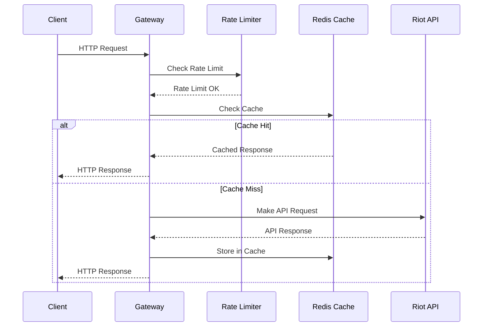
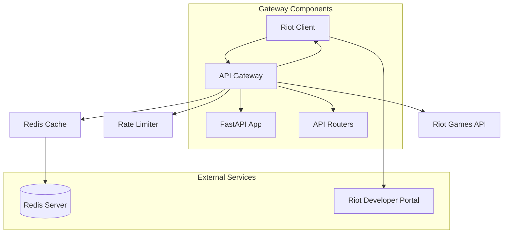

# Documentation Guide

This guide explains how to contribute to and maintain the documentation for the LOLStonks API Gateway.

## Documentation System Overview

The project uses **MkDocs** with the **mkdocstrings** plugin to generate documentation directly from Python docstrings. This ensures that the documentation stays in sync with the codebase.

### Documentation Stack

- **MkDocs**: Static site generator
- **mkdocstrings**: Automatic API documentation from docstrings
- **Material for MkDocs**: Modern documentation theme
- **Markdown**: Source format for all documentation

## Documentation Structure

```
docs/
├── index.md                   # Homepage and project overview
├── getting-started/           # User guides
│   ├── installation.md
│   ├── quick-start.md
│   └── configuration.md
├── api/                       # API reference (auto-generated)
│   ├── overview.md
│   ├── riot-client.md
│   ├── models.md
│   ├── routers.md
│   └── cache.md
├── architecture/              # Architecture documentation
│   ├── overview.md
│   ├── rate-limiting.md
│   └── caching.md
├── development/               # Developer documentation
│   ├── contributing.md
│   ├── testing.md
│   └── documentation.md
├── legacy/                    # Legacy documentation
│   ├── api.md
│   ├── setup.md
│   └── architecture.md
└── data/                      # Generated data files
    └── openapi.json
```

## Writing Documentation

### Markdown Guidelines

#### Headers

```markdown
# Level 1 Header (Page Title)
## Level 2 Header
### Level 3 Header
#### Level 4 Header
```

#### Code Blocks

```markdown
# Inline code
Use `inline code` for short code snippets.

# Fenced code blocks
```python
def example_function():
    """Example function with docstring."""
    return "Hello, World!"
```

# Code blocks with syntax highlighting
```python
def api_request():
    """Make API request with error handling."""
    try:
        response = await client.get("/api/endpoint")
        return response.json()
    except httpx.HTTPError as e:
        logger.error(f"API error: {e}")
        return None
```
```

#### Lists

```markdown
# Unordered list
- Item 1
- Item 2
  - Nested item
  - Another nested item

# Ordered list
1. First step
2. Second step
   1. Sub-step 2.1
   2. Sub-step 2.2
3. Third step
```

#### Tables

```markdown
| Parameter | Type | Description | Required |
|-----------|------|-------------|----------|
| region | str | Riot API region | Yes |
| count | int | Number of results | No |
| start | int | Starting index | No |
```

#### Admonitions

```markdown
!!! note "Note Title"
    This is a note admonition.

!!! tip "Tip"
    This is a tip for users.

!!! warning "Warning"
    This is a warning message.

!!! danger "Danger"
    This indicates a dangerous action.
```

#### Links

```markdown
# Internal links
[Link to installation guide](getting-started/installation.md)

# External links
[Riot Developer Portal](https://developer.riotgames.com/)

# Reference links
[API Reference][api-reference]

[api-reference]: api/overview.md
```

## Docstring Standards

### Google Style Docstrings

The project uses **Google Style** docstrings for consistency and mkdocstrings compatibility.

#### Function/Method Docstrings

```python
async def get_summoner_by_name(
    summonerName: str,
    region: str = "euw1",
    riot_client: RiotClient = Depends(),
    cache: RedisCache = Depends()
) -> SummonerDto:
    """
    Get summoner information by summoner name.

    Retrieves comprehensive summoner data including profile information,
    level, and account details from the Riot API.

    Args:
        summonerName: The summoner name to search for (case-insensitive)
        region: Riot API region code (default: "euw1")
        riot_client: Dependency-injected Riot API client
        cache: Dependency-injected Redis cache instance

    Returns:
        SummonerDto: Summoner information including:
            - id: Summoner ID
            - accountId: Account ID
            - puuid: Player UUID
            - name: Summoner name
            - profileIconId: Profile icon ID
            - summonerLevel: Summoner level
            - revisionDate: Last data revision timestamp

    Raises:
        ValueError: If summonerName is empty or invalid
        httpx.HTTPStatusError: If Riot API returns an error
        CacheError: If cache operations fail

    Example:
        >>> summoner = await get_summoner_by_name("Faker", "kr")
        >>> print(f"Summoner: {summoner['name']} (Level {summoner['summonerLevel']})")
        Summoner: Faker (Level 523)

    Note:
        This endpoint is rate limited and cached for 1 hour to improve
        performance and reduce API load.
    """
```

#### Class Docstrings

```python
class RiotClient:
    """
    HTTP client for Riot API with rate limiting and retry logic.

    Provides a robust wrapper around httpx for making requests to the Riot Games API
    with automatic rate limiting, retry on 429 responses, and proper error handling.

    Attributes:
        api_key: Riot Games API key for authentication
        client: Underlying httpx AsyncClient instance
        rate_limiter: Rate limiter for API request throttling

    Example:
        >>> client = RiotClient("RGAPI-example-key")
        >>> summoner = await client.get(
        ...     "/lol/summoner/v4/summoners/by-name/Faker",
        ...     region="kr"
        ... )
        >>> print(summoner["name"])
        Faker
    """
```

#### Module Docstrings

```python
"""
Riot API HTTP client with rate limiting and automatic retries.

This module provides a comprehensive client for interacting with Riot Games APIs,
including:

- Automatic rate limiting using token bucket algorithm
- Intelligent retry logic with exponential backoff
- Region-aware URL routing
- Comprehensive error handling and logging
- Support for all Riot API endpoints

The client is designed to be production-ready with proper error handling,
logging, and monitoring capabilities.

Example:
    >>> from app.riot.client import RiotClient
    >>> client = RiotClient("your-api-key")
    >>> data = await client.get("/lol/summoner/v4/summoners/by-name/Faker", "kr")
"""
```

## API Documentation

### Auto-Generated API Docs

API documentation is automatically generated from docstrings using mkdocstrings.

#### Creating API Reference Pages

```markdown
# Riot Client

This section documents the Riot API client implementation.

## RiotClient

::: app.riot.client.RiotClient
    options:
      show_source: true
      show_root_heading: true
      show_root_members_full_path: false
      members_order: source

## RateLimiter

::: app.riot.rate_limiter.RateLimiter
    options:
      show_source: true
      show_root_heading: true
      show_root_members_full_path: false
      members_order: source
```

#### mkdocstrings Configuration Options

```yaml
plugins:
  - mkdocstrings:
      handlers:
        python:
          options:
            docstring_style: google
            show_source: true
            show_root_heading: true
            show_root_members_full_path: false
            show_signature_annotations: true
            signature_crossrefs: true
            merge_init_into_class: true
            members_order: source
          paths: [.]
```

### Cross-References

Use automatic cross-references to link between documentation:

```markdown
# Link to specific class/methods
Use the [`RiotClient`][app.riot.client.RiotClient] for API requests.

# Link to specific method
Call the [`get()`][app.riot.client.RiotClient.get] method.

# Link with custom text
The [rate limiting][app.riot.rate_limiter.RateLimiter] system prevents API abuse.
```

## Diagrams and Visualizations

### Mermaid Diagrams

Use Mermaid for architecture diagrams and flowcharts:

```markdown
### Request Flow


```

### Architecture Diagrams

```markdown
### System Architecture


```

## Local Documentation Development

### Setup

```bash
# Install documentation dependencies (using UV - recommended)
uv pip install -e ".[docs]"
# or using pip:
pip install -e ".[docs]"
```

### Running Local Development Server

```bash
# Start MkDocs development server
mkdocs serve

# Start with live reload on specific port
mkdocs serve --dev-addr=127.0.0.1:8001

# Start with strict mode (better error checking)
mkdocs serve --strict
```

### Building Documentation

```bash
# Build documentation
mkdocs build

# Build with clean output
mkdocs build --clean

# Build to specific directory
mkdocs build --site-dir /path/to/output
```

### Development Workflow

1. **Make Changes**
   ```bash
   # Edit documentation files
   vim docs/getting-started/installation.md
   ```

2. **Preview Changes**
   ```bash
   # Start development server
   mkdocs serve
   # Visit http://127.0.0.1:8000
   ```

3. **Check for Issues**
   ```bash
   # Build with strict checking
   mkdocs build --strict

   # Check for broken links
   mkdocs build --strict --verbose
   ```

4. **Test Documentation**
   ```bash
   # Verify API documentation generates correctly
   curl http://127.0.0.1:8000/api/riot-client/
   ```

## Documentation Quality

### Review Checklist

Before submitting documentation changes:

- [ ] **Accuracy**: Information is correct and up-to-date
- [ ] **Clarity**: Language is clear and easy to understand
- [ ] **Completeness**: All necessary information is included
- [ ] **Consistency**: Style and terminology are consistent
- [ ] **Formatting**: Markdown formatting is correct
- [ ] **Links**: All links work and point to correct locations
- [ ] **Code Examples**: Code examples are tested and working
- [ ] **Diagrams**: Diagrams are clear and accurate

### Style Guidelines

1. **Active Voice**: Use active voice ("Click here" not "The button should be clicked")
2. **Present Tense**: Use present tense for instructions ("Open the file" not "Open the file")
3. **Simple Language**: Avoid jargon and complex terminology
4. **Consistent Terminology**: Use the same terms throughout the documentation
5. **Examples**: Provide concrete examples for complex concepts

## Automated Documentation

### API Documentation Generation

The existing script generates API documentation from the running FastAPI app:

```python
# scripts/generate_api_docs.py
import asyncio
import httpx
import json
from pathlib import Path

async def generate_api_docs():
    """Generate comprehensive API documentation."""

    # Get OpenAPI schema from running app
    async with httpx.AsyncClient() as client:
        response = await client.get("http://localhost:8000/openapi.json")
        openapi_schema = response.json()

    # Generate documentation pages
    generate_endpoints_overview(openapi_schema)
    generate_schemas_documentation(openapi_schema)
```

### CI/CD Integration

Documentation is automatically built and deployed:

```yaml
# .github/workflows/docs.yml
name: Deploy Documentation

on:
  push:
    branches: [ main ]

jobs:
  build-and-deploy:
    runs-on: ubuntu-latest
    steps:
    - uses: actions/checkout@v4

    - name: Setup Python
      uses: actions/setup-python@v4
      with:
        python-version: '3.12'

    - name: Install dependencies
      run: |
        pip install -e ".[docs]"

    - name: Build documentation
      run: mkdocs build

    - name: Deploy to GitHub Pages
      uses: peaceiris/actions-gh-pages@v3
      with:
        github_token: ${{ secrets.GITHUB_TOKEN }}
        publish_dir: ./site
```

## Contributing to Documentation

### Adding New Documentation

1. **Create the file** in the appropriate directory
2. **Follow the style guidelines** for formatting and structure
3. **Add cross-references** to related documentation
4. **Update the navigation** in `mkdocs.yml`
5. **Test locally** with `mkdocs serve`
6. **Submit pull request** with clear description

### Updating Existing Documentation

1. **Make minimal changes** to fix issues
2. **Preserve existing style** and structure
3. **Update related documentation** if necessary
4. **Test changes** thoroughly
5. **Document the changes** in pull request

### Documentation Review Process

1. **Self-review** your changes before submitting
2. **Check links** and formatting
3. **Test code examples** to ensure they work
4. **Request review** from maintainers
5. **Address feedback** promptly

## Best Practices

### Documentation Maintenance

1. **Keep documentation current** with code changes
2. **Review regularly** for accuracy and completeness
3. **Update examples** when APIs change
4. **Remove outdated information** promptly
5. **Add new features** to documentation as they're added

### Performance Considerations

1. **Optimize images** for web (compress, appropriate formats)
2. **Minimize external dependencies** in documentation
3. **Use code highlighting** efficiently
4. **Avoid excessive nesting** in documentation structure

### Accessibility

1. **Use semantic HTML** in generated output
2. **Provide alt text** for images and diagrams
3. **Ensure sufficient color contrast** in diagrams
4. **Use descriptive link text** instead of "click here"

This documentation system ensures that the LOLStonks API Gateway has comprehensive, maintainable, and user-friendly documentation that stays synchronized with the codebase.
